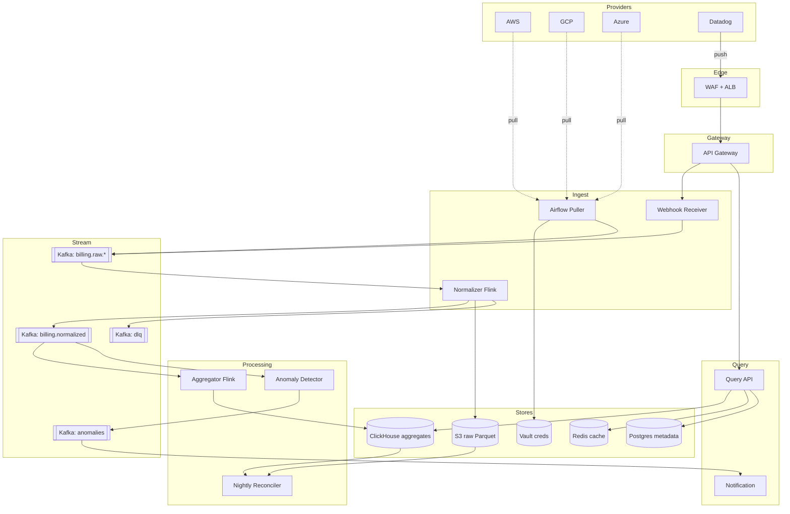

# 3. Billing Aggregation API — HLD

## 1. Requirements

### Functional
- Collect billing/usage events from multiple cloud providers (Amazon Web Services (AWS), Google Cloud Platform (GCP), Microsoft Azure, Snowflake, Datadog) per customer account.
- Normalize into a canonical `BillingEvent` schema (currency, unit, service, resource).
- Aggregate spend by customer / provider / service / tag / day / month.
- Expose an API for dashboards: current-month spend, trend, breakdown.
- Detect anomalies (>X% week-over-week (WoW) change) and emit alerts.
- Support back-fills and re-statements from providers (bills change retroactively).
- 2-year retention for raw events; indefinite for aggregates.

### Non-Functional
- Application Programming Interface (API) 95th percentile (p95) < 300 ms for dashboard queries.
- Ingest availability 99.95%; dashboard availability 99.9%.
- Event-driven — push (webhook) where supported, pull (CRON) otherwise.
- Exactly-once aggregation semantics (idempotent).
- Scale ceiling: 50M events/hour, peak 30k/s, 2 y × 250 Terabyte (TB) raw events.

## 2. Scale & Estimates (recap)

- 100k customers × 5 providers × 100 resources = **50M events/hour** = **~14k/s avg**.
- Peak at the top of the hour (providers flush): **~30k/s**.
- Event size ~300 B → **4 MB/s** → **350 GB/day** → **250 TB over 2 years** raw.
- Aggregates: 100k customers × ~50 dims × 30 days ≈ 150M rows/month ≈ **7.5 GB/month**.
- Dashboard read Queries Per Second (QPS): ~500/s avg, 2k/s peak (corporate 9am).
- Full math: [estimations doc](../back_of_envelope_estimations_example.md)

## 3. High-Level Component Design

### Edge / Load Balancer (LB)
- External Application Load Balancer (ALB) (Layer 7 (L7)) for webhooks + dashboard API, Transport Layer Security (TLS) termination.
- Webhook endpoints have per-provider Internet Protocol (IP) allowlists at Web Application Firewall (WAF).

### API Gateway
- Kong with JSON Web Token (JWT)/Open Authorization (OAuth) for dashboard APIs, Hash-based Message Authentication Code (HMAC) signature validation for webhooks.
- Rate limit per customer (60 req/min dashboard); no rate limit on webhook (providers can't be throttled) — absorb via Kafka.

### Services (microservices)
| Service | Responsibility |
|---------|---------------|
| Webhook Receiver | Validates provider signatures, normalizes envelope, publishes to Kafka |
| Puller (scheduled) | CRON jobs per provider account; paginates provider APIs, publishes events |
| Normalizer | Kafka consumer; provider-specific schema → canonical `BillingEvent` |
| Aggregator | Flink job computing hourly/daily rollups with watermarks |
| Reconciler | Nightly job comparing aggregates vs provider official bill |
| Query API | Serves dashboard reads from aggregate store |
| Anomaly Detector | Streams aggregates, applies z-score, emits alerts |
| Customer/Account Service | Customer, provider credentials (vault-backed), tags |
| Notification Service | Alerts → email/Slack/PagerDuty |

### Datastores
- **Kafka**: event backbone.
- **Amazon Simple Storage Service (S3) (raw + parquet)**: immutable raw events, source of truth.
- **ClickHouse** (or Druid): aggregates, columnar, fast group-by for dashboards.
- **PostgreSQL**: customer/account/credentials/alert rules metadata.
- **Redis**: query cache + idempotency keys.
- **Vault**: provider API keys.

### Async Infra
- Kafka topics: `billing.raw.{provider}`, `billing.normalized`, `billing.aggregated`, `anomalies`, `dlq`.
- Airflow Directed Acyclic Graphs (DAGs) for CRON pullers and nightly reconciliation.

## 4. API Design

```
# Webhook (provider → us)
POST /v1/webhooks/{provider}
     headers: X-Signature
     body: provider-specific payload
     → 202 Accepted

# Dashboard
GET  /v1/customers/{cid}/spend?from=2026-03-01&to=2026-04-01&group_by=service
     → { total, currency, buckets: [{service, amount}] }

GET  /v1/customers/{cid}/spend/timeseries?granularity=day&providers=aws,gcp
     → { series: [{ts, amount}] }

GET  /v1/customers/{cid}/anomalies?since=7d
POST /v1/customers/{cid}/alert-rules

# Admin
POST /v1/accounts   body: { customer_id, provider, credentials_ref }
POST /v1/backfill   body: { customer_id, provider, from, to }
```

## 5. Data Storage & Schema Design

### Schema (key tables/collections)
```
BillingEvent(event_id PK, customer_id, provider, account_id, service, resource_id,
             usage_qty, unit, unit_price, amount, currency, ts, tags{...}, ingested_at)

-- ClickHouse rollup
SpendDaily(customer_id, provider, service, tag_env, day, amount)
   ENGINE = SummingMergeTree PARTITION BY toYYYYMM(day) ORDER BY (customer_id, day, provider, service)

SpendHourly(customer_id, provider, hour, amount)
   ENGINE = SummingMergeTree

-- Postgres
Customer(cid PK, name, plan, currency_pref)
Account(account_id PK, cid, provider, credentials_ref, external_account_id, status)
AlertRule(rule_id PK, cid, metric, threshold, channel)
IngestCheckpoint(cid, provider, account_id, watermark_ts)   -- for pullers
```

### DB Choice & Justification

- **Why ClickHouse for aggregates**: columnar, vectorized execution, group-by over hundreds of millions of rows in sub-second; `SummingMergeTree` gives us native pre-aggregation; cheap to run compared to a data warehouse.
- **Why not Postgres for aggregates**: row store + B-tree; group-by over 150M rows/month at p95 300 ms is not feasible without heavy materialized views we'd have to hand-roll.
- **Why not Snowflake/Google BigQuery**: excellent analytics but per-query cost + 1–5 s minimum latency hurts interactive dashboards. Great for ad-hoc finance team queries on the raw Parquet tier instead.
- **Why not Druid**: viable alternative; chose ClickHouse for operational simplicity (single binary, fewer moving parts than Druid's coordinator/broker/historical split).
- **Why not Cassandra/Amazon DynamoDB**: no group-by; we'd end up materializing every possible rollup upfront, which explodes storage and breaks ad-hoc `group_by=tag`.
- **Why S3 Parquet for raw**: immutable, cheap, replayable. If aggregation logic changes, we re-run Flink from S3 and rebuild ClickHouse tables.
- **Why Postgres for metadata**: relational, small, needs Atomicity Consistency Isolation Durability (ACID) (credential rotation, alert rule updates).
- **Why Kafka**: decouples unreliable providers from our pipeline, buffers the 30k/s hour-boundary spike, enables replay.

### Sharding & Partitioning
- Kafka: partitioned by `customer_id` (so ordering per customer, scale consumers horizontally).
- ClickHouse: sharded by `customer_id` hash × 2 replicas; `PARTITION BY toYYYYMM(day)` lets us drop old partitions cheaply.
- S3: `s3://billing-raw/{provider}/year=/month=/day=/hour=/` for Hive-style partition pruning.

### Replication
- Kafka Replication Factor (RF)=3, `acks=all`.
- ClickHouse: ReplicatedMergeTree with 2 replicas per shard (ZooKeeper (ZK)/Keeper coordinated).
- Postgres: primary + 1 sync + 1 async replica.
- S3: built-in durability.

## 6. Scalability & Performance

### Caching
- Redis caches dashboard query responses keyed by `(cid, query_hash)` Time To Live (TTL) 60 s — big win for 9am load spike where everyone opens the same dashboard.
- Materialized daily rollups in ClickHouse act as a "cache" for month-to-date queries.
- Content Delivery Network (CDN)-level caching not used (per-customer private data).

### Message Queues
- Kafka is the spike absorber. The 30k/s top-of-hour burst lands in `billing.raw.*`; Normalizer and Aggregator consume at their own pace.
- Consumer groups scale horizontally by `customer_id` partitions.

### Read-heavy vs Write-heavy
- Balanced. Writes bursty (30k/s peak). Reads steady (~500/s) but latency-sensitive. ClickHouse excels at both through a separation of ingest (MergeTree background merges) and query paths.

## 7. Deep Dive

### Pull vs push ingestion
- **Push (webhook)**: AWS Cost and Usage Report (CUR) doesn't push; Datadog and some Software as a Service (SaaS) do. Webhook Receiver validates HMAC, 202s immediately, publishes to `billing.raw.{provider}`. This is the happy path — low latency, no polling cost.
- **Pull (CRON)**: For AWS/GCP/Azure, Airflow DAG runs hourly per account. Reads `IngestCheckpoint.watermark_ts` from Postgres, calls provider API with `since=watermark`, paginates, publishes events, advances watermark on success. If partial failure, watermark not advanced → next run retries idempotently.
- **Idempotency**: `event_id = sha256(provider + account + resource + ts + amount)`. Normalizer checks a Bloom filter + RocksDB state store (Flink keyed state) to dedupe.
- **Back-fill**: `/v1/backfill` publishes a backfill task to `billing.backfill`; puller walks the specified range and emits events tagged `backfill=true` so aggregator re-runs those days.

### Idempotent aggregation with watermarks
- Flink job keyed by `(customer_id, provider, service, day)`.
- Event-time processing with watermarks: we wait up to 6 hours for late events (providers are chronically late).
- Window trigger: fires on watermark close, writes to ClickHouse via `SummingMergeTree`. Because it's a sum-merge, re-emitting the same aggregate on re-run converges (events are deduped upstream, so the sum stays correct).
- Nightly Reconciler compares our daily total vs the provider's "official" bill (once the bill finalizes) and emits a correction delta if off by >0.5%.
- **Pre-aggregation strategy**: we materialize daily rollups in ClickHouse (`SpendDaily`) and `SpendHourly` for the current day. Dashboard queries hit these; raw events are only scanned for drill-downs.

## 8. Trade-offs

- **Consistency, Availability, Partition tolerance (CAP)**: Ingest = **AP** (buffer in Kafka, never reject a webhook). Query = **AP** (serve slightly stale aggregate over erroring).
- **Consistency model**: eventual — dashboards reflect data within ~2 min of event arrival; official-bill reconciliation is nightly.
- **Failure handling**:
  - Webhook 202 + Kafka `acks=all` ensures no data loss; Dead Letter Queue (DLQ) on bad payloads.
  - Puller checkpoints are transactional with the Kafka send (outbox pattern) so we don't advance the watermark without publishing.
  - Flink checkpoints to S3 every 60 s — recovery resumes from last checkpoint.
  - ClickHouse write failures buffer in a retry topic.
  - Circuit breakers on provider APIs; when an account fails repeatedly we pause that puller and alert ops.

## 9. Mermaid Diagram


