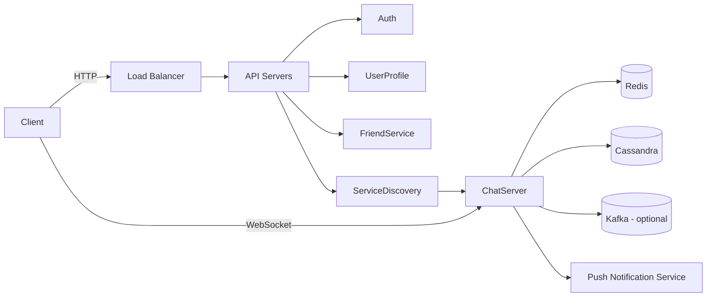

# Chat Application HLD (Final Revision Notes)

---

# 1. High-Level Architecture



---

# 2. Stateless vs Stateful

| Type      | Services                   | Protocol  |
| --------- | -------------------------- | --------- |
| Stateless | Auth, Profile, Friend list | HTTP      |
| Stateful  | Chat, Presence             | WebSocket |

---

# 3. Chat Flow (1:1)

```text id="flow2"
User A → WebSocket → Chat Server
        → generate message_id
        → store in Cassandra
        → push to User B (WebSocket)
```

---

# 4. Multi-Device Synchronization

```text id="sync4"
last_seen_message_id (per conversation per device)
```

Flow:

```text id="sync5"
Device connects
→ sends last_seen_message_id
→ fetch messages WHERE message_id > last_seen
```

Storage:

```text id="sync6"
(user_id, device_id, conversation_id) → last_seen_message_id
```

---

# 5. Read Receipt

```text id="read4"
SENT → DELIVERED → READ
```

Optimization:

```text id="read5"
READ_UPTO: message_id
```

Group:

```text id="read6"
message_id → {user_id: read_at}
```

---

# 6. Presence System

```text id="pres2"
User A online
→ update Redis
→ fetch friends
→ push via WebSocket
```

* no Kafka in hot path
* selective push at scale

---

# 7. Storage Design

| Data          | DB        |
| ------------- | --------- |
| User, Friends | RDBMS     |
| Messages      | Cassandra |

---

# 8. Message Data Model (Cassandra)

## 1:1 Chat

```text id="conv2"
conversation_id = min(userA, userB) + "_" + max(userA, userB)
```

---

# ❗ Core Cassandra Concepts

## Partition Key

```text id="pk2"
partition_key = (conversation_id, bucket)
```

👉 decides **node + partition**

---

## Bucket

> splits large data into smaller partitions

Example:

```text id="bucket2"
("1_2", 20260419)
("1_2", 20260420)
```

---

## Clustering Key

```text id="ck3"
clustering_key = message_id
```

👉 ensures ordering inside partition

---

## Range Query

```sql id="rq2"
SELECT * FROM messages
WHERE conversation_id = '1_2'
AND bucket = 20260420
AND message_id > 842
LIMIT 50;
```

---

## Tables

```sql id="table3"
CREATE TABLE messages (
  conversation_id text,
  bucket int,
  message_id bigint,
  sender_id bigint,
  content text,
  created_at timestamp,
  PRIMARY KEY ((conversation_id, bucket), message_id)
);
```

```sql id="table4"
CREATE TABLE group_messages (
  channel_id text,
  bucket int,
  message_id bigint,
  user_id bigint,
  content text,
  created_at timestamp,
  PRIMARY KEY ((channel_id, bucket), message_id)
);
```

---

# 9. Message ID Strategy

* unique
* ordered

Options:

* Snowflake
* local sequence ✅

---

# 10. Kafka Usage

Optional (NOT in hot path)

Used for:

* async processing
* retries
* offline delivery

---

# 11. Redis Usage

```text id="redis2"
user_id → online/offline
user_id → server mapping
cache friend list
```

---

# 12. WebSocket Event Schema (IMPORTANT)

## Send Message

```json id="ws1"
{
  "type": "SEND_MESSAGE",
  "conversation_id": "1_2",
  "sender_id": 1,
  "content": "hello"
}
```

---

## Receive Message

```json id="ws2"
{
  "type": "NEW_MESSAGE",
  "conversation_id": "1_2",
  "message_id": 842,
  "sender_id": 2,
  "content": "hi"
}
```

---

## Read Receipt

```json id="ws3"
{
  "type": "READ_UPTO",
  "conversation_id": "1_2",
  "message_id": 842
}
```

---

## Delivered Ack

```json id="ws4"
{
  "type": "DELIVERED",
  "message_id": 842
}
```

---

## Sync (on reconnect)

```json id="ws5"
{
  "type": "SYNC",
  "conversation_id": "1_2",
  "last_seen_message_id": 653
}
```

---

## Presence Update

```json id="ws6"
{
  "type": "PRESENCE",
  "user_id": 2,
  "status": "ONLINE"
}
```

---

# 13. Inbox Model

Small groups:

```text id="inbox3"
fanout-on-write
```

Large groups:

```text id="inbox4"
fanout-on-read
```

---

# 14. Key Tradeoffs

| Problem       | Solution       |
| ------------- | -------------- |
| hot partition | bucket         |
| ordering      | message_id     |
| sync          | last_seen_id   |
| read receipts | read_upto      |
| presence      | selective push |

---

# 15. Final Mental Model

```text id="final2"
WebSocket → real-time
HTTP → support APIs

Partition Key → distribution
Bucket → scaling
Clustering Key → ordering + range queries

Redis → presence
Cassandra → messages
Kafka → async
```

---

# 🚀 One-line Summary

> **WebSocket for real-time, Cassandra for scale, Redis for state, bucket for partitioning, message_id for ordering**

---
