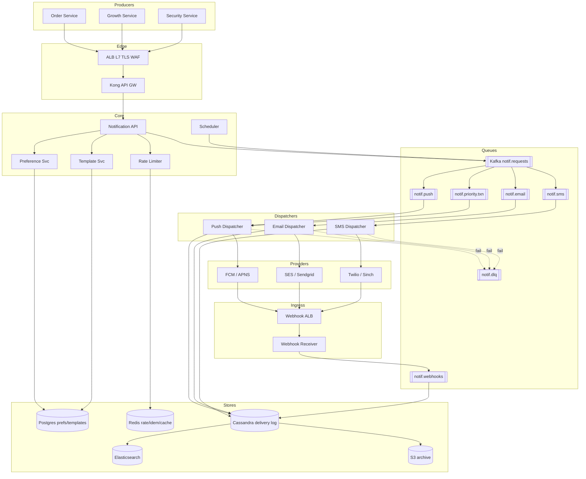

# 2. Distributed Notification Service — HLD

## 1. Requirements

### Functional
- Multi-channel delivery: push (Firebase Cloud Messaging (FCM) / Apple Push Notification service (APNS)), email (Amazon Simple Email Service (SES) / Sendgrid), Short Message Service (SMS) (Twilio).
- Producer services (Orders, Growth, Security, Payments, etc.) call a single Application Programming Interface (API) to send a notification.
- Template engine: notifications reference a template Identifier (ID) + variables; localization per user.
- Per-user preferences: opt-in/out per channel and per category.
- Per-user and per-category rate limiting (e.g., max 5 marketing push/day).
- Scheduled and immediate sends; batch/broadcast (send to 10M users).
- Delivery tracking: queued → sent → delivered → opened → clicked.
- Idempotency on the producer's request id.
- Priority classes: transactional (One-Time Password (OTP)) > operational > marketing.
- Delivery log searchable for 30 days.

### Non-Functional
- Send latency (enqueue → provider dispatch) 99th percentile (P99) < 2 s for transactional; < 30 s for marketing.
- Availability 99.95% for enqueue path; best-effort for actual provider delivery.
- Durability: once accepted, must be delivered at least once or Dead Letter Queue (DLQ)'d (no silent drop).
- Consistency: at-least-once delivery; dedup at provider boundary via idempotency key.
- Scale ceiling: 200M users, 1B notifs/day, 50k peak Queries Per Second (QPS).

## 2. Scale & Estimates (recap)

- 200M users × 5 notifs/day = **1B notifs/day**.
- Channel mix: push 70% = 700M, email 20% = 200M, SMS 10% = 100M.
- Notif QPS: 1B / 86400 ≈ **12k avg, 50k peak** (morning + evening spikes).
- Payload ≈ 1 KB (template_id, vars, user_id, metadata) → 12 MB/s → **~1 TB/day** raw.
- 30-day delivery log: 30 TB; with Replication Factor (RF)=3 → **90 TB**.
- Per-user rate limit state in Redis: 200M users × ~100 B → **~20 GB**.
- Template cache: 10k templates × 5 KB × 20 locales ≈ 1 GB.
- Full math: [estimations doc](../back_of_envelope_estimations_example.md)

## 3. High-Level Component Design

### Edge / Load Balancer (LB)
- Amazon Web Services (AWS) Application Load Balancer (ALB) at Layer 7 (L7) for the HyperText Transfer Protocol (HTTP) `POST /notify` API — Transport Layer Security (TLS), Web Application Firewall (WAF), health checks.
- Internal-only service mesh traffic for producers (mutual TLS (mTLS) via Istio); external webhook ingress (provider callbacks) on a separate ALB.

### API Gateway
- Kong in front of producers: API key auth per service, global rate limit per tenant service, routing to Notification API.
- Webhook receiver service is behind its own gateway since provider Internet Protocol (IP) addresses must be allowlisted.

### Services (microservices)
| Service | Responsibility |
|---------|---------------|
| Notification API | Accepts send requests, validates, enqueues |
| Preference Service | User channel/category opt-ins |
| Template Service | Fetch + render templates with locale |
| Rate Limiter | Sliding-window per-user/per-category checks |
| Scheduler | Cron + delayed sends, writes to Kafka at fire time |
| Dispatcher (per channel) | Push / Email / SMS workers that talk to providers |
| Webhook Receiver | Consumes provider delivery/bounce callbacks |
| Delivery Log Service | Writes + queries the 30d log |
| Analytics Rollup | Open/click aggregation |

### Datastores
- **Cassandra** — delivery log (90 TB, write-heavy, Time To Live (TTL) 30d).
- **PostgreSQL** — user preferences, templates, producer API keys, schedule metadata.
- **Redis Cluster** — rate limit counters, template cache, dedup idempotency keys.
- **Amazon Simple Storage Service (S3)** — long-term archive of delivery reports (compliance), rendered HyperText Markup Language (HTML) for email.
- **Elasticsearch** — searchable delivery log (user_id, request_id, status).

### Async Infra
- **Kafka** (the backbone):
  - `notif.requests` — all incoming requests, partitioned by user_id.
  - `notif.push`, `notif.email`, `notif.sms` — per-channel dispatch queues.
  - `notif.priority.transactional` — separate high-priority topic with dedicated consumers.
  - `notif.webhooks` — provider callbacks.
  - `notif.dlq` — terminal failures.
- **Kafka Streams / Flink** for sliding-window rate limit aggregation (backs the Redis counter).

## 4. API Design

```
POST /v1/notify
  Headers: X-Idempotency-Key, X-Producer-Id
  {
    "user_id": "u_123",
    "template_id": "order_shipped",
    "channels": ["push","email"],    // optional; else use user prefs
    "vars": {"order_id":"A-19", "eta":"Apr 13"},
    "category": "transactional",
    "priority": "high",
    "send_at": null                  // or ISO for scheduled
  }
  → 202 {"request_id":"r_9f...", "status":"accepted"}

GET  /v1/notify/{request_id}        → status + per-channel breakdown
POST /v1/broadcast                   {segment_id, template_id, vars}
GET  /v1/preferences/{user_id}
PUT  /v1/preferences/{user_id}       {push:true, email:false, sms:true, categories:{...}}

POST /webhooks/fcm                   (provider → us)
POST /webhooks/ses
POST /webhooks/twilio
```

## 5. Data Storage & Schema Design

### Schema

```
-- Cassandra (delivery log, write-heavy, TTL)
delivery_log (
  user_id       text,
  bucket_day    text,          -- '2026-04-11'
  request_id    uuid,
  channel       text,
  template_id   text,
  status        text,          -- queued|sent|delivered|bounced|clicked
  provider_id   text,
  error_code    text,
  created_at    timestamp,
  updated_at    timestamp,
  PRIMARY KEY ((user_id, bucket_day), created_at, request_id)
) WITH default_time_to_live = 2592000;   -- 30 days

-- Postgres
UserPreferences(user_id PK, push bool, email bool, sms bool,
                categories jsonb, locale text, timezone text, updated_at)
Templates(template_id PK, name, channel, subject, body, locale, version, created_at)
Producers(producer_id PK, api_key_hash, rate_limit_rps, allowed_templates jsonb)
Schedules(schedule_id PK, cron, template_id, segment_id, next_fire_at, status)

-- Redis
rl:{user_id}:{category}          → sliding window sorted set (score = ts)
idem:{producer_id}:{idem_key}    → request_id (TTL 24h)
tpl:{template_id}:{locale}       → rendered template string (TTL 1h)
```

### DB Choice & Justification

The log is the big decision — 90 TB, write-heavy, time-series, read by user_id + time range, 30d TTL.

- **Why Cassandra for the delivery log**: (1) 50k writes/s is comfortable with a modest cluster. (2) Time Window Compaction Strategy (TWCS) makes TTL deletes cheap — entire Sorted String Tables (SSTables) drop at 30d boundary, no tombstone scan pain. (3) Partition key (user_id, bucket_day) keeps a user's day of logs co-located for "why didn't Alice get her OTP" debug queries. (4) Horizontal scale is linear; we can grow nodes as traffic grows.
- **Why Postgres for preferences/templates**: Strongly consistent reads on opt-in/opt-out are legally important (General Data Protection Regulation (GDPR), CAN-SPAM). Volume is tiny (200M rows × 500 B ≈ 100 GB). Templates need versioned, transactional updates. Postgres (PG) is the right call.
- **Why not DynamoDB for the log**: Workable (pk = user_id#day, sk = ts) but (a) on-demand pricing for 50k Write Capacity Units (WCU) + 4 TB storage becomes eye-watering (~$100k/month range), (b) TTL deletes in DynamoDB (DDB) still cost WCU, (c) global secondary indexes for request_id lookup double cost. Cassandra on Amazon Elastic Compute Cloud (EC2) wins on cost at this scale.
- **Why not MongoDB for the log**: Compaction on a 90 TB collection is painful; sharding is fine but TTL monitor thread is single-threaded and struggles at our delete rate. Write amplification with WiredTiger under sustained 50k w/s is higher than Cassandra.
- **Why not Kafka as the store**: Kafka is the transport, not the query layer. You can't do `WHERE user_id=X AND status='bounced'` without a secondary index. Also, Kafka retention of 30 days at 1 TB/day is doable but replays cost a full scan.
- **Why not Redis as primary**: 90 TB in RAM = absurd cost. Redis is right for rate-limit counters (small, hot, needs sub-ms latency).

### Sharding & Partitioning
- Cassandra: partition `(user_id, bucket_day)` — day bucket prevents unbounded partitions for heavy users.
- Kafka: `notif.requests` partitioned by `user_id` → preserves per-user ordering, enables per-user rate-limit locality.
- Redis: cluster mode, slot by `{user_id}` hash tag.
- Postgres preferences: hash-shard by `user_id` via Citus once >200 Gigabytes (GB).

### Replication
- Cassandra: RF=3, `LOCAL_QUORUM` writes for transactional, `LOCAL_ONE` for marketing (faster).
- Postgres: 1 primary + 2 replicas, streaming + Write-Ahead Log (WAL) archive.
- Redis: cluster with 1 replica per master, Append-Only File (AOF) for rate-limit durability (losing a few counters is tolerable).
- Kafka: RF=3, min.insync.replicas=2, acks=all for transactional topic.

## 6. Scalability & Performance

### Caching
- Templates rendered and cached in Redis keyed by `(template_id, locale, vars_hash)` with 1h TTL — a broadcast to 10M users renders once.
- User preferences cached in Redis; invalidated on PUT.
- Provider auth tokens (FCM Open Authorization (OAuth)) cached per dispatcher instance.

### Message Queues
- Kafka is the backbone; producers never block on providers.
- Separate topics per channel + per priority class. Transactional has dedicated consumer group with higher parallelism (more partitions, more pods). Marketing is throttled.
- Backpressure: if FCM is slow, `notif.push` lags; we monitor consumer lag and alert; marketing is shed first.
- DLQ topic for terminal failures; ops tool replays after fix.

### Read-heavy vs Write-heavy
- Write-heavy: 50k peak. The pipeline is optimized for enqueue speed (API → Kafka is ~5 ms).
- Reads (delivery log queries) are sparse, mostly support debugging + analytics rollups. Served by Cassandra + ES for text search.

## 7. Deep Dive

### Topic 1 — Per-User / Per-Category Rate Limiting (Sliding Window in Redis)

Requirement: "max 5 marketing pushes per user per day; max 1 OTP per 60 s; global 100 notifs/user/day."

Naive fixed window has burst edges. We use a **sliding window log** in Redis per `(user_id, category)`:

```
ZADD rl:u_123:marketing <now_ms> <request_id>
ZREMRANGEBYSCORE rl:u_123:marketing 0 (<now_ms> - window_ms)
ZCARD rl:u_123:marketing
```

If `ZCARD > limit` → reject with 429 (transactional) or drop (marketing).

All three commands are wrapped in a Lua script for atomicity (one Round Trip Time (RTT), atomic on the Redis shard). Entries expire via `EXPIRE` equal to window length so memory is bounded.

Memory math: 200M users × avg 3 categories × 5 entries × 50 B ≈ 150 GB across Redis cluster. With tag routing `{user_id}`, all of a user's limit sets live on one shard, so the Lua script stays local.

For very hot users (power users, internal test accounts), we add a second tier: a pre-check in the API pod using a **token bucket** in process memory (fed by a local leaky refill), to short-circuit 90% of checks before hitting Redis.

### Topic 2 — Fan-out, Provider Integration, Idempotency, and DLQ

Flow for one send:

1. `POST /notify` → Notification API checks idempotency key in Redis (`SET NX` with 24h TTL). Dedup within the same producer.
2. Resolve user prefs (Redis → PG fallback). Filter channels.
3. Rate limit check per channel+category. Rejected requests still logged with status="rate_limited".
4. Produce one message per channel to `notif.requests`. Store `request_id → pending` in Cassandra.
5. Dispatcher consumer (per channel) batches to provider API (FCM batch = 500 tokens/call; SES = 50/call).
6. Provider response → update Cassandra status=sent and publish to `notif.webhooks`.
7. Provider later calls back with delivery/bounce → Webhook Receiver updates status.

**Idempotency** is end-to-end:
- Producer-facing: `X-Idempotency-Key` dedups retries from the caller.
- Internal: each channel message carries `request_id`; Cassandra upserts are idempotent on `(request_id, channel)`.
- Provider-facing: FCM has message dedup via our own `message_id`; SES has `MessageDeduplicationId`.

**Retry policy**: Dispatcher uses exponential backoff (1 s, 5 s, 30 s, 2 m) on 5xx / timeouts. On 4xx (bad token) we mark `bounced` immediately. After max retries → `notif.dlq`. Ops dashboard shows DLQ size; replay tool re-enqueues with fresh backoff.

**Provider failover**: Email has SES primary and Sendgrid secondary. If SES error rate > 5% over 1 min, Dispatcher flips a Redis feature flag and routes new sends to Sendgrid. SMS similarly via Twilio → Sinch.

## 8. Trade-offs

- **Consistency, Availability, Partition tolerance (CAP)**: Enqueue path prefers **Available and Partition-tolerant (AP)** — we'd rather accept and possibly double-send than reject during a partition. The preferences store (Postgres) is **Consistent and Partition-tolerant (CP)** since opting out must be honored immediately.
- **Consistency model**: At-least-once delivery. Dedup at the provider boundary via idempotency keys; some duplicate push notifications under failure are acceptable (industry norm).
- **Failure handling**:
  - Circuit breakers per provider (Hystrix-style); open on > 20% error rate, half-open after 30 s.
  - Retries with jitter to avoid thundering herd on provider recovery.
  - Idempotency keys at producer + internal + provider layer.
  - DLQ with automated replay and alerting on DLQ depth.
  - Graceful degradation: if Redis rate-limiter is down, fall back to local token bucket with stricter global limit.

## 9. Mermaid Diagram


