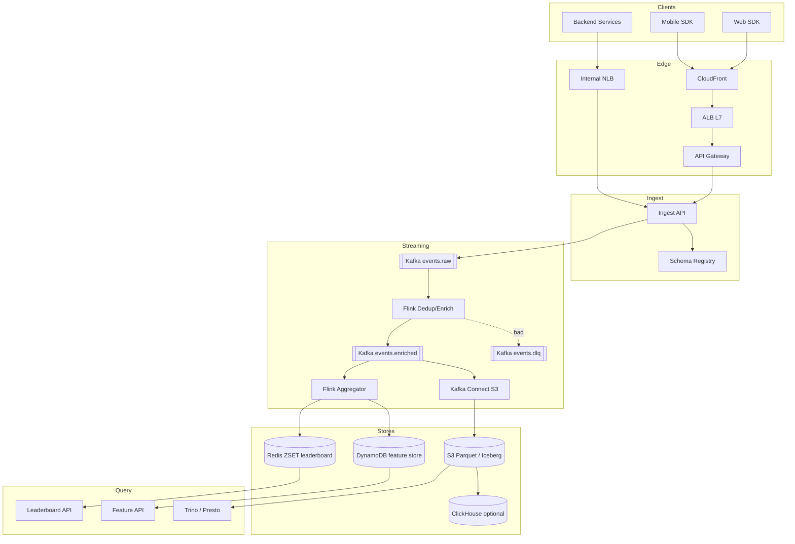

# 4. Event Processor (Cart / View / Click) — HLD

## 1. Requirements

### Functional
- Ingest product events from all client apps: `view`, `add_to_cart`, `remove_from_cart`, `checkout_start`, `purchase`, `search`, `click`, `impression`, `scroll`, `session_end` (~10 types).
- Real-time consumers:
  - Leaderboards (top products last 1h).
  - Fraud / anomaly detection.
  - Recommendation feature store update.
- Batch consumers:
  - 90-day analytics queries.
  - Machine Learning (ML) training data.
  - Daily business reports.
- Replayable pipeline — if a downstream service has a bug, re-run from event log.
- Schema evolution without breaking old consumers.
- Deduplication (clients may resend on reconnect).

### Non-Functional
- Ingest latency (produce → durable) 99th percentile (P99) < 100 ms.
- Real-time path: event → leaderboard visible in < 5 s.
- Batch: fresh to 90 days in data lake.
- Durability: Replication Factor (RF)=3, zero data loss on broker failure.
- Availability 99.95% on ingest, 99.9% on query APIs.
- Scale ceiling: 500M events/day, 25k peak Queries Per Second (QPS).

## 2. Scale & Estimates (recap)

- 500M events/day, 10 types.
- Event QPS: 500M / 86400 ≈ **6k avg, 25k peak**.
- Event size ≈ 500 B (user_id, session_id, type, product_id, price, ts, device, ua_hash, country) → 3 MB/s = **~250 GB/day** raw.
- Hot window (Redis leaderboard): last 1h × 10M active product interactions × ~100 B ≈ **1 GB**.
- 90-day cold: 250 GB × 90 = **22 TB raw**, Parquet + Snappy compression → **5–10 TB**.
- Kafka retention 7 days hot → 1.75 TB × RF=3 ≈ 5.25 TB cluster.
- Full math: [estimations doc](../back_of_envelope_estimations_example.md)

## 3. High-Level Component Design

### Edge / Load Balancer (LB)
- Amazon Web Services (AWS) Application Load Balancer (ALB) at Layer 7 (L7) fronts the ingest Application Programming Interface (API), global Anycast via CloudFront for client Software Development Kits (SDKs) to minimize Transport Layer Security (TLS) Round Trip Time (RTT).
- Separate internal Network Load Balancer (NLB) for server-to-server producers (backend services).

### API Gateway
- AWS API Gateway with API key per producer, per-producer rate limit, per-event-type rate limit. Authentication via signed client tokens (clients) or service mutual TLS (mTLS) (backend).

### Services (microservices)
| Service | Responsibility |
|---------|---------------|
| Ingest API | Validates, stamps server_ts, publishes to Kafka |
| Schema Registry | Avro schemas, evolution rules |
| Stream Processor (Flink) | Real-time aggregations, sessionization |
| Leaderboard Service | Reads Redis sorted sets, exposes top-N API |
| Feature Store Writer | Flink job writes features to online store |
| Cold Writer | Kafka → Amazon Simple Storage Service (S3)/Parquet via Kafka Connect |
| Query Service | Presto/Trino over S3 for analytics |
| Dedup Service | Short-window dedup by event_id |

### Datastores
- **Kafka** — primary event log, source of truth for 7 days.
- **Redis Sorted Sets** — leaderboard (last 1h windows).
- **S3 + Parquet** — cold store, 90 days online + lifecycle to Glacier.
- **Apache Hudi / Iceberg** on S3 — table format with updates + time travel.
- **DynamoDB (DDB)** — online feature store for recs (sub-ms lookups by user_id).
- **ClickHouse** (optional) — sub-second analytics over recent 30 days for dashboards.
- (MongoDB considered and rejected — see justification.)

### Async Infra
- **Kafka** (center of the system):
  - `events.raw` — all events, 256 partitions, 7d retention.
  - `events.enriched` — after dedup + enrichment.
  - `events.dlq` — Dead Letter Queue (DLQ) for invalid / poison events.
- **Flink** consumes `events.enriched`, sinks to Redis, DynamoDB, S3.

## 4. API Design

```
POST /v1/events/batch
  {
    "producer_id": "web-sdk",
    "events": [
      {
        "event_id": "e_9f2...",            // client-generated UUID
        "type": "add_to_cart",
        "user_id": "u_123",
        "session_id": "s_abc",
        "product_id": "p_42",
        "price_cents": 1299,
        "client_ts": 1712800000123,
        "device": "ios",
        "app_version": "4.2.1"
      }
    ]
  }
  → 202 {"accepted": 37, "rejected": 0}

GET /v1/leaderboard/top?window=1h&category=electronics&n=20
  → [{product_id, score, rank}, ...]

GET /v1/features/user/{user_id}
  → {recent_categories:[...], avg_session_len:..., ...}

POST /v1/query (analyst)
  {sql: "SELECT ... FROM events WHERE day='2026-04-10' ..."}
```

## 5. Data Storage & Schema Design

### Schema

```
-- Avro schema in registry
{
  "type": "record", "name": "Event", "version": 3,
  "fields": [
    {"name":"event_id","type":"string"},
    {"name":"type","type":{"type":"enum","symbols":["view","add_to_cart",...]}},
    {"name":"user_id","type":["null","string"],"default":null},
    {"name":"session_id","type":"string"},
    {"name":"product_id","type":["null","string"],"default":null},
    {"name":"price_cents","type":["null","long"],"default":null},
    {"name":"client_ts","type":"long"},
    {"name":"server_ts","type":"long"},
    {"name":"country","type":["null","string"],"default":null},
    {"name":"device","type":["null","string"],"default":null},
    {"name":"props","type":{"type":"map","values":"string"}}
  ]
}

-- S3 Parquet (partitioned)
s3://events/dt=2026-04-11/hour=14/type=add_to_cart/part-000.parquet

-- Redis leaderboard
lb:1h:{category}        ZSET (score = view_count, member = product_id)
lb:1h:global            ZSET
(snapshot every minute, sliding by 1-minute buckets)

-- DynamoDB online feature store
PK = user_id
Attributes: last_viewed (list), favorite_category, session_count, updated_at
```

### DB Choice & Justification

The interesting choice here is the layering: Kafka as log, Redis for hot, S3/Parquet for cold, DynamoDB for online lookups. Each store earns its place.

- **Why Kafka as the event log / source of truth**: (1) Persistent, replayable, at 25k QPS this is trivial (Kafka handles millions). (2) Partitioning by `user_id` gives per-user ordering for sessionization. (3) 7-day retention means downstream bugs can be fixed and replayed without data loss. (4) Consumer groups decouple real-time (Flink) from batch (Kafka Connect to S3) without extra infra. (5) The whole lambda architecture is native.
- **Why S3 + Parquet + Iceberg for cold**: (1) Cheap storage ($23/TB/month, ~$115 for 5 TB compressed). (2) Columnar Parquet makes analytical queries fast. (3) Iceberg adds Atomicity Consistency Isolation Durability (ACID) + schema evolution + time travel on top of plain files, so we can UPDATE/DELETE for General Data Protection Regulation (GDPR). (4) Trino/Presto/Spark all read it.
- **Why Redis for leaderboards**: Sorted sets give O(log n) inserts + O(log n) range queries, exactly what leaderboards need. 1 GB fits on one shard easily. Sub-ms read latency meets User Interface (UI) requirements.
- **Why DynamoDB for online feature store**: Point reads by user_id at P99 < 5 ms, auto-scales, managed. Recs service needs a key-value lookup for every request and volume is modest.
- **Why not MongoDB as the primary store**: The interview question explicitly asks "Kafka, MongoDB, Redis — which?". Mongo can store events (doc-per-event, sharded by user_id), but (a) 500M docs/day × 90 days = 45B docs is expensive vs S3, (b) range scans for analytics are slow compared to columnar Parquet, (c) no replay semantics — you'd need to re-read the whole collection, whereas Kafka offsets give you a pointer, (d) the "stream processing" story on Mongo change streams is much weaker than Kafka + Flink. Mongo is fine for operational data; wrong layer for the event pipeline.
- **Why not Cassandra as the primary event store**: Similar to Mongo — you can, but you give up Kafka's cheap replay and lose the decoupling between producers and consumers that Kafka enables. Cassandra is a store, Kafka is a log; for event processing, the log shape wins.
- **Why not Postgres**: obviously wrong scale — 500M writes/day into one primary is 6k w/s sustained, which a single Postgres (PG) can do with some pain, but analytics on 22 TB is impossible.
- **Why not Redis as the primary store**: RAM cost for 22 TB is in the tens of thousands per month; Redis is a view layer here, not truth.

### Sharding & Partitioning
- Kafka: 256 partitions on `events.raw`, key = `user_id` → per-user ordering, rebalance-friendly.
- S3: Hive-style partitioning `dt=YYYY-MM-DD/hour=HH/type=TYPE` for partition pruning in Presto.
- Redis: cluster, slot by `{category}` — one category per shard, global leaderboard on its own shard.
- DynamoDB: partition key = `user_id`, adaptive capacity handles hot keys.

### Replication
- Kafka: RF=3, min.insync.replicas=2, `acks=all` on ingest, rack-aware placement across 3 Availability Zones (AZs).
- Redis: cluster with 1 replica per master, `Append-Only File (AOF) everysec` (losing 1 s of leaderboard updates is acceptable).
- S3: 11 9s durable natively.
- DynamoDB: multi-AZ replication built-in.

## 6. Scalability & Performance

### Caching
- Leaderboard results cached at the API layer for 5 s (reduces Redis ops for viral items).
- Schema registry responses cached in every producer SDK.
- Feature store lookups cached in recs service with 30 s Time To Live (TTL).

### Message Queues
- Kafka is the backbone, not a sidecar.
- Producer batching (linger.ms=20, batch.size=64KB) reduces network overhead.
- Consumer groups: real-time (Flink, low-lag), batch (Kafka Connect, high-throughput), can tolerate lag of minutes.
- DLQ topic for schema-invalid events + tooling to inspect and reprocess.

### Read-heavy vs Write-heavy
- Write-heavy ingest path (25k peak). Kafka optimized for sequential append.
- Read side splits: hot reads (leaderboard, features) served by Redis/DynamoDB at very high QPS; cold reads (analytics) are low QPS but wide scans, served by Trino on S3.
- Backpressure: if Flink lags, Kafka absorbs 7 days of buffer; alerting triggers well before that.

## 7. Deep Dive

### Topic 1 — Lambda (Kafka + Flink + S3) with Hot/Cold Split

Architecture:

```
Clients → Ingest API → Kafka events.raw
                             │
          ┌──────────────────┼──────────────────┐
          │                  │                  │
       Flink              Flink             Kafka Connect
     (dedup +           (sessionize +           (raw sink)
     enrich)            features)                │
          │                  │                   ▼
          ▼                  ▼                S3 Parquet
    events.enriched     Redis ZSET            (Iceberg)
                        DynamoDB                  │
                                                  ▼
                                          Trino / Spark / Athena
```

**Hot path** (real-time, Flink on `events.enriched`):
- Sliding 1-hour window, step 1 minute, group by product_id.
- Output: write to Redis ZSET `lb:1h:{category}` via `ZINCRBY` with 1-minute bucket keys; aggregation step rolls up N buckets into the display key.
- Session windows: group by session_id with 30-minute gap; emit session_end events to DynamoDB for feature store.

**Cold path** (Kafka Connect S3 sink):
- Consumes `events.enriched` with a separate consumer group.
- Buffers 5 min or 128 MB, whichever first, then writes one Parquet file per partition.
- Iceberg commit appends the file to the table; table is immediately queryable.
- Compaction job nightly merges small files into 256 MB targets for query performance.

Why lambda (not kappa)? Kappa would replay from Kafka for batch queries, but Kafka retention of 7 days can't answer "how many add-to-carts on 2026-01-15". S3 is where 90 days live; lambda is the right fit.

Replay story: downstream bug in Flink job? Reset consumer offset to `yesterday_00:00` and re-consume — Redis ZSETs are idempotent with proper keys (bucket by minute), feature store upserts are idempotent, so replays are safe.

### Topic 2 — Schema-on-Read vs Schema-on-Write + Backpressure

**Schema-on-write** (our choice for `events.raw`). Producers use the Avro schema registry. Ingest API rejects events that don't validate. Benefits:
- Downstream consumers never see garbage — simpler code.
- Schema evolution is governed: adding optional fields with defaults = backwards compatible; removing / renaming = blocked by registry compatibility rules.
- Avro binary is 30% smaller than JavaScript Object Notation (JSON), saves Kafka bandwidth and S3 cost.

**Schema-on-read** for ad-hoc analytics. Analysts sometimes want to query yet-unmodeled properties; we keep a `props: map<string,string>` for flexibility. Trino can `CAST(props['experiment_id'] AS BIGINT)` at read time. Best of both worlds.

**Schema evolution** path: v1 → v2 adds `country` with default null. Old consumers reading v2 events see null — fine. New consumers reading v1 events get default null — fine. Forbidden: v1 → v2 making `user_id` required, because historic v1 events might have nulls.

**Backpressure handling**:
1. **At ingest**: Kafka producer with `block.on.buffer.full=true`, `max.block.ms=5000`. If Kafka is slow, API returns 503 after 5 s rather than Out Of Memory (OOM)ing. The ingest API itself is stateless and horizontally scales, so Central Processing Unit (CPU) is rarely the bottleneck.
2. **Flink**: Flink has native backpressure — slow sinks (e.g., Redis hiccup) propagate upstream, slowing the Kafka consumer. Checkpoints continue, lag grows, alert fires at 30s lag.
3. **Cold sink**: Kafka Connect S3 sink lagging is fine — it's an independent consumer group, and Kafka's 7-day retention absorbs it.
4. **Client-side**: SDKs batch and queue events locally; on 503 they retry with exponential backoff + jitter, capped at 100 MB local storage, then start dropping with a `drop_count` metric sent on next success.
5. **Circuit breaking**: If error rate on the Ingest API > 10% over 1 min, upstream ALB marks it unhealthy, traffic shifts to healthy AZs.

For extreme spikes (Black Friday), Ingest API horizontally auto-scales on CPU + Kafka produce latency, and we pre-warm Kafka partitions.

## 8. Trade-offs

- **Consistency, Availability, Partition tolerance (CAP)**: Ingest side is **Available and Partition-tolerant (AP)** — we'd rather accept and queue than reject. Once in Kafka, the system is **Consistent and Partition-tolerant (CP)** (Kafka with `acks=all`, RF=3, min.insync.replicas=2).
- **Consistency model**: At-least-once end-to-end. Dedup by `event_id` in a short Flink window (1-hour lookback via Flink state backend) handles client retries. Analytics are eventually consistent (minutes of lag for cold path).
- **Failure handling**:
  - Retries with jitter in the SDK.
  - Idempotent sinks (Redis ZINCRBY with minute-bucket keys, DynamoDB conditional writes with version).
  - DLQ for poison events (bad schema) — not dropped, inspectable.
  - Flink checkpoints to S3 every 30 s; on job failure, resume from last checkpoint + Kafka offset, exactly-once into sinks that support it (Kafka → Kafka, Kafka → S3 via two-phase commit).
  - Circuit breakers around DynamoDB writes to prevent hot-partition failure from cascading.
  - Monitoring: Kafka lag, Flink checkpoint duration, Redis op latency, DynamoDB throttles — all on one dashboard with paging alerts.

## 9. Mermaid Diagram


