# 23. Food Delivery App — HLD

A general food-delivery system (DoorDash / Swiggy / Zomato / Uber Eats style). Three actors: **Customer**, **Restaurant**, **Delivery Partner**. Core flow: customer browses nearby restaurants → places order → restaurant accepts and prepares → delivery partner picks up → order delivered.

## 1. Requirements

### Functional
- Customer can search/browse restaurants by location (geospatial filtering, cuisine, rating, ETA, price).
- Customer views restaurant menu, adds items to cart, places order with payment.
- Restaurant receives order, confirms or rejects, updates preparation status.
- System dispatches a nearby delivery partner; partner accepts or declines.
- Real-time order tracking: customer sees restaurant status + delivery partner location on a map.
- Push notifications at every state transition (placed, accepted, ready, picked, delivered).
- Ratings and reviews after delivery.
- Promotions, coupons, and dynamic pricing (surge during peak hours).
- Customer support and order cancellation/refund flow.

### Non-Functional
- **Latency**: search/browse 99th percentile (p99) < 300 ms; order placement < 500 ms; location updates < 1 s end-to-end.
- **Availability**: 99.95% — outages directly cost orders.
- **Consistency**: strong for payments and order state; eventual for restaurant feed and ratings.
- **Scale**: 100M Monthly Active Users (MAU), 30M Daily Active Users (DAU), 5M orders/day, 1M restaurants, 500k delivery partners online at peak.
- **Durability**: orders, payments, audit trail must survive any single region outage. Recovery Point Objective (RPO) ≈ 0 for financial data.
- **Geographic**: multi-region (per metropolitan area), with locality-aware routing.

## 2. Scale & Estimates (recap)

- 30M Daily Active Users (DAU); 5M orders/day; avg cart 3 items.
- **Order write throughput**: ~60 orders/sec average, peak ~500/sec (8× dinner spike).
- **Browse/search throughput**: 30M × 10 actions / 86,400 ≈ 3,500 Queries Per Second (QPS), peak ~15k/sec.
- **Delivery partner location ingest**: 500k partners × 1 ping per 4 sec = 125k pings/sec.
- **Storage**: orders ≈ 10 GB/day → ~18 TB over 5 years (×3 replication = ~55 TB). Menus/restaurants ~10 GB total.
- Full math: [estimations doc](../back_of_envelope_estimations_example.md)

## 3. High-Level Component Design

### Edge / Load Balancer
- Global Server Load Balancer (GSLB) with geo-DNS — routes customers to the nearest region.
- Per-region Application Load Balancer (ALB) at Layer 7 (L7) for customer/restaurant HyperText Transfer Protocol Secure (HTTPS) traffic; Network Load Balancer (NLB) at Layer 4 (L4) for the long-lived WebSocket (WS) gateway.
- Transport Layer Security (TLS) terminated at the edge; mutual TLS (mTLS) between internal services.
- Web Application Firewall (WAF) for bot/abuse protection.

### Application Programming Interface (API) Gateway
- Kong / Envoy / AWS API Gateway.
- Authentication via JSON Web Token (JWT); rate-limit per user/IP; per-route circuit breakers; request/response logging.
- Routes external traffic to internal microservices; speaks HTTPS to clients and google Remote Procedure Call (gRPC) to backends.

### Services (microservices)

| Service | Responsibility |
|---------|---------------|
| User Service | Customer profiles, addresses, payment methods, preferences |
| Restaurant Service | Restaurant onboarding, menus, hours, availability |
| Search/Discovery Service | Geospatial restaurant search with filters and ranking |
| Cart Service | In-progress cart state (ephemeral) |
| Pricing Service | Item pricing, taxes, promotions, surge multipliers, delivery fee |
| Order Service | Order lifecycle state machine, source of truth for orders |
| Payment Service | Payment authorization, capture, refunds (integrates Stripe / Braintree) |
| Restaurant Order Service | Pushes orders to restaurant tablet/app, tracks prep state |
| Dispatch Service | Matches delivery partners to orders (assignment algorithm) |
| Location Service | Ingests delivery partner Global Positioning System (GPS) pings, serves recent locations |
| Tracking Service | Real-time customer-facing tracking (WebSocket fan-out) |
| Notification Service | Push, Short Message Service (SMS), email at state transitions |
| Rating Service | Post-delivery ratings, reviews |
| Promo Service | Coupon creation, validation, redemption |
| Analytics Service | Order metrics, restaurant dashboards, partner earnings |

### Datastores
- **PostgreSQL** (sharded by user_id and restaurant_id): users, restaurants, menus, payments — anything needing transactions.
- **Cassandra**: order events (append-only state log), location pings (time-series, write-heavy).
- **Redis Cluster**: session cache, cart state, "drivers near me" geo-index (using `GEOADD` / `GEORADIUS`), surge multipliers per cell.
- **Elasticsearch**: restaurant search index (location, cuisine, rating, hours, dish keywords).
- **Amazon Simple Storage Service (S3)**: restaurant photos, menu images, static assets — fronted by a Content Delivery Network (CDN).
- **Kafka**: backbone for order events, location stream, notification dispatch, analytics ingest.

### Async Infra
- **Kafka topics**:
  - `order.events` — order state transitions (placed, accepted, ready, picked, delivered)
  - `partner.locations` — delivery partner GPS pings
  - `dispatch.requests` — orders waiting for assignment
  - `notification.outbound` — fan-out to push/SMS/email channels
  - `analytics.firehose` — every business event for warehouse ingest
- **Dead Letter Queue (DLQ)** per topic for poison messages.

## 4. API Design

```
# Customer-facing
GET    /v1/restaurants?lat=...&lng=...&cuisine=...&page=...
GET    /v1/restaurants/{id}/menu
POST   /v1/cart                              { restaurant_id, items[] }
POST   /v1/orders                            { cart_id, address_id, payment_method_id, promo_code? }
       → 201 { order_id, status: "PLACED", estimated_delivery_time }
GET    /v1/orders/{order_id}                 → full state + partner location
GET    /v1/orders/{order_id}/track           → WebSocket upgrade for live updates
POST   /v1/orders/{order_id}/cancel
POST   /v1/orders/{order_id}/rating          { stars, comment }

# Restaurant-facing
GET    /v1/restaurant/orders/incoming        → WebSocket stream of new orders
POST   /v1/restaurant/orders/{id}/accept
POST   /v1/restaurant/orders/{id}/ready

# Delivery partner-facing
POST   /v1/partner/online                    { lat, lng }
POST   /v1/partner/location                  { lat, lng, heading, speed, ts }   (high frequency)
POST   /v1/partner/offers/{offer_id}/accept
POST   /v1/partner/orders/{id}/picked
POST   /v1/partner/orders/{id}/delivered
```

Order placement is idempotent on `Idempotency-Key` header to prevent double-charge on client retries.

## 5. Data Storage & Schema Design

### Schema (key tables)

```
users(user_id PK, email, phone, created_at, default_address_id, ...)
addresses(address_id PK, user_id FK, lat, lng, label, ...)
payment_methods(pm_id PK, user_id FK, provider, token_ref, ...)

restaurants(restaurant_id PK, name, lat, lng, cuisine[], rating, hours, status, ...)
menus(restaurant_id, item_id PK, name, price_cents, available_bool, image_url, ...)

orders(order_id PK, user_id FK, restaurant_id FK, status, total_cents, address_id, created_at, ...)
order_items(order_id FK, item_id, qty, unit_price_cents, modifiers[])
order_events(order_id, ts, event_type, actor, details)        -- Cassandra: append-only audit log

partners(partner_id PK, name, vehicle_type, status, current_lat, current_lng, ...)
partner_locations(partner_id, ts, lat, lng, heading, speed)   -- Cassandra: time-series

payments(payment_id PK, order_id FK, status, amount_cents, provider_ref, ...)
ratings(rating_id PK, order_id FK, type ENUM('restaurant','partner'), stars, comment, ...)
```

### Database Choice & Justification

**Polyglot persistence** — different stores for different access patterns.

- **Why PostgreSQL for users / orders / payments**:
  - Need full Atomicity Consistency Isolation Durability (ACID) — placing an order must atomically debit a payment, decrement promo limits, and create an order row.
  - Rich relational model with joins (order → items → restaurant → menu).
  - Proven at scale; can be sharded by user_id.

- **Why Cassandra for order_events and partner_locations**:
  - Write-heavy, append-only, time-series — Cassandra's Log-Structured Merge tree (LSM) shines here.
  - 125k location pings/sec is too much for Postgres on a single leader.
  - Reads are time-range scans by partition key (partner_id or order_id) — exactly what Cassandra is good at.

- **Why Redis for cart and "drivers near me"**:
  - Carts are ephemeral, need sub-millisecond reads, fine to lose on crash.
  - Geospatial queries for dispatch (`GEORADIUS partners 5km`) need sub-10ms latency.

- **Why Elasticsearch for restaurant search**:
  - Multi-field filtering (cuisine, rating, distance, hours) plus relevance scoring is what an inverted index is built for.
  - Postgres + PostGIS works for small scale but becomes the bottleneck once filters get complex.

- **Why not MongoDB**:
  - Order transactions and payments need cross-row ACID — MongoDB's multi-document transactions exist but are slower and more limited.
  - Joins would be needed across orders/items/restaurants which Mongo handles poorly.

- **Why not DynamoDB as primary**:
  - Access patterns evolve (new filters, new query shapes) — DynamoDB's single-table design is hostile to that.
  - Cross-entity transactions are limited to 100 items — fine until you hit a corner case.

- **Why not Cassandra as the source of truth for orders**:
  - Eventual consistency on reads would let a customer place an order against stale menu/price data.
  - No real transactions — payments need atomicity Cassandra can't give.

### Sharding & Partitioning
- **Postgres**: shard `users` and `orders` by `hash(user_id)`; shard `restaurants` and `menus` by `hash(restaurant_id)`. Cross-shard fan-out (e.g., search) is avoided by denormalizing into Elasticsearch.
- **Cassandra**: partition `partner_locations` by `(partner_id, day)` so a single partition holds one day of pings; partition `order_events` by `order_id`.
- **Redis**: cluster mode, hash-slot sharding by key.
- **Geo sharding**: search and dispatch are partitioned by city/region — a query in Mumbai never touches the New York shard.

### Replication
- **Postgres**: leader-follower per shard, synchronous replica for failover, async replicas for reads. Cross-region async standby for Disaster Recovery (DR).
- **Cassandra**: Replication Factor (RF) = 3, `LOCAL_QUORUM` consistency for writes, multi-Availability Zone (AZ) per region.
- **Redis**: 1 master + 2 replicas per shard with Sentinel.
- **Elasticsearch**: 1 primary + 2 replicas per shard.

## 6. Scalability & Performance

### Caching
- **Content Delivery Network (CDN)** (CloudFront / Fastly) for restaurant images, menu thumbnails, static assets.
- **Redis** caches:
  - Restaurant detail (1 min Time To Live (TTL)) — read-heavy, slow-changing.
  - Menu items (5 min TTL) — invalidated on update via Change Data Capture (CDC).
  - "Drivers near cell X" (geo index, refreshed continuously).
  - User session, recent searches.
- **Application-level cache** (Caffeine in JVM services) for promo rules and pricing config.
- Cache invalidation: write-through for menus; CDC from Postgres → Kafka → cache invalidation worker.

### Message Queues
- **Kafka** decouples order placement from downstream side effects:
  - Order Service writes the order, then publishes `order.placed` to Kafka.
  - Restaurant Order Service, Dispatch Service, Notification Service, Analytics Service all consume independently.
- **Outbox pattern** in Postgres — the order row and the outbox event are inserted in one transaction; a CDC connector ships outbox rows to Kafka, guaranteeing at-least-once delivery without dual-write inconsistency.
- Per-topic DLQs for poison messages; automatic retry with exponential backoff.

### Read-heavy vs Write-heavy
- **Browse/search is read-heavy** (3.5k QPS reads vs 60 QPS order writes) → caching + Elasticsearch + CDN.
- **Location ingest is write-heavy** (125k writes/sec) → Kafka buffer + Cassandra sink.
- **Order writes need ACID** → keep them in Postgres, accept lower throughput, rely on horizontal sharding by user_id when one shard saturates.

## 7. Deep Dive

### Deep Dive 1 — Order State Machine and the Saga

An order moves through a strict state machine:

```
CREATED → PLACED → ACCEPTED → PREPARING → READY_FOR_PICKUP
       → PICKED_UP → DELIVERED
       (or → CANCELLED at any earlier step)
```

Each transition involves multiple services — payment, restaurant, dispatch, partner — and we cannot wrap them in a single distributed transaction. Instead we use a **saga**:

1. **Order Service** writes `orders` row with `status=CREATED`, plus an outbox event, in one Postgres transaction.
2. **Payment Service** consumes `order.created`, authorizes payment, publishes `payment.authorized` (or `payment.failed`).
3. On `payment.authorized`, Order Service flips status to `PLACED` and emits `order.placed`.
4. **Restaurant Order Service** consumes `order.placed`, pushes to the restaurant's tablet, awaits accept/reject. Emits `order.accepted` or `order.rejected`.
5. On `order.rejected`, **compensating transaction**: refund payment, notify customer.
6. **Dispatch Service** consumes `order.accepted`, runs assignment algorithm, sends offer to a delivery partner.
7. Subsequent events (`pickup`, `delivery`) flow through the same Kafka log.

Key properties:
- Every consumer is idempotent (deduplication via `event_id` table).
- Every transition is durable (Postgres + Kafka, never one without the other thanks to outbox).
- Failures trigger compensations, not rollbacks.

### Deep Dive 2 — Delivery Partner Dispatch / Assignment

When an order is ready (or sometimes earlier), the Dispatch Service must pick the best partner.

**Inputs**: order pickup location, drop-off location, ETA, food readiness time, surge state, partner availability, partner location, partner rating, partner historical acceptance rate.

**Algorithm sketch**:
1. **Candidate pool**: query Redis Geo for partners within radius R of the restaurant (`GEORADIUS partners <lat> <lng> 5 km`).
2. **Filter**: drop offline partners, drop those with active deliveries, drop those with low acceptance scores.
3. **Score**: estimated time to pickup + drop-off + a fairness factor (don't always pick the same partner). Could be a learned model in production.
4. **Offer**: send a push offer to the top-1 partner. If declined or timeout (10–15 s), move to the next.
5. **Batching**: if multiple orders are nearby with similar ready times, the optimizer can assign one partner to a multi-stop route (cost savings, longer customer ETA).

**Concurrency control**: Redis lock on `order_id` ensures only one dispatch loop is active per order. Partner state (idle / offered / busy) is in Redis with a short TTL so a crashed dispatcher doesn't strand a partner.

**Surge pricing**: a separate streaming job watches the ratio of open offers to idle partners per H3 cell; surge multiplier is published to Redis with a 1 min TTL. Pricing Service reads it at order time.

## 8. Trade-offs

- **CAP**:
  - **Order/payment path**: CP — we'd rather refuse an order than double-charge or accept a stale price.
  - **Browse / location / tracking**: AP — we'd rather show a slightly stale location than show nothing.
- **Consistency model**:
  - **Strong consistency** for orders, payments, inventory of promo codes.
  - **Eventual consistency** for restaurant search index (a new restaurant is searchable within ~1 min), partner locations (~2 s lag is acceptable), ratings.
  - **Read-Your-Writes** for "My Orders" — readers route to the leader for the same user_id shard so a customer always sees their just-placed order.
- **Failure handling**:
  - Circuit breakers (Resilience4j / Hystrix) on every cross-service call.
  - Idempotency keys on all mutating Application Programming Interface (API) calls.
  - Outbox pattern + Kafka guarantees at-least-once event delivery; consumers dedupe.
  - DLQs with operator dashboards for poison events.
  - Multi-region active-passive: failover takes minutes; orders in flight are reconciled from the order_events log on recovery.
  - Chaos engineering — periodic partner-pool failure, payment provider failure, region failover drills.

## 9. Mermaid Diagram

```mermaid
graph TB
    subgraph Clients
        Customer[Customer App]
        RestaurantApp[Restaurant Tablet]
        PartnerApp[Delivery Partner App]
    end

    subgraph Edge
        CDN[CDN<br/>Static Assets]
        GSLB[GSLB / Geo-DNS]
        ALB[ALB - L7 HTTPS]
        NLB[NLB - L4 WebSocket]
        WAF[WAF]
    end

    subgraph Gateway
        APIGW[API Gateway<br/>Auth / Rate Limit]
    end

    subgraph CoreServices
        User[User Service]
        Restaurant[Restaurant Service]
        Search[Search Service]
        Cart[Cart Service]
        Pricing[Pricing Service]
        Order[Order Service]
        Payment[Payment Service]
        RestOrder[Restaurant Order Service]
        Dispatch[Dispatch Service]
        Location[Location Service]
        Tracking[Tracking Service - WS]
        Notif[Notification Service]
        Rating[Rating Service]
        Promo[Promo Service]
    end

    subgraph Datastores
        PG[(PostgreSQL<br/>Users / Orders / Payments)]
        Cass[(Cassandra<br/>Events / Locations)]
        Redis[(Redis Cluster<br/>Cart / Geo / Cache)]
        ES[(Elasticsearch<br/>Restaurant Search)]
        S3[(S3 + CDN<br/>Images / Assets)]
    end

    subgraph Async
        Kafka[Kafka<br/>order.events / partner.locations<br/>dispatch.requests / notification.outbound]
        DLQ[DLQs]
    end

    subgraph External
        Stripe[Stripe / Braintree]
        Push[Push / SMS / Email Providers]
        Maps[Maps / Routing API]
    end

    Customer --> CDN
    Customer --> GSLB
    RestaurantApp --> GSLB
    PartnerApp --> GSLB
    GSLB --> WAF --> ALB
    GSLB --> NLB
    ALB --> APIGW
    NLB --> Tracking

    APIGW --> User
    APIGW --> Restaurant
    APIGW --> Search
    APIGW --> Cart
    APIGW --> Order
    APIGW --> Payment
    APIGW --> Location
    APIGW --> Rating
    APIGW --> Promo

    Order --> Pricing
    Order --> Payment
    Order --> PG
    Order --> Kafka

    Search --> ES
    User --> PG
    Restaurant --> PG
    Cart --> Redis
    Payment --> Stripe
    Payment --> PG

    Location --> Kafka
    Kafka --> Cass
    Kafka --> Dispatch
    Kafka --> RestOrder
    Kafka --> Notif
    Kafka --> Tracking
    Kafka --> DLQ

    Dispatch --> Redis
    Dispatch --> Maps
    Tracking --> Redis

    Notif --> Push
    Restaurant --> S3
```


