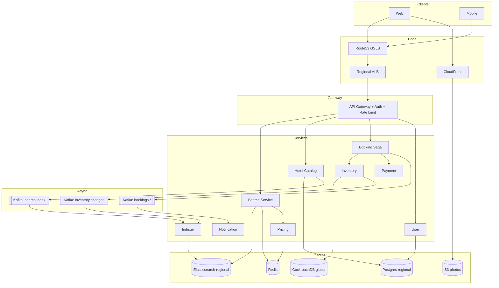

# 1. Hotel Booking System — HLD

## 1. Requirements

### Functional
- Search hotels by city, dates, guests, filters (price, stars, amenities, distance).
- View hotel detail: rooms, rates, photos, reviews, availability for date range.
- Reserve a room: hold inventory, collect payment, confirm booking.
- Cancel / modify booking subject to policy.
- Manage bookings per user (upcoming, past, receipts).
- Hotelier/admin flow: onboard hotel, manage inventory, rates, photos.
- Multi-region operation: users in United States (US) and Europe (EU) served by nearest region.

### Non-Functional
- Search 99th percentile (p99) latency < 300 ms (read path).
- Booking p99 latency < 1.5 s end-to-end (write path with payment).
- Availability: 99.99% for read path, 99.95% for booking path (payment dependency).
- Strong consistency on inventory: zero double bookings for the same room/night.
- Eventual consistency acceptable for search index (seconds lag).
- Durability: booking + payment records 11 9s (replicated + backed up).
- Scale ceiling: 100M rooms, 5M Daily Active Users (DAU), 100M searches/day, 100k bookings/day, 2 active-active regions.

## 2. Scale & Estimates (recap)

- Inventory: 1M hotels × 100 rooms = 100M rooms. Room-nights = 100M × 365 = 36.5B rows/yr (pruned).
- Monthly Active Users (MAU) 50M, DAU 5M.
- Searches: 100M/day → ~1.2k Queries Per Second (QPS) avg, peak ~5k QPS.
- Bookings: 100k/day → ~1.2/s avg, peak ~20/s (strongly consistent writes).
- Inventory store: ~20 GB per region, shardable by hotel_id.
- Search index (Elasticsearch (ES)): ~5 GB per region (denormalized hotel docs).
- Read:write ratio ≈ 1000:1.
- Full math: [estimations doc](../back_of_envelope_estimations_example.md)

## 3. High-Level Component Design

### Edge / Load Balancer (LB)
- Global Server Load Balancing (GSLB) via Route53 latency-based routing → nearest region (us-east-1, eu-west-1).
- Regional Amazon Web Services (AWS) Application Load Balancer (ALB) (Layer 7 (L7)) terminates Transport Layer Security (TLS), routes by path to Application Programming Interface (API) Gateway.
- CloudFront Content Delivery Network (CDN) in front of static assets (hotel photos, JS/CSS).

### API Gateway
- Kong / AWS API Gateway at the regional edge.
- AuthN via JSON Web Token (JWT) (issued by Auth service), AuthZ via scopes.
- Rate limits: 60 req/min/user on search, 10 req/min/user on booking attempts.
- Request routing to google Remote Procedure Call (gRPC)/Representational State Transfer (REST) backends via service discovery (Consul/EKS).

### Services (microservices)
| Service | Responsibility |
|---------|---------------|
| Search Service | Query Elasticsearch, merge pricing, return ranked results |
| Hotel Catalog Service | CRUD for hotel metadata, rooms, amenities, photos |
| Pricing Service | Dynamic pricing, promotions, currency conversion |
| Inventory Service | Authoritative source of room availability; holds + confirms |
| Booking Service | Orchestrates reserve → payment → confirm saga |
| Payment Service | Wraps Stripe/Adyen; idempotent charge API |
| User Service | Profile, preferences, booking history |
| Review Service | Ratings/reviews, moderation |
| Notification Service | Email/Short Message Service (SMS)/push on booking events |
| Indexer Service | Consumes Change Data Capture (CDC), upserts to Elasticsearch |

### Datastores
- **CockroachDB (or Spanner)**: inventory + bookings (global, strongly consistent).
- **PostgreSQL (per region)**: hotel catalog, users, reviews.
- **Elasticsearch**: search index (per region, eventually consistent).
- **Redis**: hot pricing cache, session cache, distributed locks for reservation holds.
- **Amazon Simple Storage Service (S3) + CloudFront**: hotel photos/variants.
- **Kafka**: inventory change events, booking events, search-index updates.
- **ClickHouse / Snowflake**: analytics (search-to-book funnel, pricing experiments).

### Async Infra
- Kafka topics: `inventory.changes`, `bookings.created`, `bookings.cancelled`, `payments.completed`, `search.index.updates`, `email.outbox`.
- Purpose: decouple indexer from Online Transaction Processing (OLTP), drive notifications, feed analytics, replicate search index cross-region.

## 4. API Design

```
GET  /v1/search?city=SF&checkin=2026-05-01&checkout=2026-05-03&guests=2
     → { hotels: [{id, name, price, rating, thumb, ...}], cursor }

GET  /v1/hotels/{hotel_id}
     → { id, rooms: [...], amenities, reviews_summary, photos }

GET  /v1/hotels/{hotel_id}/availability?checkin&checkout&guests
     → { rooms: [{room_type_id, count_available, price}] }

POST /v1/bookings/hold
     body: { hotel_id, room_type_id, checkin, checkout, guest_info }
     → { hold_id, expires_at, total }   # 10 min hold

POST /v1/bookings/confirm
     body: { hold_id, payment_token, idempotency_key }
     → { booking_id, status: "CONFIRMED", receipt_url }

POST /v1/bookings/{booking_id}/cancel
     → { status, refund_amount }

GET  /v1/users/{uid}/bookings?status=upcoming
```

All write APIs require `Idempotency-Key` header.

## 5. Data Storage & Schema Design

### Schema (key tables)
```
Hotel(hotel_id PK, name, city, geo_lat, geo_lng, stars, amenities[], region)
RoomType(room_type_id PK, hotel_id FK, name, capacity, base_price)
RoomInventory(hotel_id, room_type_id, date, total, booked, version)   -- PK (hotel_id, room_type_id, date)
Booking(booking_id PK, user_id, hotel_id, room_type_id, checkin, checkout,
        status, total, currency, payment_id, idempotency_key UNIQUE, created_at)
Hold(hold_id PK, hotel_id, room_type_id, checkin, checkout, user_id, expires_at)
Payment(payment_id PK, booking_id, provider_ref, status, amount)
User(user_id PK, email, name, phone, region)
Review(review_id PK, hotel_id, user_id, rating, text, created_at)
```

ES document:
```
HotelDoc { hotel_id, name, city, geo, stars, min_price_30d, amenities[], rating, photo_url }
```

### DB Choice & Justification

- **Why CockroachDB (or Spanner) for inventory + bookings**: booking requires strong consistency and Atomicity Consistency Isolation Durability (ACID) across `RoomInventory` + `Booking` + `Hold`. Global footprint with row-level leaseholders lets us pin each hotel's inventory to its geographically-nearest region (locality-aware). Serializable isolation prevents double booking without app-level gymnastics.
- **Why not single-region Postgres**: we need active-active across US/EU. Postgres multi-master (BDR, Citus) has painful conflict resolution; synchronous cross-region Postgres kills write latency (~150 ms round-trip time (RTT)). Cockroach handles this with Raft groups per range.
- **Why not Cassandra/DynamoDB**: no multi-row ACID. Double-booking prevention would require Lightweight Transactions (Cassandra) or conditional writes + sagas (Dynamo), which are slow (~100 ms) and hard to get right when holds + bookings + inventory must update atomically.
- **Why not MongoDB**: multi-document transactions exist but perform poorly on the sharded tier we'd need at 100M rooms; also lacks true active-active.
- **Why not Redis as primary**: not durable enough for financial records; Append-Only File (AOF) fsync trade-offs don't meet 11 9s durability requirement.
- **Why Elasticsearch for search**: free-text, geo, faceted filters, relevance ranking out of the box; eventual consistency is fine because inventory is re-checked at booking time.
- **Why Postgres for catalog/users/reviews**: relational, low write volume, regional ownership, mature tooling.

### Sharding & Partitioning
- **Cockroach**: range-partitioned by `(hotel_id, date)` for `RoomInventory`; `hotel_id`-locality pins ranges to region of the hotel.
- **Postgres catalog**: sharded by `hotel_id` hash (Citus) when >1 Terabyte (TB); today fits single primary per region.
- **Elasticsearch**: index per region, sharded by `city_hash` (8 shards × 1 replica) so city-level queries stay local.
- **Kafka**: partitioned by `hotel_id` so all events for a hotel land in one partition (ordering per hotel).

### Replication
- Cockroach: Raft, Replication Factor (RF)=3 per region, synchronous within region, asynchronous cross-region for non-local ranges.
- Postgres: primary + 2 streaming replicas per region.
- Elasticsearch: 1 primary + 1 replica per shard, per region.
- S3: cross-region replication enabled for photos.

## 6. Scalability & Performance

### Caching
- Redis holds: hot hotel pages (Time To Live (TTL) 60 s), pricing quotes keyed by `(hotel_id, date_range, guests)` TTL 30 s, user session, autocomplete for city names.
- CloudFront caches `GET /v1/hotels/{id}` JavaScript Object Notation (JSON) for 30 s with `stale-while-revalidate`.
- Negative-result caching for "no availability" with short TTL 5 s to absorb retries.

### Message Queues
- Kafka absorbs bursts in indexing and notifications.
- `bookings.created` fan-out → Notification, Analytics, Loyalty, Customer Relationship Management (CRM) consumers.
- Dead Letter Queue (DLQ) topics for poison messages; retry with exponential backoff.

### Read-heavy vs Write-heavy
- Overwhelmingly read-heavy (1000:1). Scale search tier horizontally (ES, stateless Search Service, Redis). Bookings are the contention point — those go straight to Cockroach with per-room leaseholder affinity.

## 7. Deep Dive

### Cross-region replication & double-booking prevention
- Each room-night (`hotel_id, room_type_id, date`) is "owned" by exactly one region (the hotel's home region) — Cockroach locality constraints. All writes for that range are served by one leaseholder, so no cross-region conflict is possible for the same row.
- A user in EU booking a US hotel pays a ~80 ms RTT tax on the write, which is acceptable for ~20 QPS peak.
- Reservation hold flow:
  1. Client → `POST /bookings/hold`: Inventory Service opens a serializable txn, checks `total - booked ≥ 1` for every date in range, inserts `Hold` row, increments `booked`, commits.
  2. Hold TTL = 10 min; a background sweeper decrements `booked` for expired holds.
  3. `POST /bookings/confirm`: another txn converts Hold → Booking, calls Payment, and persists `payment_id`.
- Alternative considered: Redis distributed lock (Redlock). Rejected — not safe under partition, and we already have a durable store that gives us serializability for free.
- Idempotency: `Idempotency-Key` stored with Booking row; duplicate confirm returns the original result.

### Search index vs source of truth
- Elasticsearch is a read-model, not the truth. Indexer Service consumes `inventory.changes` + `hotel.updates` from Kafka via Debezium CDC on Cockroach/Postgres and upserts `HotelDoc`.
- ES stores only `min_price_30d` and boolean "has availability in next 30 d" — not exact nightly counts. This drastically reduces update volume (otherwise every booking would re-index).
- On booking click-through, Search Service calls Inventory Service for exact availability and price, so ES staleness never causes a bad booking — only bad ranking/filtering on the edge.
- Lag budget: 5 s p99. If indexer is behind, a banner shows "prices/availability may have changed".

## 8. Trade-offs

- **Consistency, Availability, Partition tolerance (CAP)**: Inventory path picks **CP** (consistency over availability — we'd rather 503 a booking than double-book). Search path picks **AP** (return stale results than fail).
- **Consistency model**: Serializable for inventory + bookings; read-your-writes for user's own booking list (pin to region); eventual for search index and review aggregates.
- **Failure handling**:
  - Circuit breakers around Payment, Pricing (Hystrix/resilience4j).
  - Retries with jitter and idempotency keys on all writes.
  - Booking saga: if payment fails, compensating txn releases the hold.
  - DLQs on all Kafka consumers; replay tooling.
  - Inventory service has a "panic" mode that switches to read-only if Cockroach is degraded, preventing data corruption.

## 9. Mermaid Diagram


