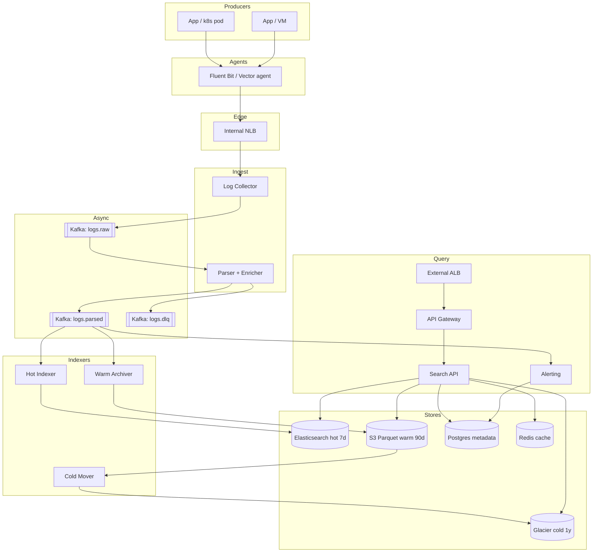

# 2. Logging Application — HLD

## 1. Requirements

### Functional
- Ingest structured + unstructured log lines from thousands of services.
- Parse, enrich (service, host, env, trace_id), and index for search.
- Full-text + field search over recent logs (last 7 days).
- Slower search + aggregation over warm tier (up to 90 days).
- Cold retrieval (download/archive) up to 1 year.
- Alerting on log patterns (e.g., error rate, specific regex).
- Multi-tenant isolation (per team / per service).
- Retention policies per tenant / per log level.

### Non-Functional
- Ingest 99th percentile (p99) from agent → durable: < 2 s.
- Search 95th percentile (p95) on hot tier: < 1 s for simple queries, < 5 s for aggregations.
- Availability: 99.9% ingest (no data loss, may buffer); 99.5% search.
- Durability: 11 9s for ingested logs (replicated 3×).
- Back-pressure: ingest layer must absorb 3× burst without dropping.
- Scale ceiling: 1M logs/sec sustained, 500 MB/s, 43 TB/day.

## 2. Scale & Estimates (recap)

- 10k services × ~100 logs/s avg = **1M logs/s**.
- Avg line size: 500 B → **500 MB/s ingest**.
- **43 TB/day** raw ingest (~15 PB/yr).
- Hot tier (7 d, Elasticsearch (ES), Replication Factor (RF)=3, compressed ~2×): ~**900 TB** provisioned.
- Warm tier (90 d, Parquet on Amazon Simple Storage Service (S3), compressed ~5×): ~**400 TB**.
- Cold tier (1 y, Glacier, compressed ~5×): ~**1.5 Petabyte (PB)**.
- Query Queries Per Second (QPS): ~100/s (humans + dashboards + alert rules).
- Full math: [estimations doc](../back_of_envelope_estimations_example.md)

## 3. High-Level Component Design

### Edge / Load Balancer
- Logs ingested via agent push → internal Network Load Balancer (NLB) (Layer 4 (L4)) in front of Log Collector pods (google Remote Procedure Call (gRPC)/HyperText Transfer Protocol (HTTP)).
- Query path: external Application Load Balancer (ALB) (Layer 7 (L7)) → Search Application Programming Interface (API), Transport Layer Security (TLS) terminated there.

### API Gateway
- Query tier behind Kong/Envoy with JSON Web Token (JWT) auth, tenant scoping, per-tenant rate limits.
- Ingest tier authenticates agents via mutual Transport Layer Security (mTLS) + per-service API keys (no user gateway).

### Services (microservices)
| Service | Responsibility |
|---------|---------------|
| Log Agent (Fluent Bit / Vector) | Runs on every host/pod; tails files, batches, ships |
| Log Collector | Terminates agent connections, validates, writes to Kafka |
| Parser / Enricher | Kafka consumer; grok parse, add metadata, route to indexers |
| Hot Indexer | Writes to Elasticsearch hot tier |
| Warm Archiver | Batches + compacts to Parquet on S3 |
| Cold Mover | Lifecycle job S3 → Glacier |
| Search API | Query across hot (ES), warm (Athena/Presto), cold (unfreeze) |
| Alerting Service | Saved queries / thresholds; publishes to PagerDuty/Slack |
| Tenant / Quota Service | Tenant metadata, retention policy, quota accounting |

### Datastores
- **Elasticsearch (OpenSearch)**: hot tier, last 7 d.
- **S3 + Parquet + Iceberg/Delta catalog**: warm tier (7–90 d).
- **Glacier Deep Archive**: cold tier (90 d – 1 y).
- **PostgreSQL**: tenant metadata, saved searches, alert rules, user/Role-Based Access Control (RBAC).
- **Redis**: query result cache, rate-limit counters.
- **ClickHouse (optional)**: metric-style log aggregates for dashboards (fast group-by).

### Async Infra
- **Kafka**: `logs.raw` (partitioned by `tenant_id`), `logs.parsed`, `logs.dlq`, `alerts.fired`.
- Retention on `logs.raw`: 24 h (safety buffer in case indexer lags).
- Schema registry (Confluent / Avro) for parsed log schema.

## 4. API Design

```
# Ingest
POST /v1/logs/ingest               (gRPC streaming preferred)
     body: [{ ts, level, service, host, msg, attrs{...}, trace_id }, ...]
     → { accepted: n, rejected: m }

# Query
POST /v1/search
     body: {
       tenant, from, to, query: "level:ERROR AND service:checkout",
       size: 100, cursor
     }
     → { hits: [...], cursor, took_ms, tier: "hot|warm|cold" }

POST /v1/aggregations
     body: { tenant, from, to, query, group_by: ["service","level"], interval:"1m" }
     → { buckets: [...] }

# Alert rules
POST /v1/alerts
     body: { name, query, threshold, window, channel }
GET  /v1/alerts/{id}/history
```

## 5. Data Storage & Schema Design

### Schema (key tables/collections)
```
ESLogDoc(@timestamp, tenant_id, service, host, level, msg, trace_id, attrs{...})
   -- ES index: logs-{tenant}-{YYYY.MM.DD}

ParquetLog(ts, tenant_id, service, host, level, msg, attrs, partition=date/service)

Tenant(tenant_id PK, name, retention_hot_days, retention_warm_days, quota_gb_day)
SavedQuery(sq_id PK, tenant_id, user_id, name, query_dsl)
AlertRule(rule_id PK, tenant_id, query, threshold, window, channel, enabled)
```

### DB Choice & Justification

- **Why Elasticsearch (hot tier)**: inverted index for ad-hoc full-text + structured filters, fast aggregations on recent data, mature Index Lifecycle Management (ILM) for rollover, de-facto standard for log search (Kibana).
- **Why not Cassandra/Scylla for hot**: no inverted index; you'd bolt SASI on, which is limited. Group-by and free-text search are painful.
- **Why not Postgres**: B-tree indexes don't scale to 1M writes/s or PB-scale text search. Generalized Inverted Index (GIN) is fast enough for small workloads only.
- **Why not BigQuery/Snowflake for hot**: per-query latency ~seconds even for small slices; great for warm/cold, bad for interactive debugging.
- **Why S3 + Parquet + Iceberg (warm tier)**: massively cheaper than ES ($0.023/GB vs $0.20+/GB SSD-backed), columnar compression is great for logs, and Iceberg lets us schema-evolve and partition-prune without rewriting data.
- **Why Glacier for cold**: $0.00099/GB for retention we almost never read; restore-on-demand is acceptable for compliance/audit queries.
- **Why Kafka as ingest buffer**: decouples producers from indexers, absorbs 3× bursts, provides replay for reindexing, ordered per-partition.
- **Why Postgres for metadata**: small, relational, needs joins (tenants → rules → users) and transactions; don't over-engineer.

### Sharding & Partitioning
- Kafka: partitioned by `tenant_id` hash (~512 partitions), ordering guaranteed per tenant.
- Elasticsearch: one index per tenant per day (`logs-{tenant}-2026.04.11`), 10 primary shards × 1 replica for big tenants, 1×1 for small ones. ILM rolls daily.
- S3/Parquet: partitioned by `tenant_id/date/service`, file size ~256 MB (compactor merges small files).
- ClickHouse (if used): `MergeTree` partitioned by `toYYYYMM(ts)`, ordered by `(tenant_id, service, ts)`.

### Replication
- Kafka: RF=3, `min.insync.replicas=2`, `acks=all`.
- Elasticsearch: 1 primary + 1 replica per shard (eff. RF=2; Kafka buffer provides the third copy).
- S3: built-in 11 9s durability, cross-region replication for critical tenants.
- Postgres: primary + 2 streaming replicas + Point-In-Time Recovery (PITR).

## 6. Scalability & Performance

### Caching
- Redis caches query results for saved dashboards (keyed by normalized query + time window, Time To Live (TTL) 30 s).
- ES "request cache" for aggregation queries on frozen time ranges.
- Client-side caching for tenant metadata.

### Message Queues
- Kafka is the backbone — producers never block on indexers. If ES is down, logs pile up in Kafka for up to 24 h without loss.
- Dead Letter Queue (DLQ) (`logs.dlq`) for parse failures; ops tool to inspect + reprocess.
- Alerting consumer is a separate consumer group — alerts never blocked by indexing lag.

### Read-heavy vs Write-heavy
- Very **write-heavy** on ingest (500 MB/s). Read QPS is small but reads are "heavy" (large scans). Scale indexer pods horizontally; hot tier is the bottleneck and most expensive piece — tune aggressively.

## 7. Deep Dive

### Tiered storage + ILM
- **Hot (0–7 d, ES)**: bulk writes via `_bulk` API, 5–10 MB per request, 1–2 s refresh interval (searches see data within 2 s). Solid State Drive (SSD)-backed nodes. Force-merge on day 2.
- **Rollover**: ILM rolls the write index when >50 GB or >1 day. Old indices are "warm-phased" in ES first (bigger shards, fewer replicas) on Hard Disk Drive (HDD) nodes for day 2–7.
- **Warm (7–90 d, S3 Parquet)**: `Warm Archiver` consumer reads from Kafka (or replays `logs.parsed`) and writes Parquet files to S3 via Iceberg. Search over this tier via Presto/Trino/Athena. Typical query: 5–30 s.
- **Cold (90–365 d, Glacier)**: lifecycle rule on S3 prefix `warm/` → Glacier Deep Archive. Restore Service Level Agreement (SLA) 12 h; user sees "archived — restore job queued" in User Interface (UI).
- **Cost impact**: hot $0.20/GB/mo, warm $0.023/GB/mo, cold $0.001/GB/mo. Moving from "all hot" to tiered saves ~90%.

### Ingest pipeline + back-pressure
- Agent (Fluent Bit) buffers on local disk (64 MB per pod) — handles Collector/Kafka outage gracefully.
- Collector → Kafka with `acks=all`; if Kafka slow, Collector returns 503 and agent retries with jitter.
- Parser/Enricher reads `logs.raw`, parses with grok/regex (precompiled per service), enriches with host/Kubernetes (k8s) metadata from a cache, writes to `logs.parsed`.
- Indexer batches 10k docs or 5 MB → ES `_bulk`. If ES rejects (429), consumer pauses and resumes with exponential backoff — Kafka offsets not advanced, so no data loss.
- Tenant quota enforcement at Parser: over-quota logs routed to a `throttled` topic with sampled indexing + a warning banner.

## 8. Trade-offs

- **Consistency, Availability, Partition tolerance (CAP)**: Ingest path = **AP** (never drop; accept eventual indexing lag). Query path = **AP** as well (stale results over errors).
- **Consistency model**: eventual — logs appear in search within ~5 s p99.
- **Failure handling**:
  - Agent disk buffer + Kafka buffer + consumer offset = at-least-once delivery; dedupe via `log_id = hash(host+ts+offset)`.
  - DLQ for parse failures, re-drivable.
  - ES node loss: shards re-replicate from replicas; worst case re-index from Kafka (24 h retention window).
  - Circuit breaker in Search API: if hot tier is degraded, fall back to Parquet tier with a UI note.
  - Rate limiting at Collector prevents a runaway service from drowning the cluster.

## 9. Mermaid Diagram


