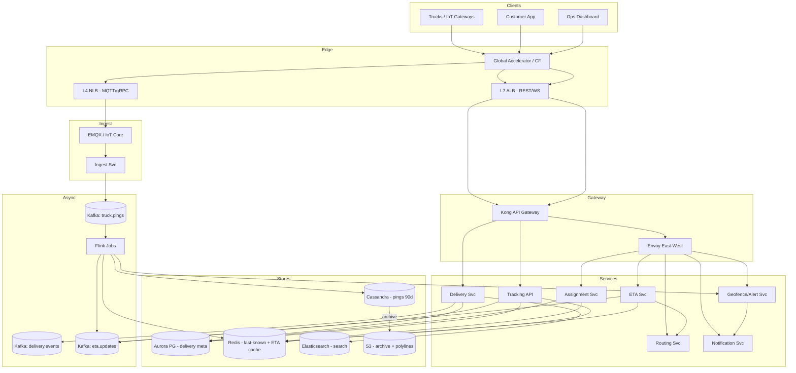

# 1. Logistics Management System — High-Level Design (HLD)

## 1. Requirements

### Functional
- Onboard and manage a fleet of trucks (registration, capacity, type, status: idle/en-route/maintenance).
- Ingest Global Positioning System (GPS) pings from every active truck every 5 seconds (lat, lon, speed, heading, fuel, engine state).
- Create delivery orders with pickup + drop waypoints (up to 20 stops per route).
- Allocate / assign a truck to a delivery to maximize fleet utilization and minimize delivery time.
- Compute and continuously refresh Estimated Time of Arrivals (ETAs) (every 30s) for all in-flight deliveries, factoring live traffic.
- Real-time tracking User Interface (UI) for ops + customer (last known location, progress %, ETA, route polyline).
- Geofence + Service Level Agreement (SLA) breach alerts (truck off-route, stopped > threshold, ETA slipping).
- Historical trip playback and analytics (driver behavior, route efficiency).
- Search trucks/deliveries by id, region, status, customer.

### Non-Functional
- Ingest latency 99th percentile (p99) < 500 ms from ping to "visible on map".
- Tracking read latency p99 < 200 ms.
- Availability 99.95% for tracking & ingest; 99.99% for delivery metadata writes.
- Durability: no loss of delivery records (11 nines); raw pings tolerate ~0.01% loss.
- Consistency: strong for delivery/assignment state; eventual for location & ETA.
- Scale ceiling: 500k trucks, 160k pings/s peak, 2M deliveries/day, growth 2× in 18 months.
- 90-day hot location history, 5-year retention on delivery metadata.

## 2. Scale & Estimates (recap)

- Fleet: 500k trucks, 80% active = 400k live concurrently.
- GPS ping cadence: every 5s → 400k / 5 = **80k pings/s average, 160k/s peak**.
- Deliveries: 2M/day → ~25 writes/s (peak ~100/s during business hours).
- ETA recompute: every 30s for all in-flight deliveries. Assume ~400k active legs → **~13k ETA computes/s**.
- Ping payload ~100 B → 80k × 100 = 8 MB/s raw → **~700 GB/day**.
- 90-day hot storage: 700 GB × 90 ≈ **63 TB**, × Replication Factor (RF) 3 ≈ **190 TB**.
- Delivery metadata: 2M/day × 2 KB ≈ 4 GB/day → ~7 TB over 5y.
- Full math: [estimations doc](../back_of_envelope_estimations_example.md)

## 3. High-Level Component Design

### Edge / Load Balancer (LB)
- Global anycast with **Amazon Web Services (AWS) Global Accelerator / Cloudflare** fronting regional Application Load Balancers (ALBs).
- **Layer 4 (L4) Network Load Balancer (NLB)** terminates MQTT/google Remote Procedure Call (gRPC) from trucks (long-lived connections, sticky).
- **Layer 7 (L7) ALB** for customer/ops Representational State Transfer (REST) Application Programming Interfaces (APIs) with Transport Layer Security (TLS) termination (ACM certs, mutual Transport Layer Security (mTLS) for trucks).
- Geo routing: pings go to nearest regional ingest cluster (latency + data sovereignty).

### API Gateway
- **Envoy** for internal east-west + **Kong** at the public north-south edge.
- Auth: Open Authorization 2 (OAuth2)/JSON Web Token (JWT) for customers & ops; device certs (mTLS) for truck gateways.
- Rate limit: 1 req/5s/truck on ingest; 100 Requests Per Second (RPS)/user on tracking reads; token bucket in Redis.
- Routing: path-based to tracking-svc, delivery-svc, assignment-svc, analytics-svc.

### Services (microservices)
| Service | Responsibility |
|---------|---------------|
| Ingest Service | Accept GPS pings over MQTT/gRPC, validate, push to Kafka. |
| Location Service | Serves "current location" reads; keeps last-known in Redis + writes to time-series Database (DB). |
| Delivery Service | Create Read Update Delete (CRUD) for orders, waypoints, state machine (created→assigned→picked→delivered). |
| Assignment Service | Matches deliveries to trucks (optimization: distance, capacity, SLA, fuel). |
| ETA Service | Recomputes ETAs every 30s using map provider + live traffic + current leg. |
| Routing Service | Shortest/fastest path, polyline generation (wraps OSRM/Valhalla). |
| Tracking API | Read-side aggregator: merges delivery + location + ETA for UI. |
| Geofence/Alert Service | Evaluates rules (off-route, idle, SLA breach), emits alerts. |
| Notification Service | Push/Short Message Service (SMS)/email fan-out. |
| Analytics Service | Batch jobs on history (Spark/Flink) for driver scorecards, utilization. |

### Datastores
- **Cassandra** — raw time-series location history (ping log, 90 days hot).
- **PostgreSQL (Aurora)** — delivery, truck, driver, customer metadata (strong consistency).
- **Redis Cluster** — last-known location per truck, hot ETA cache, rate-limit counters.
- **Elasticsearch** — search over deliveries/trucks (by id, region, status, driver).
- **Amazon Simple Storage Service (S3) + Parquet** — cold archive past 90 days, analytics lake.
- **H3 / Geohash index in Redis** — spatial bucket of trucks for nearest-neighbor lookups.

### Async Infra
- **Kafka** topics:
  - `truck.pings` (partitioned by truck_id, 256 partitions) — raw GPS.
  - `delivery.events` — state machine transitions (assigned, picked, delivered).
  - `eta.updates` — pushed to tracking consumers + websockets.
  - `alerts.raw` — geofence/SLA breaches.
- **Flink** jobs consume `truck.pings` for geofence eval, ETA triggers, anomaly detection.
- **Amazon Simple Queue Service (SQS) Dead Letter Queue (DLQ)** for failed notification deliveries.

## 4. API Design

```
POST /v1/trucks                         # register
POST /v1/trucks/{id}/ping               # (internal, via MQTT normally)
GET  /v1/trucks/{id}/location           # last-known + staleness

POST /v1/deliveries                     # create {waypoints[], cargo, sla}
GET  /v1/deliveries/{id}                # full state + current leg
POST /v1/deliveries/{id}/assign         # manual override (ops)
GET  /v1/deliveries/{id}/eta            # {eta_ts, confidence}
GET  /v1/deliveries/{id}/track          # Server-Sent Events (SSE)/WebSocket stream

POST /v1/assignments/solve              # batch optimizer trigger
GET  /v1/fleet/nearby?lat=&lon=&r=      # H3 lookup, ops dashboard
```

Sample response (JavaScript Object Notation, JSON) for `GET /v1/deliveries/{id}`:
```json
{
  "id": "del_123", "status": "IN_TRANSIT",
  "truck_id": "trk_9", "current_leg": 3,
  "waypoints": [...], "eta": "2026-04-11T18:42:00Z",
  "last_location": {"lat":..,"lon":..,"ts":..}
}
```

## 5. Data Storage & Schema Design

### Schema

```
Truck(truck_id PK, plate, capacity_kg, type, status, home_depot_id, driver_id, created_at)

Driver(driver_id PK, name, license, phone, rating, current_truck_id)

Delivery(delivery_id PK, customer_id, status, created_at, sla_deadline,
         assigned_truck_id, current_leg, total_legs, route_polyline_s3_key)

Waypoint(delivery_id PK, seq CK, lat, lon, type[pickup|drop], eta, actual_arrival)

LocationPing(truck_id PK, ts CK DESC, lat, lon, speed, heading, fuel_pct)
  # Cassandra, partitioned by (truck_id, day_bucket), clustered by ts DESC

LastKnown(truck_id PK → {lat, lon, ts, speed})   # Redis

ETACache(delivery_id PK → {eta_ts, computed_at})  # Redis, TTL 45s

Assignment(assignment_id PK, delivery_id, truck_id, score, assigned_at, algo_version)

GeofenceRule(rule_id PK, delivery_id, type, polygon_geojson, threshold)
```

### DB Choice & Justification

- **Why Cassandra for location pings**: extremely high write throughput (160k/s peak), linear horizontal scale, Time To Live (TTL) built-in for 90-day expiry, partition key `(truck_id, day_bucket)` gives a perfect natural shard and clustering on `ts DESC` makes "last N pings for a truck" a single partition scan. Tunable consistency (LOCAL_QUORUM for writes, ONE for reads) matches our eventual-consistency tolerance for location.
- **Why Postgres (Aurora) for delivery metadata**: we need strong consistency, multi-row transactions (state machine + waypoint updates + assignment in one commit), foreign keys, joins on delivery + driver + truck. Write volume is only ~25/s — Postgres handles it with room to spare. Aurora gives 6-way replication and <1s failover.
- **Why not Postgres for pings**: 160k writes/s would require extreme vertical scaling + manual sharding; Postgres isn't built for time-series at this cadence. Retention-based deletion would cause massive bloat and vacuum storms.
- **Why not DynamoDB for pings**: cost model (Write Capacity Unit, WCU) at 160k writes/s is painful (~$6k/mo just for writes before storage). Cassandra on self-managed nodes is ~3× cheaper at this volume, and we need the flexible secondary clustering. DynamoDB is good up to ~10k/s; beyond that Cassandra/ScyllaDB wins.
- **Why not MongoDB**: weaker time-series story than Cassandra; sharding balancer has historically been painful under sustained write pressure; the document model gives us nothing here since pings are fixed-shape.
- **Why not Redis as primary**: in-memory cost for 63 TB is prohibitive (~$400k/mo). Redis is perfect as a **cache** for last-known (400k keys × 200 B ≈ 80 MB, trivial) but not as the system of record.
- **Why InfluxDB/TimescaleDB considered**: Timescale (Postgres extension) would work for ~10-20k writes/s but hits a wall near 100k/s without aggressive sharding. We'd rather pick a database designed for our peak.

### Sharding & Partitioning
- Cassandra: partition key `(truck_id, day_bucket)` — bounds partition size (~17k rows/day ≈ 1.7 MB, well below 100 MB soft limit). Secondary table `pings_by_region` keyed on `(h3_cell, ts_bucket)` for geo scans.
- Postgres: shard by `tenant_id` (logistics company) once >1 TB; until then, single writer + read replicas.
- Redis: cluster with 32 shards, consistent hashing on truck_id.

### Replication
- Cassandra RF=3 across 3 Availability Zones (AZs), LOCAL_QUORUM writes, LOCAL_ONE reads.
- Aurora: 1 writer + 5 readers, synchronous to 4/6 storage nodes.
- Redis: 1 primary + 2 replicas per shard; async replication.
- Kafka: RF=3, min.insync.replicas=2, acks=all on `delivery.events`; acks=1 on `truck.pings` (throughput > durability for pings).

## 6. Scalability & Performance

### Caching
- **Last-known location**: Redis, written on every ping consumer commit, read by tracking API. Single-digit ms p99.
- **ETA cache**: Redis with TTL 45s (recompute cadence 30s + slack). Cache key `eta:{delivery_id}`.
- **Route polyline**: S3 + Content Delivery Network (CDN) CloudFront; only recomputed on reroute events.
- **Fleet geo-index**: Redis sorted set keyed by H3 cell → member set of truck_ids; enables O(log n) nearest-neighbor.

### Message Queues
- Kafka decouples ingest from downstream (ETA, geofence, analytics). A consumer lag spike on ETA doesn't slow ingest.
- Partitioning `truck.pings` by truck_id guarantees per-truck ordering (critical for geofence state).
- Flink checkpoints every 10s to S3; exactly-once from Kafka → Cassandra sink via idempotent writes keyed on (truck_id, ts).

### Read-heavy vs Write-heavy
- **Write-heavy on pings** (80k/s steady). Scaled via Kafka partitioning + Cassandra Log-Structured Merge tree (LSM).
- **Read-heavy on tracking** (every customer app polling / streaming). Served from Redis + WebSocket fan-out; database is bypassed for hot path.
- Assignment service is CPU-heavy (optimization), not I/O heavy — runs on dedicated node pool, scales on queue depth.

## 7. Deep Dive

### ETA Computation Pipeline
1. Scheduler publishes a "recompute" tick to `eta.compute` topic every 30s, partitioned by delivery_id.
2. ETA workers consume; for each delivery, fetch: current truck location (Redis), remaining waypoints (Postgres, cached), live traffic tile (Google/Mapbox Roads API or internal OSRM with traffic overlay).
3. Compute: for each remaining leg, `distance / effective_speed`, sum → `eta_ts`.
4. Write to Redis `eta:{id}` + emit to `eta.updates` Kafka topic.
5. WebSocket gateway consumes `eta.updates`, pushes to subscribed clients.
6. **Optimization**: skip recompute if truck hasn't moved > 20 m since last tick (debounce), cuts load ~40%.
7. **Fallback**: if map provider is down, use last good speed × remaining distance (degraded mode, confidence flag=LOW).

### Location Ingest Backbone
- Trucks open persistent MQTT connection to regional **EMQX / AWS Internet of Things (IoT) Core** broker, authenticated via mTLS device cert.
- Broker bridges to Kafka `truck.pings` topic (ordered per truck via device_id as partition key).
- **Back-pressure**: if Kafka lag > 30s, Ingest drops to sampling (1 of 3 pings) and flags degraded mode.
- **Ordering guarantee**: per-truck First-In-First-Out (FIFO) via partition key; consumers use ts to drop out-of-order stragglers.
- **Batching**: trucks with poor connectivity buffer locally up to 60s and flush as array; Ingest unrolls.
- Cassandra writer is an idempotent Flink sink — replayable from any Kafka offset without dupes.

### Driver/Route Assignment (briefly, as secondary deep-dive)
- Greedy nearest-neighbor within H3 k-ring for real-time (<1s).
- Periodic (every 5 min) batch optimizer (OR-Tools Vehicle Routing Problem, VRP) rebalances unassigned + in-flight legs.
- Scoring: `w1 * eta_to_pickup + w2 * capacity_penalty + w3 * driver_hours_left - w4 * fuel_level`.

## 8. Trade-offs

- **Consistency, Availability, Partition tolerance (CAP)**: Cassandra (location) chooses **Availability + Partition tolerance (AP)** — we'd rather serve stale location than fail tracking. Postgres (delivery) chooses **Consistency + Partition tolerance (CP)** — never accept conflicting assignment writes.
- **Consistency model**: Strong for delivery state (Postgres, serializable on state transitions). Eventual for location and ETA (read-your-writes not guaranteed on tracking UI, which is fine — user sees update within 1-2s).
- **Failure handling**:
  - Circuit breaker (Hystrix/resilience4j) on map provider; fallback to last-known speed.
  - Retries with exponential backoff on Kafka producer; idempotent Flink consumer.
  - DLQ for poison pings (malformed payload), alerts after N=100.
  - Delivery state transitions use Postgres advisory locks + idempotency key on API to avoid double-assign.
  - Kafka replication + multi-AZ ensures broker failure is transparent.
  - Regional failover: Domain Name System (DNS) health-check flips to secondary region; Aurora global database for cross-region read.

## 9. Mermaid Diagram


