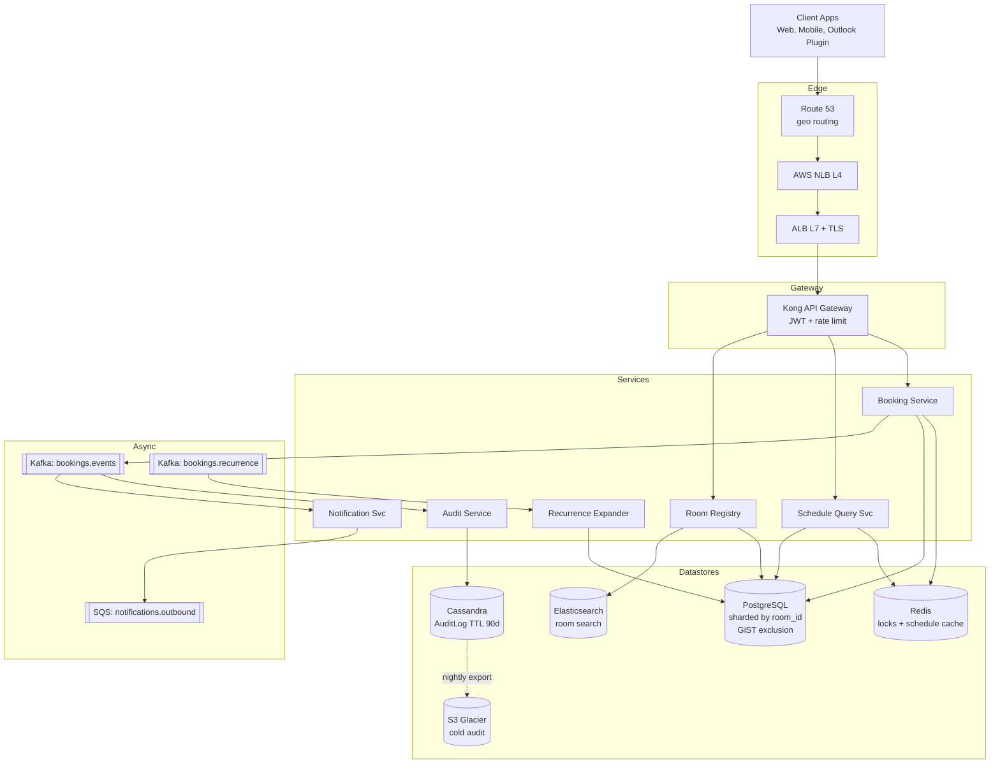

# 1. Meeting Scheduler — High-Level Design (HLD)

## 1. Requirements

### Functional
- Book a meeting room for a `[start, end]` interval given room id, organizer, attendees.
- Cancel / modify a booking (must be audit-logged).
- Query a room's schedule for a day/week; query free slots across a building.
- Enforce room capacity (attendee count <= room capacity) at booking time.
- Stream of booking requests must be serialized per room — no double-booking.
- Maintain audit log of every create / modify / cancel event with a Time To Live (TTL) of 90 days.

- Minimize "spillage" — fragmentation of free time caused by arbitrary placements (best-fit packing of incoming requests into existing free windows where possible).
- Support recurring meetings (weekly standups) as a first-class concept.

### Non-Functional
- **Latency**: 99th percentile (p99) booking write < 200 ms; p99 schedule read < 50 ms.
- **Availability**: 99.95% for reads, 99.9% for writes (booking is write-critical but brief downtime is tolerable per-room).
- **Durability**: 11 9s for confirmed bookings; audit log is WORM-ish, never lost inside TTL window.
- **Consistency**: Strong per-room (linearizable). Across rooms is independent — no cross-room transactions needed.
- **Scale ceiling**: 1M rooms, 50M bookings/day, 2.3 TB audit at steady state.

## 2. Scale & Estimates (recap)

- 10k companies x 100 rooms = **1M rooms**
- 50 bookings/room/day x 1M = **50M bookings/day**
- Avg meeting = 30 min, audit retention = 90 days
- Booking Queries Per Second (QPS): 50M / 86400 = **~580/s average**
- Peak QPS (workday compression, ~6 effective hours, 3x burst): **~5k/s**
- Row size: ~500 B → **25 GB/day** of bookings
- Audit log (create/modify/cancel ≈ 1.5x bookings): **~75M events/day**, ~600 B each → ~45 GB/day
- 90 day audit = **~4 TB** (we'll round to 2.3 TB effective after compression)
- Full math: [estimations doc](../back_of_envelope_estimations_example.md)

## 3. High-Level Component Design

### Edge / Load Balancer (LB)
- **Amazon Web Services (AWS) Network Load Balancer (NLB) (Layer 4 (L4))** in front of public Application Programming Interface (API) nodes for raw Transmission Control Protocol (TCP) throughput.
- **Application Load Balancer (ALB) (Layer 7 (L7))** behind NLB for path routing, Transport Layer Security (TLS) termination (ACM certs).
- Geo routing via **Route 53 latency-based** — calendars are regional (Europe (EU) companies stay in EU cluster).

### API Gateway
- **Kong** or **AWS API Gateway**.
- JSON Web Token (JWT) auth (OIDC via company SSO / Okta).
- Rate limit: 100 req/s per user, 1k req/s per tenant.
- Routes `/v1/bookings/*`, `/v1/rooms/*`, `/v1/schedule/*` to the right backend service.
- Tenant header injection from JWT claims (multi-tenant isolation).

### Services (microservices)
| Service | Responsibility |
|---------|---------------|
| **Booking Service** | Create / modify / cancel bookings; enforces per-room serialization and capacity rules. |
| **Schedule Query Service** | Read-only: room schedules, free-slot search, building-wide availability. Optimized for reads. |
| **Room Registry Service** | CRUD for rooms, capacity, amenities, building/floor metadata. |
| **Audit Service** | Consumes booking events and writes immutable audit rows. Handles TTL cleanup. |
| **Notification Service** | Emails / push for reminders, cancellations, conflicts. |
| **Recurrence Expander** | Materializes recurring meetings into concrete bookings over a rolling 60-day window. |

### Datastores
- **PostgreSQL (sharded by room_id)** — canonical booking + room tables; supports per-room transactions and range queries.
- **Cassandra** — audit log (append-only, time-series, TTL native).
- **Redis** — per-room lock keys + hot schedule cache (today/tomorrow for hot rooms).
- **Elasticsearch (ES)** — room search (by amenity, building, floor, capacity).
- **Amazon Simple Storage Service (S3)** — long-term cold audit archive (post-90-day exports for compliance).

### Async Infra
- **Kafka topic `bookings.events`** — booking create/modify/cancel events fan out to Audit, Notification, Analytics.
- **Kafka topic `bookings.recurrence`** — triggers recurrence expansion jobs.
- **Amazon Simple Queue Service (SQS) `notifications.outbound`** — email/push worker queue, Dead Letter Queue (DLQ) after 3 retries.

## 4. API Design

```
POST /v1/bookings
  body: { room_id, start_ts, end_ts, organizer, attendees[], title }
  resp: { booking_id, status: "CONFIRMED" | "CONFLICT", conflict_with? }

PATCH /v1/bookings/{id}
  body: { start_ts?, end_ts?, attendees? }

DELETE /v1/bookings/{id}          -> soft-cancel, audit row written

GET  /v1/rooms/{room_id}/schedule?date=YYYY-MM-DD
GET  /v1/rooms/search?building=X&capacity>=10&amenity=projector
GET  /v1/rooms/{room_id}/free-slots?date=YYYY-MM-DD&duration=30m

GET  /v1/bookings/{id}/audit     -> audit trail
```

## 5. Data Storage & Schema Design

### Schema (key tables)
```
Rooms(room_id PK, tenant_id, building_id, floor, capacity, amenities JSON, tz)

Bookings(
  booking_id PK,
  room_id FK,                -- shard key
  tenant_id,
  start_ts, end_ts,
  organizer_id,
  attendee_count,
  status ENUM(CONFIRMED,CANCELLED),
  version INT,               -- optimistic concurrency
  created_at, updated_at,
  INDEX (room_id, start_ts)  -- range scans per room
)

BookingAttendees(booking_id, user_id, rsvp_status)

AuditLog(                    -- Cassandra
  room_id,                   -- partition key
  event_ts TIMEUUID,         -- clustering key DESC
  booking_id,
  event_type, actor, before JSON, after JSON
) WITH default_time_to_live = 7776000   -- 90 days

RecurrenceRules(rule_id PK, room_id, rrule, dt_start, dt_end)
```

### DB Choice & Justification
- **Why PostgreSQL for bookings**: per-room strong consistency is the whole ballgame. We need `SELECT ... FOR UPDATE` or SERIALIZABLE to detect interval overlaps atomically. PG's `tsrange` + GiST exclusion constraint (`EXCLUDE USING gist (room_id WITH =, during WITH &&)`) enforces "no two bookings on the same room overlap" at the database (DB) level — that's a killer feature here. Sharding by `room_id` keeps every booking transaction single-partition, so we never need a distributed transaction.
- **Why not MySQL**: no native range types, no exclusion constraints; we'd have to simulate overlap checks with app-side locks which is strictly worse. PG wins on the domain fit.
- **Why not Cassandra/DynamoDB for bookings**: both are eventually consistent at the tunable level we'd want; neither supports "no-overlap" constraints. Dynamo conditional writes only check single-item conditions, not interval overlap across rows. We'd end up building a locking layer in Redis anyway. Use them for the audit log (Cassandra) where writes are append-only and we want TTL + high write throughput.
- **Why not MongoDB**: document model is fine but overlap enforcement would again push into app-layer locks, and Mongo's transactions are limited to single-shard for good performance. No meaningful advantage over PG and fewer constraint primitives.
- **Why not Redis as primary**: non-durable by default; AOF with fsync-every-write kills throughput; not a relational store — building audit joins and tenant queries would be painful. Redis is great for the lock + cache tier, not the source of truth.

Cassandra for audit specifically: append-only, native TTL (per-row `default_time_to_live`), partition-drop efficiency for time-series, and ~75M writes/day scales trivially.

### Sharding & Partitioning
- **Bookings**: shard by `room_id` (hash). 1M rooms → 64 physical shards, ~16k rooms each. Every booking transaction touches exactly one shard. Hot buildings balance out because hashing distributes co-located rooms.
- **AuditLog**: partition by `room_id`, clustering on `event_ts DESC`. Query "last N events for room X" is a single partition read. TTL drops old sstables cleanly.

### Replication
- PG: synchronous leader + 1 sync replica + 1 async replica per shard, failover via Patroni. Recovery Point Objective (RPO) ≈ 0, Recovery Time Objective (RTO) ~30s.
- Cassandra: Replication Factor (RF)=3, `LOCAL_QUORUM` writes and reads within a region.
- Redis: Cluster mode, 1 replica per primary, `WAIT` for lock-critical ops.

## 6. Scalability & Performance

### Caching
- **Redis hot schedule cache**: key `room:{id}:day:{yyyymmdd}` → serialized day of bookings, TTL 1h, invalidated on write via Kafka event.
- **Free-slot cache**: precomputed free windows for the top 1% hot rooms, refreshed on booking event.
- **Room metadata** cached at gateway (rarely changes).

### Message Queues
- Kafka decouples booking writes from audit/notifications/analytics. Booking write path stays under 200 ms even when downstream is slow.
- Audit writes consumed at-least-once; duplicates collapsed via `(booking_id, event_ts, event_type)` idempotency key.

### Read-heavy vs Write-heavy
- Mixed: reads dominate (schedule viewing >> booking). Read replicas handle `GET /schedule`. Writes pinned to leader per shard.
- Free-slot search pattern is the read hotspot → served from Redis, not PG.

## 7. Deep Dive

### Concurrency control (per-room serialization)
Three options, we layer two of them:

1. **GiST exclusion constraint in PG** — cheapest and correct. The DB itself rejects overlapping inserts:
   ```
   ALTER TABLE Bookings
     ADD CONSTRAINT no_overlap
     EXCLUDE USING gist (room_id WITH =, tsrange(start_ts, end_ts) WITH &&)
     WHERE (status = 'CONFIRMED');
   ```
   Inserts that overlap throw a constraint violation → service returns 409. This handles correctness even under SERIALIZABLE isolation.

2. **Redis per-room mutex** in front for *fast failure and fairness*: `SET room:{id}:lock <req_id> NX PX 2000`. Prevents the thundering herd of 20 simultaneous attempts from all hitting PG and generating constraint errors; one wins the lock, the rest back off with a 409 quickly.

3. **Optimistic `version` column** for modify/cancel — `UPDATE ... WHERE version = $old`; if zero rows updated, retry with refreshed state. Cheaper than pessimistic locks for the common non-contended case.

Pessimistic (`SELECT FOR UPDATE`) is reserved for the rare high-contention hot room where optimistic retries would thrash.

Single-partition writer discipline: because sharding is by `room_id`, every booking mutation is a local transaction. No 2PC, no saga for the write path.

### Spillage minimization + audit retention
- **Best-fit placement**: when the client says "book a 30-min meeting sometime 9-11am", the booking service queries free windows in that range and picks the *smallest free window that still fits*, leaving larger windows intact for longer meetings. Fall back to first-fit under load — best-fit is O(n log n) on windows, first-fit is O(n).
- **Defragmentation pass**: nightly job suggests consolidations ("move Alice's 10:30 to 10:00 to free a contiguous hour") but only as notifications, never auto-moves.
- **Audit retention**: Cassandra `default_time_to_live = 7776000` drops old rows. Additionally, monthly partition-drop on `event_ts` month buckets keeps compaction cheap. Cold exports to Amazon S3 Glacier before drop for compliance.

## 8. Trade-offs

- **Consistency, Availability, Partition tolerance (CAP)**: CP per shard. In a partition we'd rather refuse a booking than double-book.
- **Consistency model**: Strong (linearizable) per room via PG leader + exclusion constraint. Cross-shard queries are eventually consistent (audit, analytics).
- **Failure handling**: circuit breaker on PG from Booking Service (fail fast, 503); idempotency key `(tenant_id, client_request_id)` dedupes retries; Kafka DLQ for poisoned audit events; notification SQS has DLQ + exponential backoff.

## 9. Mermaid Diagram


