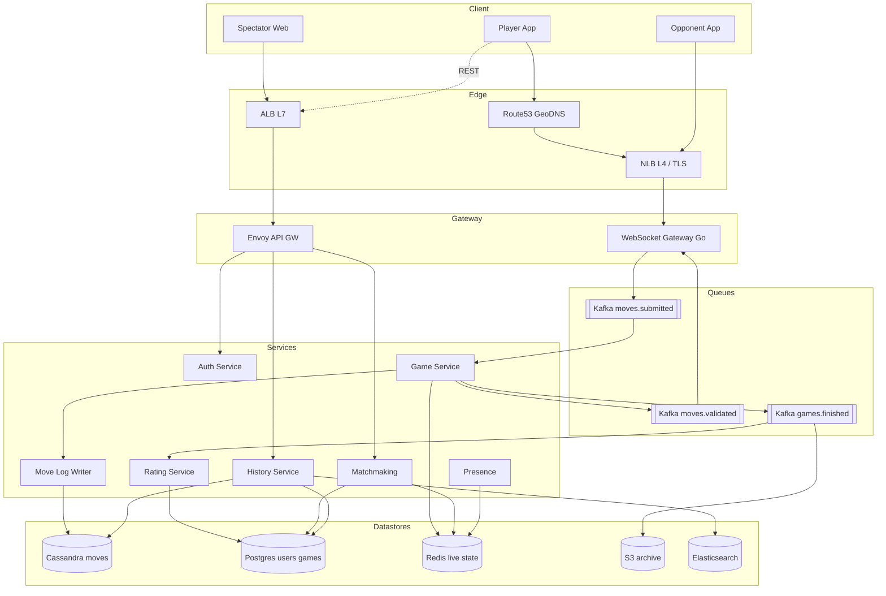

# 1. Multiplayer Chess — HLD

## 1. Requirements

### Functional
- Two authenticated users can start a chess game (ranked or casual) via matchmaking based on ELO rating.
- Real-time move submission: a player submits a move, opponent sees it within ~200 ms.
- Server-side move validation (legality, turn, check/checkmate, stalemate, en passant, castling, promotion).
- Full move history per game, replay, PGN export.
- Undo / takeback request (opponent must approve) — must roll back state atomically.
- Draw offers, resignation, time forfeit (clocks tick on server).
- Spectator mode (read-only live feed).
- Post-game: update ELO, persist game result, allow rematch.
- Reconnect within grace period (e.g., 60 s) without losing game state.

### Non-Functional
- Move push latency 99th percentile (P99) < 200 ms (same region), < 400 ms cross-region.
- Availability 99.95% for gameplay path; 99.9% for matchmaking.
- Durability: once a move is ack'd, it must never be lost (11 9s on move log).
- Consistency: **strong** on move ordering within a game (linearizable append), eventual on ELO/leaderboard.
- Scale ceiling: 1M Daily Active Users (DAU), 5M games/day, up to 100k concurrent live games at peak.

## 2. Scale & Estimates (recap)

- DAU: 1M; 5 games/user/day → 5M games/day.
- 40 moves/game → 200M moves/day.
- Move write Queries Per Second (QPS): 200M / 86400 ≈ **2.3k avg, 10k peak**.
- Move read QPS (spectators + replays): ~3× writes → **7k avg, 30k peak**.
- Move row ≈ 50 B (game_id, seq, from, to, piece, flags, ts) → **10 GB/day, 3.6 TB/yr**.
- Game metadata row ≈ 500 B × 5M → **2.5 GB/day, ~1 TB/yr**.
- Concurrent WebSocket (WS) connections at peak: ~200k (2 players × 100k games).
- Retention: moves 1 year hot, archive to Amazon Simple Storage Service (S3) after.
- Full math: [estimations doc](../back_of_envelope_estimations_example.md)

## 3. High-Level Component Design

### Edge / Load Balancer (LB)
- Amazon Web Services (AWS) Network Load Balancer (NLB) at Layer 4 (L4) in front of WebSocket gateway tier — sticky by connection, Transport Layer Security (TLS) terminated at NLB with AWS Certificate Manager (ACM) cert.
- Layer 7 (L7) Application Load Balancer (ALB) for Representational State Transfer (REST) endpoints (matchmaking, profile, history). Geo Domain Name System (GeoDNS) (Route53 latency-based) routes to nearest region.

### Application Programming Interface (API) Gateway
- Envoy fronting REST: JSON Web Token (JWT) auth, per-user rate limit (60 req/min), routing to services.
- WebSocket gateway is separate (custom Go service) because API gateways handle long-lived sockets poorly.

### Services (microservices)
| Service | Responsibility |
|---------|---------------|
| Auth Service | Login, JWT issuance, session |
| Matchmaking Service | ELO rating-based pairing, queues by rating bucket |
| Game Service | Authoritative game state, move validation, clock |
| Move Log Service | Append-only write path for moves (event store) |
| WebSocket Gateway | Holds player sockets, routes events to Game Service via Kafka |
| Rating Service | Async ELO recompute after game end |
| Profile/History Service | Read API for past games, PGN export |
| Presence Service | Online/offline, reconnect tokens |

### Datastores
- **Cassandra** — primary move log (append-only, partitioned by game_id).
- **PostgreSQL** — users, ratings, game metadata (result, players, timestamps).
- **Redis Cluster** — live game state cache (FEN + clock + turn), presence, matchmaking queues.
- **S3** — cold archive of finished games (PGN + move blobs) after 1 year.
- **Elasticsearch** — game search (by opponent, date, opening).

### Async Infra
- **Kafka**:
  - `moves.submitted` — raw move events from WS gateway to Game Service.
  - `moves.validated` — validated moves fan-out to spectators and Move Log writer.
  - `games.finished` — triggers rating recompute, archival, notifications.
- **Amazon Simple Queue Service (SQS)** (lower volume): rating recompute jobs, email of PGN.

## 4. API Design

```
POST /v1/match/find           {mode: "ranked", time_control: "5+0"}
  → {match_id, opponent_id, color, ws_url}

WS  /v1/game/{game_id}
  ← {type: "move", from: "e2", to: "e4", promotion: null, client_seq: 17}
  → {type: "move_ack", server_seq: 34, fen: "...", clocks: {w:290, b:298}}
  → {type: "opponent_move", from: "e7", to: "e5", server_seq: 35, ...}
  ← {type: "undo_request"}       → {type: "undo_offered"}
  ← {type: "undo_accept"}        → {type: "undo_applied", revert_to_seq: 32}
  ← {type: "resign"} / {type: "draw_offer"} / {type: "draw_accept"}

GET  /v1/games/{game_id}          → full game metadata
GET  /v1/games/{game_id}/moves    → ordered move list (paginated)
GET  /v1/users/{id}/history       → past games
```

## 5. Data Storage & Schema Design

### Schema

```
-- Cassandra (move log, the hot table)
moves (
  game_id        uuid,      -- partition key
  seq            int,       -- clustering key, ascending
  ply            int,
  side           text,      -- 'w' | 'b'
  from_sq        text,
  to_sq          text,
  san            text,      -- "Nf3"
  piece          text,
  promotion      text,
  is_capture     boolean,
  is_check       boolean,
  flags          int,       -- castle, en_passant bits
  fen_after      text,      -- snapshot every N moves (e.g., every 10)
  clock_white_ms int,
  clock_black_ms int,
  server_ts      timestamp,
  PRIMARY KEY ((game_id), seq)
) WITH CLUSTERING ORDER BY (seq ASC);

-- Postgres (game metadata, strongly consistent)
Games(game_id PK, white_id, black_id, time_control, mode, result,
      termination, opening_eco, started_at, ended_at, white_rating_before,
      black_rating_before, white_rating_after, black_rating_after)

Users(user_id PK, username UNIQUE, email, rating_blitz, rating_rapid,
      rating_classical, games_played, created_at)

-- Redis
live:game:{game_id}  → HASH {fen, turn, white_clock_ms, black_clock_ms,
                             last_move_seq, undo_head}
mm:queue:{bucket}    → ZSET (rating → user_id)
```

### DB Choice & Justification

The move log is the critical store — append-only, partitioned by game, time-series-ish. The metadata is small, relational, needs Atomicity Consistency Isolation Durability (ACID).

- **Why Cassandra for moves**: (1) Write-heavy append pattern maps perfectly onto Log-Structured Merge tree (LSM); 10k write QPS is trivial. (2) Partition-by-game_id gives co-located moves — a single partition read returns the full game ordered by seq. (3) Horizontal scale with Replication Factor (RF)=3 gives durability and local reads. (4) Time To Live (TTL) support for auto-archive. (5) 3.6 TB/yr across a modest cluster (6–9 nodes) is cheap.
- **Why Postgres for metadata**: Game result + user rating update must be transactional ("record game, adjust both ratings, bump games_played") — needs a real transaction. Volume (1 TB/yr) fits a single primary with read replicas.
- **Why not Postgres for moves**: 10 GB/day of append traffic plus 30k peak reads will push a single primary. Partitioning by game_id in Postgres (PG) works but sharding across nodes is manual. Cassandra gives that out of the box.
- **Why not DynamoDB**: would work (partition key game_id, sort key seq). Dropped mainly on cost at 3.6 TB with hot reads, and vendor lock. Acceptable alt if already on AWS.
- **Why not MongoDB**: storing a game as a single document with a moves array means the doc grows up to 40 entries — fine — but concurrent $push from two replicas with our strict ordering requirement is awkward, and we'd lose per-move indexability for spectator streaming. Not a natural fit.
- **Why not Redis as primary**: RAM cost for 3.6 TB is absurd; Redis is perfect as a live-game cache but not as the source of truth.

### Sharding & Partitioning
- Cassandra: partition key `game_id` (Universally Unique Identifier (UUID), uniform hash distribution, no hot partitions — each game is bounded at ~80 rows).
- Postgres: single primary is enough at 1 TB/yr; if scaled, shard Users + Games by `user_id` / `game_id` hash via Citus.
- Redis: cluster mode, slot by `{game_id}` hash tag so all live state of a game lives on one node.

### Replication
- Cassandra: RF=3, `LOCAL_QUORUM` writes for moves (strong within a Data Center (DC)), `LOCAL_ONE` reads for replays.
- Postgres: 1 primary + 2 sync replicas, semi-sync for metadata durability.
- Redis: cluster with 1 replica per shard; Append-Only File (AOF) every second.

## 6. Scalability & Performance

### Caching
- Live game state in Redis (FEN, clocks, turn) — written on every move, read on reconnect. TTL = game duration + 1 h.
- Recent games per user cached in Redis (list of last 20 games) for instant profile load.
- Opening book / engine eval cached at Content Delivery Network (CDN) since it is static.

### Message Queues
- Kafka `moves.submitted` (partitions = 256, key = game_id) — both players' events go to the same partition, so a single Game Service instance owns each game and concurrency on a single game is serialized.
- `games.finished` triggers async ELO recompute; failure goes to Dead Letter Queue (DLQ), retried with exponential backoff.

### Read-heavy vs Write-heavy
- Writes: 10k peak moves + 3k matchmaking ops. Cassandra handles.
- Reads dominate (spectators + history): 30k peak; served from Cassandra read replicas + Redis for live games.

## 7. Deep Dive

### Topic 1 — Move Storage as Event Sourcing + Undo

Each game is a stream of immutable events in the `moves` table, ordered by `seq`. Current board state is **not** stored separately as truth; it is derivable by folding moves from seq 0. Live state in Redis is a materialized view for fast reads.

Every 10 moves we write a `fen_after` snapshot so reconstruction is O(10) replay, not O(80).

**Undo is a logical pointer, not a delete.** The `live:game:{game_id}` hash has an `undo_head` field pointing at the current "effective" seq. When Black accepts White's undo request:
1. Game Service appends a new event `type=undo, revert_to_seq=32` — append-only preserved.
2. `undo_head` in Redis is set to 32.
3. FEN and clocks are rebuilt from seq 0..32 (using the most recent snapshot).
4. All subsequent logic ignores seq > 32 until a new real move arrives, which writes seq=33 overwriting the old seq=33 logically (no physical delete — the old row remains with `superseded=true` tagged via a secondary event, or we accept tombstoning via a new seq namespace).

This gives us a complete audit log, reproducible replays, cheap undo, and zero data loss. Cassandra's immutable append fits perfectly — deletes would create tombstones and compaction pressure.

### Topic 2 — Concurrency on Simultaneous Moves

Chess is turn-based, but the network is not: Black may send a move before receiving White's ack. Or a rage-clicker may send the same move twice from reconnect.

Solution: **single writer per game via Kafka key-based partitioning.**
- WS Gateway publishes `moves.submitted` with key=game_id.
- Kafka routes all events for that game to one partition.
- A consumer group has one Game Service pod owning that partition — all events for the game are serialized through one in-memory state machine.
- The state machine checks: `msg.client_seq == expected_next_seq && msg.side == turn`. Otherwise reject with error code.
- Idempotency: WS Gateway includes a `client_move_id` UUID; if the same UUID arrives twice, Game Service returns the cached ack without re-validating.

On Game Service pod failure, Kafka partition rebalances; the new owner rebuilds state by replaying moves + snapshot from Cassandra — typically <50 ms for an 80-move game.

## 8. Trade-offs

- **Consistency, Availability, Partition tolerance (CAP)**: Moves tier is **Consistent and Partition-tolerant (CP)** — we need linearizable move ordering per game; a network partition causes that game to pause rather than accept divergent moves. Metadata is **CP** (Postgres). Profile/history can run **Available and Partition-tolerant (AP)**.
- **Consistency model**: Linearizable inside one game (single-writer via Kafka). Read-your-writes for own profile via Redis cache invalidation. Eventual for leaderboard (ELO recompute is async, seconds of lag OK).
- **Failure handling**:
  - Circuit breakers around Cassandra writes — on timeout, game pauses with user-visible "reconnecting", no silent accept.
  - WS reconnect with `Last-Received-Seq` header; gateway replays missed events from Redis/Cassandra.
  - Idempotent move submission via `client_move_id`.
  - DLQ on `games.finished` retries; manual replay tooling for stuck games.
  - Clock is authoritative on server; on disconnect we keep ticking until time forfeit.

## 9. Mermaid Diagram


