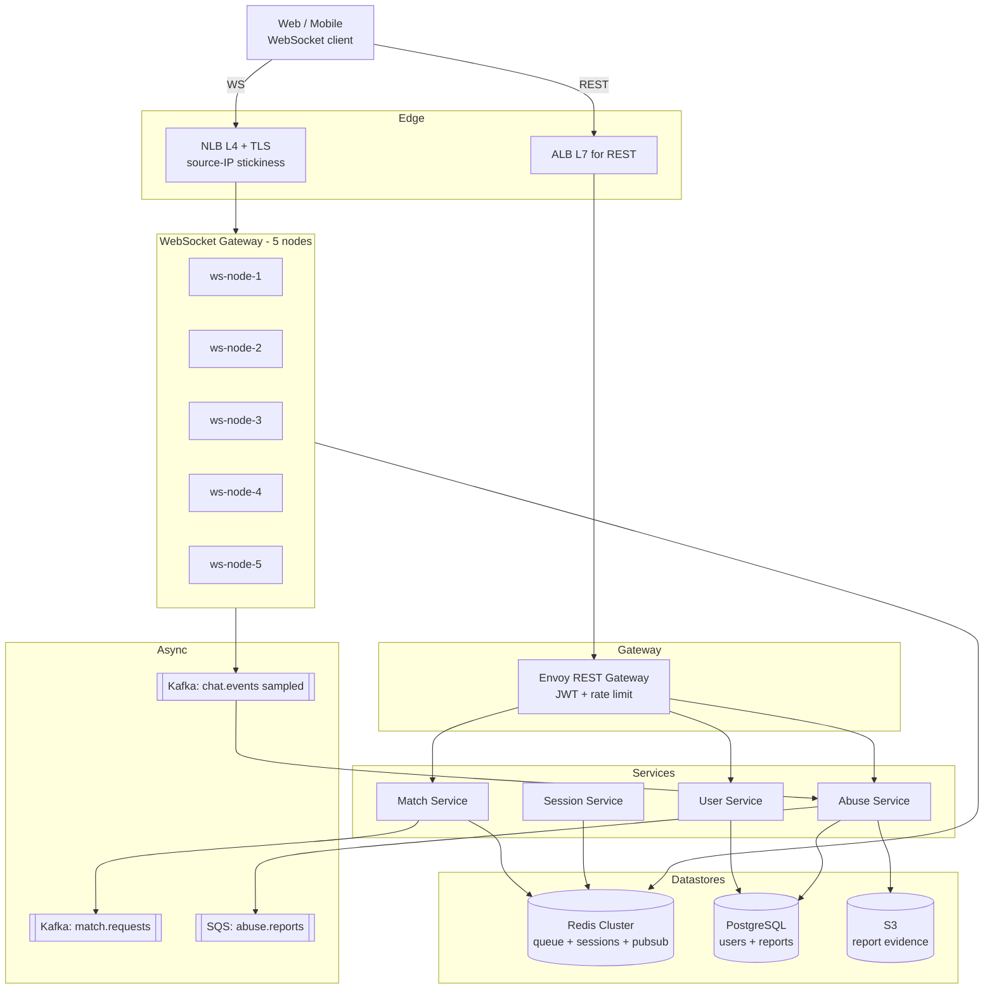

# 4. Omegle-style Match + Chat — High-Level Design (HLD)

## 1. Requirements

### Functional
- Users enter a "waiting pool" and are matched 1:1 with another waiting user (random or interest-based).
- Once matched, both peers join an ephemeral chat session with a hard cap on message count (e.g. 20) or duration (e.g. 5 min).
- Real-time bi-directional messaging (typing indicators, presence).
- Either party can "next" (end session and re-queue).
- Report / block user; abuse rate limiting.
- Messages are **ephemeral** — not persisted beyond the session.

### Non-Functional
- **Latency**: match 99th percentile (p99) < 2 s; message delivery p99 < 150 ms end-to-end.
- **Availability**: 99.9% for the gateway; matching can tolerate brief hiccups.
- **Durability**: messages ephemeral so no durability requirement. User accounts + abuse reports durable.
- **Consistency**: matching must be exactly-once (no user matched to two peers simultaneously).
- **Scale ceiling**: 50k concurrent connections peak, 10k messages/s peak.

## 2. Scale & Estimates (recap)

- 5M Daily Active Users (DAU), session ≈ 5 min, 3 matches/session, 20 messages/match
- Peak concurrency: 50k users online simultaneously (typical ~17k)
- Match Queries Per Second (QPS): 5M * 3 / 86400 ≈ **170/s avg, ~500/s peak**
- Message QPS: 5M * 3 * 20 / 86400 ≈ **3.5k/s avg, ~10k/s peak**
- Matching queue in Redis: 50k entries * ~200 B = **~10 MB** — tiny, fits in Random Access Memory (RAM) trivially.
- WebSocket (WS) gateway: 5 nodes * 10k conns each = **50k total** headroom.
- Full math: [estimations doc](../back_of_envelope_estimations_example.md)

## 3. High-Level Component Design

### Edge / Load Balancer (LB)
- **Amazon Web Services (AWS) Network Load Balancer (NLB) (Layer 4 (L4))** for WebSocket/long-lived Transmission Control Protocol (TCP) — L4 is mandatory here; Layer 7 (L7) Application Load Balancer (ALB) has WS timeouts and per-conn cost.
- Transport Layer Security (TLS) terminated at NLB via AWS Certificate Manager.
- Separate ALB for Representational State Transfer (REST) Application Programming Interfaces (APIs) (auth, user mgmt, reports) on a different hostname.
- **Sticky routing** by source-Internet Protocol (IP) address or by session cookie via a thin L7 shim (see deep dive).

### API Gateway
- **Envoy** for REST side (auth, rate limit, routing).
- Auth: short-lived JSON Web Token (JWT) issued via anonymous sign-in (no email required — Omegle-style), bound to device fingerprint.
- Rate limit: 1 match/2 s per user, 5 msgs/s per user.
- Routes `/v1/auth/*`, `/v1/match/*`, `/v1/report/*`.

### Services
| Service | Responsibility |
|---------|---------------|
| **WebSocket Gateway (5 nodes)** | Maintains WS/Server-Sent Events (SSE) connections, routes messages between peers, publishes to Redis publish/subscribe (pub/sub). |
| **Match Service** | Consumes "enqueue" requests, runs matching algorithm, notifies gateways of the pair. |
| **Session Service** | Ephemeral session state: peer pairs, message counters, Time To Live (TTL). |
| **User Service** | Account metadata, bans, abuse records — backed by Postgres. |
| **Abuse Service** | Analyzes reports, maintains block lists, integrates with Machine Learning (ML) classifier. |

### Datastores
- **Redis (cluster)** — matching queue (sorted set), session state (hash + TTL), pub/sub channels per session, rate limit counters.
- **PostgreSQL** — users, bans, abuse reports, audit trail of violations.
- **Kafka** — `chat.events` topic for async fanout (moderation, analytics, abuse pipeline).
- **Amazon Simple Storage Service (S3)** — optional report evidence (chat transcripts when a user files an abuse report — only then persisted).

### Async Infra
- **Kafka `chat.events`** — sampled message events for abuse/analytics (not the primary delivery path).
- **Kafka `match.requests`** — when a user enters the queue, an event is dropped here so match workers can pull.
- **Amazon Simple Queue Service (SQS) `abuse.reports`** — reports go to a moderation worker pool.

## 4. API Design

```
POST /v1/auth/anonymous              -> { jwt, user_id }

POST /v1/match/enqueue
  body: { interests?: [..] }
  resp: { queue_ticket }

WS   /v1/ws?token=JWT                -> upgrade to WebSocket
  server pushes:
    { type: "matched", session_id, peer_id }
    { type: "message", session_id, from, text }
    { type: "ended", reason }
  client sends:
    { type: "send", session_id, text }
    { type: "next", session_id }

POST /v1/report                      body: { session_id, reason, evidence? }
```

## 5. Data Storage & Schema Design

### Schema
```
Users(                    -- Postgres
  user_id PK, anon_handle, device_fingerprint,
  created_at, banned_until, strike_count
)

Reports(                  -- Postgres
  report_id PK, reporter_id, reportee_id,
  session_id, reason, evidence_s3_key,
  status, created_at
)

Redis:
  waiting_queue:{bucket}        ZSET   member=user_id, score=enqueued_at
  session:{session_id}          HASH   peer_a, peer_b, msg_count, started_at  TTL=10min
  session:{session_id}:ch       PUB/SUB channel for message delivery
  rate:{user_id}:msg            counter TTL=1s
  rate:{user_id}:match          counter TTL=2s
```

### DB Choice & Justification
- **Why Redis as the real-time backbone**: matching queue + session state + pub/sub all need sub-ms latency and expire naturally. Redis ZSET gives us First-In-First-Out (FIFO) ordering (score = timestamp) and O(log n) pop of the oldest waiter. Redis pub/sub gives cross-gateway message routing without Kafka's ~50ms end-to-end overhead. TTLs auto-expire stale sessions — we don't write a janitor. Data is ephemeral by design, so Redis's weaker durability isn't a problem, it's a feature.
- **Why Postgres for users/reports**: user records, bans, and abuse reports need durability, relational integrity (Foreign Key (FK) from report → user), and auditability. Postgres is the obvious, boring, right answer. It's low-QPS (hundreds/s max), fits on a single primary for years.
- **Why not Cassandra/DynamoDB for sessions**: sub-100ms latency at the per-op level is achievable, but Cassandra/Dynamo are overkill for 10 MB of ephemeral state and lack native pub/sub. Redis is an order of magnitude simpler for this exact workload.
- **Why not Kafka for message delivery**: Kafka's minimum end-to-end latency (producer ack + consumer poll + partition replication) lands in the 30–100 ms range and isn't designed for point-to-point. We do use Kafka, but for async side-channels (moderation, analytics), *not* the user-visible delivery path.
- **Why not MongoDB**: we'd still need Redis for pub/sub, so Mongo buys us nothing. Its document model isn't particularly helpful for this data shape.
- **Why not Redis as sole store**: if Redis were our *only* store we'd lose user accounts and ban history on a cluster failure. That's unacceptable for abuse handling. Hence the Postgres tier for durable user + report data.

### Sharding & Partitioning
- **WebSocket gateway**: 5 nodes, horizontally scalable. Each node maintains its own set of connections. A central registry `conn:{user_id} -> gateway_node_id` lives in Redis; to push a message to user X, we look up their gateway and publish to `gateway:{node}` pub/sub channel. This is the **"gateway sharding"** pattern.

- **Redis cluster**: 6 nodes, hash slots by `session_id` so all state for one session hits one shard.
- **Matching queue** is partitioned into "buckets" per interest tag (or a single bucket for random mode). Bucket granularity is the concurrency unit — each bucket is serviced by one match worker with a short Redis lock, avoiding duplicate matches.

### Replication
- Redis: cluster mode, 1 replica per primary, async (OK since data is ephemeral).
- Postgres: sync primary + 1 replica, single region.

## 6. Scalability & Performance

### Caching
- Redis **is** the cache layer; there's no upstream DB in the hot path for chat.
- User ban-list cached in gateway memory (~100k entries) with 1-min refresh — avoids a PG hit per connection.

### Message Queues
- Kafka `chat.events` gets a *sampled* subset of messages (1%) for moderation ML and abuse pipelines — not the primary delivery path.
- SQS for abuse report processing isolates moderation from the real-time hot path.

### Read-heavy vs Write-heavy
- Balanced: every message is a write (Redis counter increment + pub/sub publish) and a read (subscriber delivery). But **both operations are in-memory** — throughput is bounded by network and CPU of Redis nodes, not disk.
- The *real* scale bottleneck is concurrent WebSocket connections, not QPS — so we scale horizontally on gateway nodes, not vertically on DBs.

## 7. Deep Dive

### Matching algorithm (random vs interest-based)
- **Random mode (default)**: users land in a single `waiting_queue:global` ZSET. A matcher worker runs a loop:
  1. `ZPOPMIN waiting_queue:global` twice → two oldest users A, B.
  2. Acquire `SETNX match:{A} ok PX 5000` and same for B. If either fails (raced), put them back and retry.
  3. `session_id = Universally Unique Identifier (UUID)`, write `session:{session_id}` HASH with both peers and TTL 10 min.
  4. Publish to `gateway:{nodeA}` and `gateway:{nodeB}` with the `matched` event.
  5. Both gateways push the `matched` frame to the respective WS conn.
- **Interest-based mode**: user enqueues with interest tags; we hash into one or more `waiting_queue:{tag}` buckets. Matcher prefers intersecting tags first, falls back to global after 3 s wait.
- **Fairness**: score = enqueue timestamp, so ZPOPMIN gives FIFO — no starvation.
- **Scale**: at 500 matches/s peak, a single Redis shard easily handles ZPOPMIN loops. If we split by tag across shards, matchers run per-bucket in parallel.
- **Correctness**: the `SETNX match:{uid}` mutex guarantees a user can't be double-matched even if two workers race on the same ZSET pop (which is itself atomic anyway).

### WebSocket gateway sharding, sticky sessions, and abuse
- Clients connect via NLB with source-IP stickiness (or an L7 cookie if behind a CDN). Once connected, the gateway node registers `conn:{user_id} = node_id` in Redis with a TTL refreshed on heartbeat.
- To send a message A→B: gateway A looks up B's gateway via `conn:{B}`. If same node → direct in-memory push. If different node → publish to Redis pub/sub channel `gateway:{nodeB}` and let node B deliver.
- On node failure, heartbeat TTL expires → all sessions hosted there are garbage-collected, clients reconnect and get a fresh match.
- **Rate limiting**: `INCR rate:{user}:msg` with TTL 1s, reject over 5; `INCR rate:{user}:match` TTL 2s, reject over 1.
- **Abuse**: moderation workers consume 1% sampled `chat.events`; if an ML classifier flags racist/abusive content, worker writes a strike to PG, and at 3 strikes the user is auto-banned via `banned_until` timestamp. Gateway checks ban-list on connect.
- **Evidence capture on report**: only when a user files `/v1/report` do we snapshot the session's recent 20 messages from Redis and dump them to S3 as evidence — this is the only time messages persist.

## 8. Trade-offs

- **Consistency, Availability, Partition tolerance (CAP)**: AP for chat path. In a Redis partition we'd rather fail-open (drop a match, ask user to retry) than stall.
- **Consistency model**: strong for matching (mutex ensures exactly-once pairing); eventual for cross-gateway state (`conn:{user}` lookups can be momentarily stale, gateway handles via retry).
- **Failure handling**: WebSocket reconnect loop with exponential backoff + jitter; session-level idempotency via `session_id` so reconnects after a blip land back in the same session if still alive; Dead Letter Queue (DLQ) for abuse events; circuit breaker from gateway to Redis with local degradation (drop sampled events first, preserve delivery path).

## 9. Mermaid Diagram


