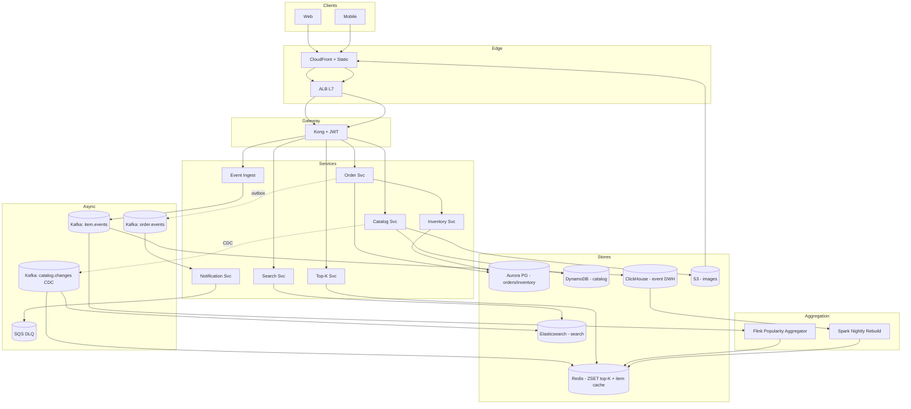

# 3. Order Processing System (Top-K Popularity) — High-Level Design (HLD)

## 1. Requirements

### Functional
- Browse catalog by category; each category page shows **Top-K (100) most popular items** in the last rolling 24h.
- Item detail page: full product info (title, description, images, price, stock, ratings).
- Place an order (single or multi-item).
- Order events (`view`, `add_to_cart`, `purchase`) feed the popularity score.
- Admin / merchant Create Read Update Delete (CRUD) on catalog items.
- Popularity ranking updates within a small latency budget (seconds to ~1 min).
- Global and per-category top-K leaderboards.

### Non-Functional
- Top-K read latency 99th percentile (p99) < 100 ms (landing pages).
- Item detail read p99 < 150 ms.
- Order write p99 < 300 ms.
- Availability 99.99% on read path, 99.95% on write path.
- Consistency: strong on order placement + inventory decrement; eventual on popularity ranking and catalog cache.
- Read-heavy workload (~90% reads).
- Scale ceiling: 100M catalog, 10M Daily Active Users (DAU), 20M orders/day, 1k categories.

## 2. Scale & Estimates (recap)

- Catalog: 100M items × ~2 KB ≈ **200 GB** core metadata.
- DAU: 10M; 20M orders/day × 3 items = **60M order-items/day**.
- Order Queries Per Second (QPS): 20M / 86.4k ≈ **230/s average**, peak ~3× = **~700/s**.
- Item events (view + add_to_cart + purchase): ~60M/day → **~700/s avg, ~2k/s peak**.
- Top-K query volume: every page view hits it → DAU × 10 pages ≈ 100M/day → **~1.2k/s avg, ~5k/s peak**.
- Redis Sorted Set (ZSET) storage: 1k categories × 10k tracked items × ~80 B ≈ **~800 MB** (with top-100 per category + candidate pool). Fits trivially.
- Reads are ~90% of traffic → Content Delivery Network (CDN) + cache are first-class.
- Full math: [estimations doc](../back_of_envelope_estimations_example.md)

## 3. High-Level Component Design

### Edge / Load Balancer (LB)
- **CloudFront** CDN for static assets, images, and cached category pages (Edge Side Includes (ESI) / edge includes).
- **Application Load Balancer (ALB) Layer 7 (L7)** for Application Programming Interface (API) calls with Transport Layer Security (TLS) termination.
- Geo routing via Route53 latency-based to nearest region.

### API Gateway
- **Kong** or **Amazon Web Services (AWS) API Gateway**: JSON Web Token (JWT) auth (user sessions), per-Internet Protocol (IP) rate limit, request validation.
- Routing: `/catalog`, `/orders`, `/topk`, `/events` to respective services.

### Services (microservices)
| Service | Responsibility |
|---------|---------------|
| Catalog Service | CRUD on items, owns item metadata (source of truth). |
| Search Service | Full-text / faceted search (Elasticsearch wrapper). |
| Order Service | Order placement, state machine, orchestrates payment + inventory. |
| Inventory Service | Stock reservation + decrement with idempotency. |
| Top-K Service | Serves ranked leaderboards per category / global. |
| Event Ingest Service | Accepts client-side event stream (`view`, `cart`, `purchase`), publishes to Kafka. |
| Popularity Aggregator | Flink job consuming events, updating Redis ZSETs. |
| Notification Service | Order confirmations, shipping updates. |
| Recommendation Service (stretch) | Personalized top-K overlay. |

### Datastores
- **PostgreSQL (Aurora)** — orders, order items, inventory ledger (strong consistency, transactional).
- **DynamoDB** (or Cassandra) — catalog item metadata (Key-Value (KV) lookup by item_id).
- **Redis Cluster** — Top-K ZSETs per category, item detail cache, session cache.
- **Elasticsearch (ES)** — full-text catalog search + facets.
- **Amazon Simple Storage Service (S3) + CloudFront** — item images.
- **ClickHouse / BigQuery** (offline) — event warehouse for analytics + lambda backfill of popularity.

### Async Infra
- **Kafka** topics:
  - `item.events` (view, cart, purchase) — partitioned by item_id.
  - `order.events` — state transitions (created, paid, shipped, cancelled).
  - `catalog.changes` — Change Data Capture (CDC) from catalog Database (DB) for cache invalidation.
- **Flink** aggregator for popularity (windowed, decayed).
- **Amazon Simple Queue Service (SQS) Dead Letter Queue (DLQ)** for notification retries.

## 4. API Design

```
GET  /v1/categories/{cat}/topk?k=100      # returns top items (cached heavily)
GET  /v1/items/{item_id}                  # item detail
GET  /v1/search?q=...&category=...        # ES-backed search

POST /v1/orders                           # place order (idempotency-key header)
GET  /v1/orders/{order_id}
POST /v1/orders/{order_id}/cancel

POST /v1/events                           # batched client events (beacon)
```

Top-K response:
```json
{
  "category": "electronics",
  "window": "24h",
  "items": [
    {"item_id": "itm_1", "score": 9342.1, "snapshot": {...}},
    ...
  ],
  "generated_at": "2026-04-11T12:34:56Z"
}
```

Place order request:
```json
{
  "user_id": "u_9",
  "items": [{"item_id": "itm_1", "qty": 2}, ...],
  "payment_method_id": "pm_3",
  "idempotency_key": "client-uuid-xyz"
}
```

## 5. Data Storage & Schema Design

### Schema

```
Item(item_id PK, category_id, title, description, price, stock,
     images_json, merchant_id, created_at, updated_at)

Category(category_id PK, name, parent_id)

Order(order_id PK, user_id, status, total_cents, currency,
      created_at, idempotency_key UNIQUE)

OrderItem(order_id PK, item_id CK, qty, price_cents, merchant_id)

InventoryLedger(item_id PK, ts CK, delta, reason, order_id)
  # append-only, source of truth for stock

# Redis
topk:{category_id}       → ZSET (item_id → score)
topk:global              → ZSET
item:{item_id}           → Hash (cached item detail, TTL 5 min)
session:{sid}            → Hash

# Elasticsearch index
items_v1 { item_id, title, description, category_id, price, popularity, ... }
```

### DB Choice & Justification

This problem has two distinct storage needs — **transactional orders** and **catalog lookups**. We pick different stores for each.

- **Why Postgres (Aurora) for orders & inventory**: Atomicity Consistency Isolation Durability (ACID) is non-negotiable. Placing an order must atomically (a) reserve inventory, (b) insert the order + order_items, (c) record the idempotency key. Multi-row transactions, foreign keys, and serializable isolation are first-class. Write volume (~700/s peak) is well within Aurora's envelope. We also get read replicas for order history pages.

- **Why DynamoDB (or Cassandra) for catalog item metadata**: Item lookups are ~1.2k/s by primary key (`item_id`). No joins needed — the item doc is self-contained. We want single-digit ms latency at 100M items and sub-linear cost growth. DynamoDB gives: managed scaling, on-demand pricing fits spiky read traffic, Global Secondary Index (GSI) by `(category_id, popularity)` handles category browse fallback when cache is cold. Cassandra is a reasonable alternative if we want to avoid vendor lock-in.

- **Why Redis for Top-K**: ZSET is literally built for this — `ZADD`, `ZINCRBY`, `ZREVRANGE 0 99`, all O(log n). Sub-ms latency at 5k QPS peak. Total memory footprint is < 1 GB across all categories. Anything else is reinventing the wheel.

- **Why Elasticsearch for search**: full-text relevance + facets + typo tolerance. Not the source of truth — populated from catalog CDC.

- **Why not Postgres for catalog metadata**: 100M rows is fine for Postgres on paper, but a global hot key (`item_id` PK) lookup at 1-2k/s competes with the order write workload. We prefer physical isolation so a catalog read spike never threatens order writes. Also, per-item image blobs inflate row width.

- **Why not Postgres for Top-K**: `SELECT ... ORDER BY popularity DESC LIMIT 100 WHERE category_id = ?` with live updates at 700 writes/s creates index bloat + lock contention. Would need materialized views refreshed periodically — strictly worse than a ZSET.

- **Why not DynamoDB for orders**: Dynamo transactions exist but are expensive (2× Write Capacity Unit (WCU)) and limited to 100 items per transaction. The relational model (Order → OrderItem → Inventory) with foreign keys is cleaner in Postgres. Strict serializable isolation is easier to reason about.

- **Why not MongoDB**: document model is fine for catalog but its transaction support is newer and multi-shard transactions have performance caveats. DynamoDB has better managed scaling and Cassandra is battle-tested at much larger catalogs (Netflix, Apple).

- **Why not Redis as primary for catalog**: 200 GB in RAM is expensive (~$1.2k/mo for a Redis cluster vs ~$200/mo on DynamoDB on-demand). Durability concerns for merchant-owned data. Redis stays as a cache.

- **Why not Elasticsearch as primary**: ES is not a system of record. Reindexing storms, no transactional guarantees, cluster splits lose writes.

### Sharding & Partitioning
- Postgres: single writer until >500 GB; shard by `user_id` hash on orders (co-locates user history).
- DynamoDB: auto-partitioned by `item_id` hash key; GSI on `category_id`.
- Redis: 16-shard cluster, `topk:{cat}` naturally partitioned by category; hot categories may need sharded ZSETs (split into K partial ZSETs, merge on read).
- Kafka `item.events`: partitioned by `item_id` for per-item ordering; 64 partitions.

### Replication
- Aurora: 1 writer + 3 readers, sync to 4/6 storage nodes.
- DynamoDB: managed multi-Availability Zone (AZ), global tables for cross-region.
- Redis: 1 primary + 2 replicas per shard; Redis Database (RDB) snapshot hourly to S3 for Disaster Recovery (DR).
- Elasticsearch: 1 primary + 2 replica shards.
- Kafka: Replication Factor (RF)=3, acks=all on `order.events`; acks=1 on `item.events`.

## 6. Scalability & Performance

### Caching
- **Edge cache (CloudFront)**: category top-K JavaScript Object Notation (JSON) with 30s Time To Live (TTL) + `stale-while-revalidate`. Absorbs ~80% of top-K reads.
- **Redis item cache**: hot item details, Least Recently Used (LRU) eviction, 5-min TTL, invalidated by `catalog.changes` CDC.
- **Application cache (Caffeine, in-process)**: request-local memoization for hot items within a single server.
- **Negative cache**: 404s cached 60s to avoid thundering herd on deleted items.

### Message Queues
- Kafka absorbs event burst (2k/s peak) and decouples Flink aggregator latency from client experience.
- Order placement uses synchronous Postgres commit (users need confirmation) but fans out post-commit events asynchronously via outbox pattern → Debezium → `order.events`.
- Retry + DLQ for notifications, stock reconciliation.

### Read-heavy vs Write-heavy
- **90% reads** — optimized via CDN → Redis → database. Database is last resort.
- Writes concentrated on order placement (~700/s peak) — trivial for Aurora.
- Popularity updates (write to Redis ZSET) happen in the Flink aggregator, not on request path → user-facing writes decoupled from popularity math.

## 7. Deep Dive

### Top-K Maintenance: ZSET vs Count-Min Sketch (CMS) vs Lambda Offline

**Option A: Redis ZSET with weighted increments (chosen)**
- `ZINCRBY topk:{cat} <weight> <item_id>` on every event.
- Weights: `view=1`, `cart=5`, `purchase=20`.
- Decay: every 1 min, multiply all scores by `0.995` (~half-life 2.3 h) via Lua script. Over 24h this approximates a rolling window.
- Read: `ZREVRANGE topk:{cat} 0 99 WITHSCORES`. O(log N + K).
- **Pros**: exact ranking, simple, sub-ms reads, natural fit.
- **Cons**: unbounded set if we don't trim — we cap at 1000 items per ZSET via `ZREMRANGEBYRANK topk:{cat} 0 -1001`.

**Option B: Count-Min Sketch + heavy hitters**
- Probabilistic, tiny memory, good for streams of billions of events.
- **Why not here**: 60M events/day is small; exact is affordable. Approximate ranking gives worse UX on the landing page.

**Option C: Lambda offline (batch)**
- Spark job every 5 min recomputes top-K from ClickHouse event warehouse, writes to Redis.
- **Why not as primary**: 5-min latency is worse than Flink's seconds.
- **Used as backup**: nightly recomputation catches Redis drift and repopulates after failover.

**Hybrid chosen**: Flink → Redis ZSET for real-time, Spark nightly for correctness backstop.

**Formula**:
```
score(item) = Σ (weight(event) * e^(-λ(now - event_ts)))
λ chosen so half-life ≈ 2h → λ = ln(2)/7200 ≈ 9.6e-5
```

### Cache Invalidation for Item Details
- **Problem**: item metadata edited by merchant; cached copy stale.
- **Solution**: CDC from catalog DB (Debezium) → Kafka `catalog.changes` → consumer publishes `DEL item:{id}` to all Redis shards + issues CloudFront invalidation for specific item path.
- **Freshness Service Level Agreement (SLA)**: eventual consistency, 5s p99 from merchant edit to cache purge.
- **Write-through alternative**: Catalog Service writes to DB + Redis in same code path. Rejected because it couples services and doesn't propagate to CDN.
- **Versioned keys**: item cache key includes `v` field (`item:{id}:v{version}`); stale versions age out via TTL.
- **Stampede protection**: `SETNX lock:{id}` + single re-populator per key on miss; others read slightly stale value.

### Popularity Score Formula (exponential decay, briefly as secondary)
- Flink tumbling window of 10s, emits incremental deltas.
- Decay applied lazily in a periodic Lua script on Redis (per category).
- Avoids O(N) writes on every tick — amortized cost is O(N_categories).

## 8. Trade-offs

- **Consistency, Availability, Partition tolerance (CAP)**:
  - Orders/inventory (Postgres): **Consistency + Partition tolerance (CP)** — reject writes on partition rather than lose consistency.
  - Catalog (DynamoDB): **Availability + Partition tolerance (AP)** — tolerate stale item detail briefly.
  - Top-K (Redis): **AP** — approximate rankings under failure acceptable.
- **Consistency model**: strong for orders/inventory; eventual for catalog cache + top-K. Users see their own order immediately (Read-Your-Writes (RYW) via primary read after write).
- **Failure handling**:
  - Idempotency key on POST /orders (unique constraint in Postgres) prevents double charge on client retry.
  - Outbox pattern for order events guarantees no lost event on crash between DB commit and Kafka publish.
  - Circuit breaker on payment provider with fallback to "pending" state + retry.
  - DLQ on notifications, replayable.
  - Redis failover: Spark batch top-K backfill recovers within 5 min.
  - CDN stale-while-revalidate shields origin during brief outages.

## 9. Mermaid Diagram


