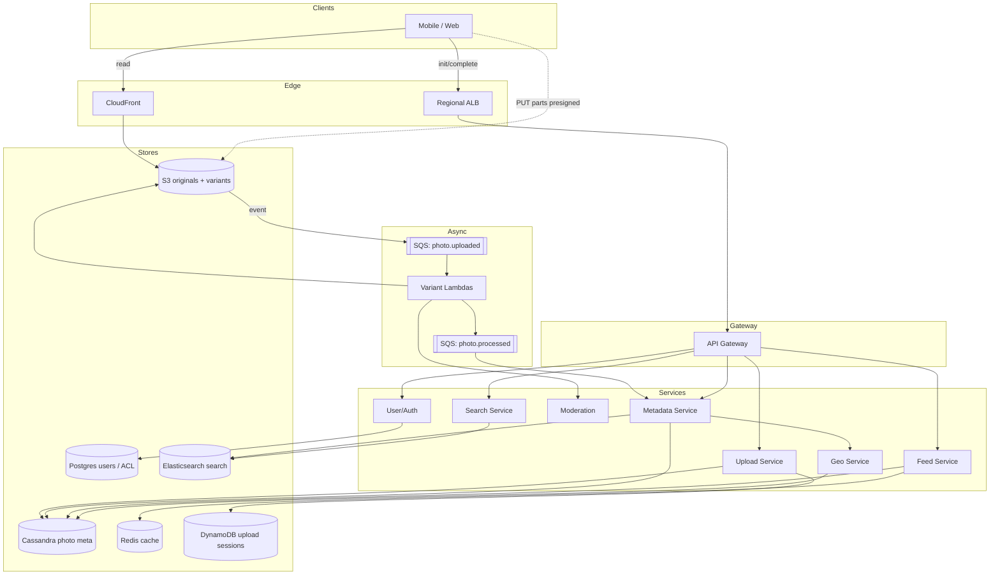

# 5. Photo Upload + Geotag Service — HLD

## 1. Requirements

### Functional
- Upload photos (mobile + web), up to ~50 MB each, resumable on mobile.
- Extract Exchangeable Image File Format (EXIF) metadata; geotag from EXIF Global Positioning System (GPS) or client-provided lat/lng.
- Generate thumbnails + display variants (e.g., 200 px, 800 px, 1600 px, WebP).
- Store originals + variants durably.
- View user's library (paginated); view a single photo fast.
- Search by location (bounding box / radius), by date, by tag.
- Public/private/friends-only sharing.
- Deletion with General Data Protection Regulation (GDPR) right-to-erasure.

### Non-Functional
- Upload 95th percentile (p95) (app → durable) < 5 s for a 3 MB photo on Long-Term Evolution (LTE).
- View p95 < 150 ms (Content Delivery Network (CDN) hit), < 500 ms (origin).
- Availability: 99.95% upload, 99.99% view.
- Durability: 11 9s (Amazon Simple Storage Service (S3) + cross-region replication for important regions).
- Forever retention until user deletes.
- Scale ceiling: 100M uploads/day, Exabyte (EB)-scale storage over 5 years.

## 2. Scale & Estimates (recap)

- 200M Monthly Active Users (MAU), 50M Daily Active Users (DAU) × 2 photos/day = **100M uploads/day**.
- Upload Queries Per Second (QPS): **~1.2k avg, peak ~5k** (evenings).
- Photo size: 3 MB original + ~500 KB of variants = ~3.5 MB effective.
- **~350 TB/day raw**; with variants + Replication Factor (RF)=3 replication, **~1 PB/day** storage footprint.
- 5-year retention: **~1.8 EB**.
- Metadata: 100M × ~1 KB = **100 GB/day** → 180 TB over 5 y (very manageable).
- View QPS: ~50k/s (served overwhelmingly from CDN).
- Full math: [estimations doc](../back_of_envelope_estimations_example.md)

## 3. High-Level Component Design

### Edge / Load Balancer
- CloudFront CDN for photo GETs (signed URLs); regional Points of Presence (PoPs) cache variants.
- Global Server Load Balancing (GSLB) for upload endpoint → nearest region.
- Regional Application Load Balancer (ALB) (Layer 7 (L7)) for metadata + auth Application Programming Interfaces (APIs); regional Network Load Balancer (NLB) (Layer 4 (L4)) for raw object uploads if going through our tier.
- Preferred path: client uploads **directly to S3** via presigned Uniform Resource Locator (URL) — bypasses our compute entirely.

### API Gateway
- Kong / API Gateway for metadata/search APIs: JSON Web Token (JWT) auth, per-user quota (e.g., 500 uploads/day), Internet Protocol (IP) rate limits.
- Photo delivery uses signed CloudFront URLs (no gateway in the path).

### Services (microservices)
| Service | Responsibility |
|---------|---------------|
| Upload Service | Issues presigned multipart URLs, records pending uploads |
| Post-Process Worker | Listens to S3 events; runs EXIF extract + variant generation |
| Metadata Service | Create Read Update Delete (CRUD) for photo metadata, albums, sharing |
| Geo Service | Writes geohash index, serves bounding-box (bbox)/radius queries |
| Search Service | Full-text + date + tag search via Elasticsearch (ES) |
| Feed Service | User library, paginated timeline |
| Moderation Service | Not Safe For Work (NSFW)/Child Sexual Abuse Material (CSAM) scanning on upload |
| Auth / User Service | Identity, sessions, Access Control Lists (ACLs) |
| Notification Service | Upload done / share events |

### Datastores
- **S3**: originals (STANDARD → Infrequent Access (IA) → Glacier lifecycle) and variants.
- **Cassandra / ScyllaDB**: photo metadata keyed by `user_id` for fast library pagination.
- **PostgreSQL**: users, albums, sharing ACLs.
- **Elasticsearch**: text/tag/date search index.
- **Redis**: recent library cache, presigned URL cache, geo-tile cache.
- **Amazon DynamoDB (optional)**: upload session state + idempotency.

### Async Infra
- **Amazon Simple Queue Service (SQS)**: `photo.uploaded`, `photo.processed`, `photo.failed`, `moderation.flagged`.
- **AWS Lambda**: variant generation (scales to 5k/s naturally).
- **Kafka** (optional): high-throughput analytics pipeline.

## 4. API Design

```
POST /v1/uploads/init
     body: { filename, content_type, size, client_ts, gps? }
     → { upload_id, s3_key, presigned_parts: [{partNumber, url}...], complete_url }

POST /v1/uploads/{upload_id}/complete
     body: { etags: [...] }
     → { photo_id, status: "PROCESSING" }

GET  /v1/photos/{photo_id}
     → { id, urls: {orig, 1600, 800, 200}, exif, geo, tags, visibility }

GET  /v1/users/{uid}/library?cursor=...&limit=50
GET  /v1/photos/search?q=beach&from=2026-01-01&bbox=-122.5,37.7,-122.3,37.8
DELETE /v1/photos/{photo_id}
POST /v1/photos/{photo_id}/share  body: { visibility, user_ids[] }
```

## 5. Data Storage & Schema Design

### Schema (key tables/collections)
```
-- Cassandra (library + photo detail)
PhotoByUser(user_id PK, created_at CK DESC, photo_id, thumb_url, geohash)
Photo(photo_id PK, user_id, s3_key, variants{...}, size, width, height,
      exif_json, lat, lng, geohash, taken_at, uploaded_at, visibility, tags[])

-- Postgres
User(user_id PK, email, handle, storage_quota_gb, used_bytes)
Album(album_id PK, user_id, name, cover_photo_id)
AlbumPhoto(album_id, photo_id) PK
Share(share_id PK, photo_id, target_user_id, visibility, created_at)

-- Elasticsearch
PhotoDoc(photo_id, user_id, taken_at, tags[], exif_text, geo_point, visibility)

-- DynamoDB (optional upload session)
UploadSession(upload_id PK, user_id, s3_key, status, parts[], created_at, ttl)
```

### DB Choice & Justification

- **Why S3 for blobs**: the only sane answer at EB scale. 11 9s durability, multipart uploads, event notifications, lifecycle rules, cross-region replication, and ~$0.023/GB STANDARD dropping to $0.004/GB Glacier Instant. We'd never build this ourselves.
- **Why not Hadoop Distributed File System (HDFS) / Ceph self-hosted**: operationally huge at this scale; no managed lifecycle to Glacier; egress/replication tooling far worse.
- **Why Cassandra for metadata**: write-heavy (1.2k QPS), linearly scalable, natural partition key `user_id` gives perfect fan-out for "my library" pagination using clustering by `created_at DESC`. Multi-region with tunable consistency.
- **Why not Postgres for photo metadata**: 100M rows/day = ~36B rows over 5 years; partitioning and vacuum become painful at that scale. Postgres is fine for the small relational parts (users, albums).
- **Why not DynamoDB for photo metadata**: works, but hot-partition risk on power users, and 36B items × $0.25/GB is more expensive than Cassandra self-managed at this scale. Use it for upload sessions where Time To Live (TTL) is free.
- **Why not MongoDB**: acceptable, but Cassandra's write throughput and multi-Data Center (DC) story are better for this write-heavy workload.
- **Why Elasticsearch for search**: geo_point, full-text tags, date ranges, and faceted filters in one engine.
- **Why Redis cache**: library page assembly hits the same keys repeatedly; presigned URL reuse for the same client.

### Sharding & Partitioning
- Cassandra `PhotoByUser` partitioned by `user_id` — all of a user's photos on one partition, ordered by time. For whales (>100k photos), use `user_id + month_bucket` composite Primary Key (PK) to bound partition size.
- S3 keys structured `uid={h(user_id)}/yyyy/mm/dd/photo_id` — random hash prefix avoids hot prefixes.
- Postgres: single primary per region; small enough not to shard.
- Elasticsearch: indexed by date (`photos-2026.04`); sharded 10×1 per monthly index.
- Geohash bucketing for spatial: geohash length 6 (~1.2 km) as a secondary index key.

### Replication
- S3: built-in 11 9s; Cross-Region Replication (CRR) for active-active regions.
- Cassandra: RF=3 per DC, `LOCAL_QUORUM`.
- Postgres: primary + 2 replicas + Point-In-Time Recovery (PITR).
- Elasticsearch: 1 replica per primary shard.

## 6. Scalability & Performance

### Caching
- CloudFront caches photo variants aggressively (immutable URLs: `photo_id/variant_hash.webp`); hit rate ~95% expected.
- Redis caches "user library first page" (TTL 60 s, invalidated on upload/delete for that user).
- Presigned URL cache in Redis (TTL matching URL expiry ~15 min).

### Message Queues
- SQS decouples upload completion from heavy variant generation. Lambdas scale transparently; failed messages go to Dead Letter Queue (DLQ) with alarms.
- Moderation runs as a parallel consumer; if moderation flags an image, a compensating step marks metadata private.

### Read-heavy vs Write-heavy
- **Read-heavy overall** (50k/s GETs vs 5k/s uploads peak) but GETs are 99% CDN. The actual origin is **write-heavy**. Upload path bypasses our compute (direct-to-S3), so we only scale metadata + post-processing.

## 7. Deep Dive

### Resumable multipart upload
- Client → `POST /uploads/init` with expected size.
- Upload Service splits into 10 MB parts, generates presigned PUT URLs for each part (S3 multipart), persists `UploadSession` in DynamoDB with TTL 24 h.
- Client uploads each part directly to S3; on flaky networks it retries only the failed parts.
- Client → `POST /uploads/{id}/complete` with collected Entity Tags (ETags).
- Upload Service calls S3 `CompleteMultipartUpload`, writes a `Photo` row in Cassandra with `status=PROCESSING`.
- S3 event → SQS → Post-Process Worker (Lambda): reads original, extracts EXIF with `exiftool`, generates variants with libvips (faster than ImageMagick), writes variants back to S3 at `photo_id/v={size}.webp`, updates `Photo.variants` and `status=READY`, publishes `photo.processed`.
- Moderation Lambda runs in parallel against the original; if flagged, sets `visibility=QUARANTINED`.

### Geo indexing
- On upload, compute `geohash(lat, lng, precision=8)` and store it on the photo row + as an ES `geo_point`.
- **Library-level geo query** ("my photos within this bbox") — served by Cassandra: secondary index on `geohash` scoped to the user's partition, or a dedicated `PhotoByUserGeo(user_id PK, geohash CK, photo_id)` table.
- **Global geo search** (admin/discover) — served by Elasticsearch `geo_bounding_box` / `geo_distance` queries, which scale better across millions of users.
- For map-view clustering, precomputed tile counts per geohash prefix cached in Redis; zoom level determines geohash precision (z=5 → prefix 3, z=12 → prefix 6, etc.).

## 8. Trade-offs

- **Consistency, Availability, Partition tolerance (CAP)**: metadata path leans **AP** (Cassandra `LOCAL_QUORUM`, eventual cross-region). Auth/ACL path leans **CP** (Postgres, we can't risk stale share permissions).
- **Consistency model**: read-your-writes for a user's own library (pin to region + write-through Redis); eventual for search index; strong for sharing/ACL decisions.
- **Failure handling**:
  - Direct-to-S3 uploads mean our tier outage doesn't block uploads in progress.
  - SQS visibility timeout + DLQ for stuck variant jobs; ops re-drives DLQ.
  - Idempotency: `photo_id = uuidv4` assigned at `init`, so retries of `complete` are safe.
  - Storage quota check at `init`; rejected before bytes fly.
  - Circuit breaker around moderation provider; if down, default to private visibility until it recovers.
  - GDPR deletion: metadata tombstone + async sweep of S3 objects + ES docs; confirmed complete within 30 days.

## 9. Mermaid Diagram


