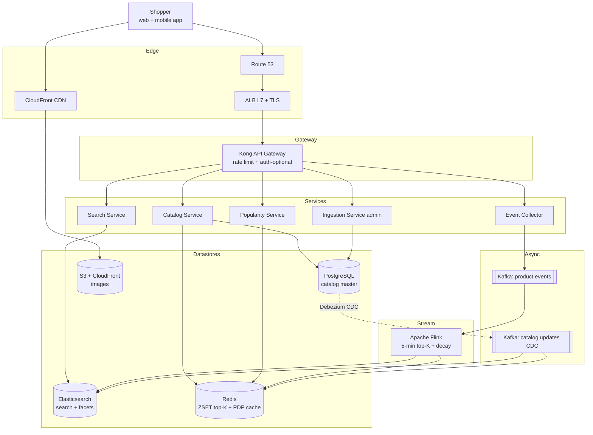

# 3. Product Browsing (E-commerce) — High-Level Design (HLD)

## 1. Requirements

### Functional
- Browse product catalog: list by category, search/filter, view Product Detail Page (PDP).
- Display **popularity-highlighted** merchandise ("trending now", "hot in Electronics") — refreshed every 5 minutes.
- Popularity computed from recent user events: views, add-to-cart, purchases (weighted, recency-decayed).
- Support pagination + filters (price, brand, rating, in-stock).
- Serve product images/assets via Content Delivery Network (CDN).
- Out of scope: cart, checkout, payments, order mgmt, inventory writes (browsing only).

### Non-Functional
- **Latency**: PDP 99th percentile (p99) < 150 ms globally, listing p99 < 200 ms.
- **Availability**: 99.99% for reads (browsing downtime = revenue loss).
- **Durability**: catalog master data durable (11 9s); popularity data can be rebuilt from event stream.
- **Consistency**: eventual for popularity (5-min Service Level Agreement (SLA)); strong for catalog source of truth (but replicated to eventually-consistent read stores).
- **Scale ceiling**: 10M products, 200M views/day, 10k peak Queries Per Second (QPS).

## 2. Scale & Estimates (recap)

- 50M Monthly Active Users (MAU), 10M Daily Active Users (DAU), 20 views/user/day → **200M views/day**
- Avg QPS: 200M / 86400 ≈ **2.3k/s**
- Peak QPS (holiday/sale burst, 4x): **~10k/s**
- Catalog size: 10M products * ~5 KB (title, desc, attrs, price, etc.) ≈ **50 GB master catalog**
- Popularity events: 2.3k/s average, ~10k/s peak → streamed into **Flink** → **Redis ZSET**
- With **90% cache hit ratio** at the CDN/Redis tier, origin store sees ~1k QPS.
- Top-K per category: ~10 categories * 1 MB each ≈ **10 MB in Redis** — trivial
- Full math: [estimations doc](../back_of_envelope_estimations_example.md)

## 3. High-Level Component Design

### Edge / Load Balancer (LB)
- **CloudFront CDN** fronts everything — images, PDP HyperText Markup Language (HTML), listing JavaScript Object Notation (JSON) (short Time To Live (TTL) with stale-while-revalidate).
- **Amazon Web Services (AWS) Application Load Balancer (ALB) (Layer 7 (L7))** for origin Application Programming Interface (API) traffic.
- Transport Layer Security (TLS) at CloudFront and ALB; HyperText Transfer Protocol (HTTP)/2 + HTTP/3 (QUIC) at edge.
- Geo routing: Route 53 latency-based across us-east-1, eu-west-1, ap-south-1.

### API Gateway
- **Kong** or **AWS API Gateway**.
- Anonymous reads allowed (most browsers aren't logged in); authenticated rate limits are higher.
- Rate limit: 60 req/s per Internet Protocol (IP) address (unauth), 200 req/s per user (auth).
- Routes `/v1/catalog/*`, `/v1/search/*`, `/v1/popularity/*`, `/v1/products/*`.

### Services
| Service | Responsibility |
|---------|---------------|
| **Catalog Service** | Product Create Read Update Delete (CRUD) (admin) + read APIs for PDP + listing. Source of truth adapter. |
| **Search Service** | Faceted search, filters, full-text — backed by Elasticsearch (ES). |
| **Popularity Service** | Reads top-K / "trending" from Redis ZSETs; enriches with product data. |
| **Ingestion Service** | (write side, admin) merchant CRUD + catalog sync. |
| **Event Collector** | Collects view/click/cart events from clients, publishes to Kafka. |
| **Popularity Aggregator (Flink)** | Stream processor that computes recency-decayed popularity scores. |

### Datastores
- **PostgreSQL** — canonical product catalog (master data, strong consistency for admin writes).
- **Elasticsearch** — denormalized search index + facet aggregations.
- **Redis** — top-K ZSETs per category, product detail cache, facet cache.
- **Amazon Simple Storage Service (S3) + CloudFront** — product images, videos, static assets.
- **Kafka** — event stream (`product.events`).
- **Flink state store (RocksDB)** — stream processor state.

### Async Infra
- **Kafka `product.events`** — views, clicks, add-to-cart, purchases from the web/app.
- **Kafka `catalog.updates`** — Change Data Capture (CDC) from PG → ES + Redis, so search index and cache stay fresh.
- **Flink pipeline** — reads `product.events`, outputs windowed top-K scores to Redis every 5 min.

## 4. API Design

```
GET /v1/catalog/categories
GET /v1/catalog/categories/{id}/products?page=1&filter=brand:Nike&sort=popularity
GET /v1/products/{product_id}               -> PDP
GET /v1/search?q=running+shoes&filter=price<5000

GET /v1/popularity/trending?category={id}&limit=20
  resp: { items: [ { product_id, title, image, score } ] }

POST /v1/events                              -> client pings view/click
  body: { user_id?, session_id, product_id, event_type, ts }
```

## 5. Data Storage & Schema Design

### Schema
```
Products(                          -- PostgreSQL
  product_id PK, sku UNIQUE,
  title, description,
  category_id FK, brand, price, currency,
  attrs JSONB,                     -- color, size, material, etc.
  images JSONB,                    -- S3 keys
  status ENUM(ACTIVE, HIDDEN, DELETED),
  created_at, updated_at
)

Categories(category_id PK, parent_id FK, name, slug, path ltree)

ProductIndex (Elasticsearch doc):
  { product_id, title, desc, brand, category_path,
    price, attrs, popularity_score, in_stock }

Redis keys:
  pdp:{product_id}        -> serialized PDP JSON,  TTL 5min
  top:{category_id}       -> ZSET { product_id → score }, TTL 10min
  facets:{category_id}    -> hash of facet counts
```

### DB Choice & Justification
- **Why Postgres for catalog master**: catalog writes are low volume (merchant uploads, hourly batches), but need strong consistency, rich relational joins (products ↔ categories ↔ brands), constraints, and JSON Binary (JSONB) for flexible attributes. PG nails all four. It is the *source of truth*; everything else is a derived read store.
- **Why Elasticsearch for search**: facet counts, relevance scoring, full-text, geo — all native in ES. Running those on Postgres Generalized Inverted Index (GIN) indexes technically works up to a few million docs but collapses on facets at 10M. ES was designed exactly for this read shape.
- **Why Redis for top-K and PDP cache**: ZSET gives O(log n) score updates and O(log n + k) top-K retrieval — this is literally the data structure for a leaderboard. At 10 MB total for popularity we don't even need clustering for that specific dataset. PDP cache absorbs the 90% hit rate we need to keep PG happy.
- **Why not only MongoDB**: Mongo could hold the catalog, but we'd still need ES for search and Redis for top-K — so we're not actually saving a store. PG's constraint/transaction story for admin writes is stronger, and the analytics team can query it with plain SQL.
- **Why not Cassandra/DynamoDB for catalog**: catalog writes are low-QPS and relational; Cassandra's wide-column model and Dynamo's single-table pattern both force us to denormalize heavily for queries we don't actually have scale pressure on. They'd shine if catalog writes were high-throughput — they aren't. Dynamo is tempting for PDP cache, but Redis is an order of magnitude faster for hot reads at the same cost here.
- **Why not Redis as primary**: not durable at the level a catalog needs (Stock Keeping Unit (SKU) pricing in Random Access Memory (RAM) only is a disaster waiting to happen), no joins, no complex queries for admins. Redis is the cache and the leaderboard, not the truth.

### Sharding & Partitioning
- **PG**: single primary (50 GB fits comfortably), category-based read replicas for listing queries.
- **ES**: 10 shards keyed by `product_id` hash, 2 replicas each → 30 total shards, coordinator nodes fan out queries.
- **Redis**: cluster mode for PDP cache (keyspace partitioned by product_id); a single node is enough for top-K ZSETs (10 MB).
- **Kafka `product.events`**: 64 partitions keyed by `product_id` so Flink can compute per-product state deterministically.

### Replication
- PG: 1 primary + 2 sync read replicas + 1 async cross-region.
- ES: 2 replicas per shard.
- Redis: 1 replica per primary + Append-Only File (AOF) (catastrophe recovery only; cache can be rebuilt).

## 6. Scalability & Performance

### Caching
- **4-layer cache**:
  1. Browser cache (Cache-Control private, 60s).
  2. **CloudFront** edge (public pages, 30–120s with Stale-While-Revalidate (SWR)).
  3. Redis product/PDP cache (origin-side, TTL 5 min, invalidated via Kafka `catalog.updates`).
  4. PG shared buffers (Operating System (OS)-level).
- This is how 10k QPS at peak becomes ~1k QPS at the origin Database (DB).
- Cache invalidation: PG → Debezium CDC → Kafka `catalog.updates` → cache invalidators patch Redis + ES keys.

### Message Queues
- Kafka absorbs bursty event traffic during flash sales (10k events/s easily handled).
- Flink consumer has independent scaling knob — lag-based autoscale.
- Catalog CDC decouples admin writes from read-path freshness.

### Read-heavy vs Write-heavy
- Overwhelmingly read-heavy (10k reads/s vs < 10 writes/s to catalog). Entire design optimizes reads — CDN, Redis, ES, read replicas — and basically ignores write throughput.
- Event ingestion is medium-write (10k/s peak) but is handled async and never blocks a read.

## 7. Deep Dive

### Popularity score formula (recency-decayed)
We want "trending now", not "most viewed ever". The canonical approach:

```
score(p, t_now) = Σ_events w(type) * exp(-λ * (t_now - t_event))
```

- `w(view) = 1`, `w(add_to_cart) = 5`, `w(purchase) = 20` — action weight ≈ economic signal strength.
- `λ = ln(2) / half_life`, with `half_life = 6h` → an event's contribution halves every 6h and becomes noise after ~24h.
- Flink job: 5-min tumbling window over `product.events`; maintains per-product decaying sum in keyed RocksDB state. Every tumble emits `(product_id, category_id, score)` into a Redis writer sink.
- Writer does `ZADD top:{category_id} score product_id` and periodically `ZREMRANGEBYRANK` to cap at top 500 per category.
- Gaming resistance: events must carry session id + IP; dedup same-session views at Flink ingest using a Bloom filter keyed by `(session, product, 5min_bucket)`.
- "Global trending" = a special category_id = ALL.

### Search & filter index (Elasticsearch) and edge caching
- ES document per product with fields denormalized from PG + the current popularity score (updated every 5 min from the same Flink sink). This lets search sort by `_score * popularity_boost`.
- Facets (`brand`, `price` buckets, `rating`) are ES aggregations — returned in the same query, no second round-trip.
- Filter combinations are cached in Redis with a key that's a hash of the query string; hit rate ~40% because a long tail of users filter the same way ("Nike under $100 in Men's Running").
- CloudFront caches **listing JSON** (not just images) with a 30s TTL. A viral product page can get 100k hits/s at the edge and 0 at the origin — this is what keeps us alive during a Super Bowl advertisement.

## 8. Trade-offs

- **Consistency, Availability, Partition tolerance (CAP)**: AP for read path. In a network partition we'd rather serve a stale listing than show an error — shopping works with 5-min-old data.
- **Consistency model**: eventual across the read stores (ES, Redis lag PG by seconds); strong inside PG for admin writes.
- **Failure handling**: if Redis is cold, Catalog Service falls through to PG with a circuit breaker capped at 2k QPS so PG can't be overwhelmed; ES failures degrade search to "keyword on PG title" fallback; Kafka Dead Letter Queue (DLQ) for malformed events; client retries are idempotent because event ingestion uses `(session_id, event_id)` dedupe.

## 9. Mermaid Diagram


