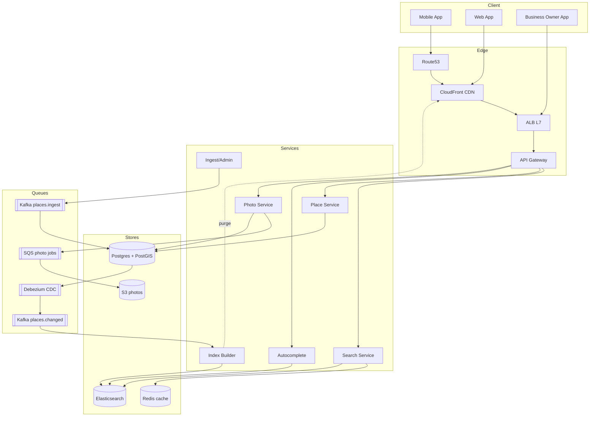

# 3. Proximity Service (Yelp / TripAdvisor) — HLD

## 1. Requirements

### Functional
- Search for places within radius R of (latitude, longitude) — "restaurants within 2 km of me".
- Filter by category, rating, price, open-now, cuisine.
- Sort by distance, rating, popularity.
- Place Create Read Update Delete (CRUD) for business owners (add, update address, hours, photos).
- Place detail page: metadata, photos, reviews (reviews are a separate service but linked).
- Autocomplete place name.
- Admin bulk import (data ingestion from partners, OpenStreetMap (OSM), etc.).

### Non-Functional
- Proximity query 99th percentile (P99) < 200 ms end-to-end.
- Availability 99.95% on read path.
- Durability: place data is source of truth; never lose an update.
- Consistency: eventual (seconds) for search index; strong for owner's own edits (read-your-writes).
- Scale ceiling: 200M places, 20M Daily Active Users (DAU), 10k peak query Queries Per Second (QPS).

## 2. Scale & Estimates (recap)

- 200M places globally.
- 100M Monthly Active Users (MAU), 20M DAU.
- 10 proximity queries/user/day → **200M queries/day** → **2.3k avg, 10k peak QPS**.
- Writes: ~10k place updates/day = **0.1 QPS avg**. Extremely read-heavy (100,000:1 ratio).
- Place row ≈ 2 KB (name, address, lat/lng, category, hours, photos_ref, attributes) → **400 GB catalog**.
- Geohash/Google S2 geometry library (S2) index: 200M × ~50 B = **10 GB** → fits in memory.
- Full math: [estimations doc](../back_of_envelope_estimations_example.md)

## 3. High-Level Component Design

### Edge / Load Balancer (LB)
- CloudFront Content Delivery Network (CDN) at the edge (huge win — proximity queries are heavily cacheable, see Deep Dive).
- Amazon Web Services (AWS) Application Load Balancer (ALB) at Layer 7 (L7) behind CDN for dynamic requests.
- Route53 latency routing to nearest region (multi-region read replicas).

### Application Programming Interface (API) Gateway
- AWS API Gateway: JSON Web Token (JWT) auth for logged-in users (optional), API key for business owner apps, rate limit 100 req/min per Internet Protocol (IP) / 1000 per user.

### Services (microservices)
| Service | Responsibility |
|---------|---------------|
| Search Service | Proximity + filter + sort; talks to geo index |
| Place Service | Create Read Update Delete on places, source of truth writes |
| Index Builder | Consumes place change events, updates geo index |
| Autocomplete Service | Prefix search on names |
| Review Service (external) | Linked by place_id, not covered here |
| Photo Service | Photo upload + resize, stores in Amazon Simple Storage Service (S3) |
| Admin / Ingest Service | Bulk imports, moderation |

### Datastores
- **PostgreSQL with PostGIS** — source of truth for place catalog (400 GB, strong consistency on writes).
- **Elasticsearch (ES)** — search index with `geo_point` for proximity + filter + sort; serves all reads.
- **Redis** — top-query cache, rate limits, autocomplete trie.
- **S3** — photos, bulk import files.
- (Alternative considered: a dedicated geo store like Tile38 — discussed below.)

### Async Infra
- **Kafka**:
  - `places.changed` — Postgres Change Data Capture (CDC) → indexer → Elasticsearch.
  - `places.ingest` — bulk import pipeline.
- **Amazon Simple Queue Service (SQS)** for photo resize jobs.

## 4. API Design

```
GET /v1/places/search?lat=37.77&lng=-122.42&radius_m=2000
    &category=restaurant&min_rating=4&open_now=true
    &sort=distance&limit=20&cursor=...
  → {
      "results":[
        {"place_id":"p_42","name":"...","lat":...,"lng":...,
         "distance_m":312,"rating":4.5,"category":"restaurant"}
      ],
      "next_cursor":"..."
    }

GET  /v1/places/{place_id}
POST /v1/places                (business owner)
PUT  /v1/places/{place_id}
GET  /v1/autocomplete?q=star&lat=...&lng=...
```

## 5. Data Storage & Schema Design

### Schema

```
-- Postgres (source of truth)
CREATE EXTENSION postgis;

Places(
  place_id        UUID PRIMARY KEY,
  owner_id        UUID,
  name            TEXT,
  address         TEXT,
  city            TEXT,
  country         TEXT,
  location        GEOGRAPHY(POINT, 4326),   -- PostGIS
  category        TEXT,
  subcategories   TEXT[],
  rating          NUMERIC(2,1),
  price_tier      SMALLINT,
  hours           JSONB,
  attributes      JSONB,
  photo_refs      TEXT[],
  status          TEXT,                     -- active|closed|pending
  created_at      TIMESTAMPTZ,
  updated_at      TIMESTAMPTZ
);
CREATE INDEX places_gix ON Places USING GIST(location);  -- R-tree

-- Elasticsearch (search index, read-only mirror)
{
  "place_id": "p_42",
  "name": "Starbucks",
  "location": {"lat": 37.77, "lon": -122.42},   -- geo_point
  "category": "cafe",
  "rating": 4.3,
  "price_tier": 2,
  "open_hours": [...],
  "popularity": 0.87
}
```

### DB Choice & Justification

This problem has two stores that matter: the source of truth and the geo index. The interesting choice is the geo index.

- **Why Elasticsearch for the search index**: (1) Native `geo_point` with `geo_distance` + `geo_bounding_box` queries. (2) Combines geo with filter (`category`, `rating`, `open_now`) and sort in one query — Postgres + PostGIS can do this but combining geo + full-text + faceting is clunky. (3) Horizontally sharded by default. (4) 400 GB with replicas fits 6–10 nodes cheaply. (5) Near-real-time (1 s refresh) is fine — owner edits tolerate a 1 s lag.
- **Why Postgres + PostGIS for source of truth**: Owner edits need transactions ("update hours, bump version, enqueue reindex event" in one commit). PostGIS gives us verification queries (exact within-radius for cross-checks). Schema evolution is easy. 400 GB × 1 primary + 2 replicas is a boring setup.
- **Why not PostGIS alone (no ES)**: At 10k query peak, PostGIS R-tree with complex filters on a single primary would need aggressive read replicas. Combining `ST_DWithin` with text filters and sorting by rating still works but at P99 you hit 300–500 ms, not 200. ES gives headroom and better fan-out. Also, ES supports aggregations (category facets) much better.
- **Why not Cassandra / DynamoDB with geohash**: You can build proximity on Cassandra by partitioning by geohash-prefix (e.g., geohash[0:5]). It works for "within this cell" but becomes painful for arbitrary radius spanning cell boundaries — you have to query multiple partitions and merge. Filter + sort must be app-side. Writes are cheap but this is a read-heavy problem, so Cassandra's write strength is wasted.
- **Why not MongoDB**: Mongo has `2dsphere` indexes and works fine up to tens of GB. At 400 GB and 10k QPS, aggregation pipelines on combined geo + filter + sort become bottlenecks, and sharding by location is awkward (hashed vs ranged trade-off is worse than ES). Viable, just worse.
- **Why not Redis as primary**: Redis has `GEOADD` / `GEOSEARCH` and is fast, but (a) in-RAM 400 GB is expensive and (b) filtering by category/rating alongside geo is not native. Good as a hot-query cache only.
- **Why not Tile38** (specialized geo): It is excellent for pure geofencing and moving objects. For a static catalog with rich filter + sort, ES is more flexible and has broader ecosystem.

### Sharding & Partitioning
- Elasticsearch: shard by `geohash[0:3]` routing — groups nearby places on the same shard so a radius query typically hits 1–4 shards, not all 50. Avoid pure hash routing because it would scatter every query across all shards.
- Postgres: single primary is enough at 400 GB. If scaled, shard by `country_code` (natural locality for regional growth).
- Redis: cluster, slot by `{geohash5}` so cache entries for a neighborhood colocate.

### Replication
- Postgres: 1 primary + 2 streaming replicas (one in DR region).
- Elasticsearch: 1 replica per shard, cross-cluster replication to a read-only mirror in another region.
- Multi-region: active-active reads, active-passive writes (writes flow to primary region, CDC replicates).

## 6. Scalability & Performance

### Caching
- **CDN**: search queries keyed by (rounded lat/lng to 3 decimals, radius_bucket, filter_hash). 3 decimals ≈ 110 m granularity — a user moving across the street hits the same cache entry. Time To Live (TTL) 60 s. Expected CDN hit rate > 70%.
- **Redis hot-query cache**: for queries that miss CDN but are popular (downtown SF at lunchtime), cache the ES result for 30 s.
- **Place detail**: cached in Redis with 5 min TTL, invalidated on owner edit via Kafka event.
- **Autocomplete**: in-memory trie in autocomplete service, rebuilt hourly from ES.

### Message Queues
- Kafka `places.changed` from Postgres CDC (Debezium) → indexer → ES. Partitioned by `place_id` to preserve per-place order.
- Batched indexer: consumes 1000 events or 1 s timeout, then bulk-indexes into ES for throughput.
- Dead Letter Queue (DLQ) for failed indexing (malformed photo ref, etc.).

### Read-heavy vs Write-heavy
- Extremely read-heavy (100k:1). Every layer optimized for reads: CDN → Redis → ES. Postgres is barely touched by search traffic.
- Writes path: owner PUT → Postgres → CDC → Kafka → Indexer → ES, sub-second end to end.

## 7. Deep Dive

### Topic 1 — Geohash vs Quad Tree vs S2 vs PostGIS R-tree

All four solve the same problem: efficient "which points are in this region". They differ in cell geometry and how they handle queries spanning multiple cells.

**Geohash**. Interleaves lat/lng bits into a base-32 string. A prefix like `9q8yy` is a rectangular cell; longer prefix = smaller cell. Level 5 ≈ 4.9 km × 4.9 km, level 7 ≈ 153 m × 153 m. For a radius query, pick the level whose cell ≈ 2R, grab that cell plus its 8 neighbors, fetch all points, then filter by exact distance.
- Pros: string keys, trivial to shard/cache, compact.
- Cons: rectangular cells distort near the poles; cell boundary problem — two points 10 m apart can sit in different cells requiring neighbor lookup. Indexing 200M points is fine.

**Quad Tree**. Recursive 2D subdivision; each node has 4 children. Query descends the tree for the target region.
- Pros: adapts to density (dense areas subdivide more).
- Cons: pointer-chasing, harder to distribute. Best for in-memory. Rebuild cost on updates is nontrivial.

**S2** (Google). Projects the sphere onto 6 cube faces, subdivides each face with a Hilbert curve. Cells are near-equal-area worldwide, including at the poles. Each cell has a 64-bit integer Identifier (ID); covering a region is a set of cell IDs.
- Pros: handles sphere correctly (no pole distortion), Hilbert curve gives good locality (nearby cells have nearby IDs → range scans), rich covering algorithms.
- Cons: library complexity; harder to explain in an interview than geohash.

**PostGIS R-tree (GIST)**. Generic spatial index on geometry/geography columns. Works for points, polygons, lines.
- Pros: Structured Query Language (SQL)-native, transactional with the rest of your data, exact distance queries.
- Cons: single-node scaling; combining with filters + sort gets heavy at > 5k QPS; not ideal for primary hot-read path.

**Our choice**. Elasticsearch's `geo_point` internally uses a Block K-Dimensional (BKD) tree (essentially a dynamic R-tree variant). We expose it to clients, shard by `geohash[0:3]` for routing, and use S2 conceptually only for cache key bucketing if we want equal-area buckets. This hybrid gives correct geo math + horizontal scale + rich filtering.

### Topic 2 — CDN / Edge Caching for Top-Query Buckets + Index Update Strategy

**CDN caching**. Proximity queries are highly spatially clustered — downtown areas at lunch hours absorb most traffic. We normalize query params before hashing the cache key:
1. Round lat/lng to 3 decimals.
2. Round radius to nearest 500 m bucket.
3. Canonicalize filter JSON (sorted keys).
4. Exclude user-specific params (user_id) — results are the same for everyone in that tile.

Result: the top 1000 tiles × ~10 filter combos ≈ 10k cache keys absorb ~70% of all QPS. At 10k peak, origin only sees ~3k QPS. TTL 60 s keeps freshness acceptable.

Cache-busting on place updates: the indexer publishes to a `places.invalidate` stream consumed by a CDN-purge worker that PURGEs tiles intersecting that place's geohash cell. For owner read-your-writes, we add a `Cache-Control: no-cache` header when the requester is the place owner.

**Index update strategy**. Options:
- **Incremental** (our choice for normal operations): CDC from Postgres → Kafka → indexer → ES bulk API. Per-document update. Latency ~1 s p99. Handles our 10k updates/day trivially.
- **Bulk rebuild** (for schema migrations or Disaster Recovery (DR)): nightly job snapshots Postgres, builds a new ES index via `reindex` API, swaps the alias atomically when done. Zero downtime. Runs in ~30 min for 200M docs on a dedicated reindex pool.
- **Hybrid** for bulk imports: ingest service writes to Postgres in batches, CDC picks them up naturally — but to avoid flooding ES we throttle the indexer to 5k docs/sec and use a separate "backfill" consumer group so live traffic isn't starved.

## 8. Trade-offs

- **Consistency, Availability, Partition tolerance (CAP)**: Read path is **Available and Partition-tolerant (AP)** — CDN + ES replicas serve stale data under partition rather than fail. Write path is **Consistent and Partition-tolerant (CP)** via Postgres.
- **Consistency model**: Eventual (1–2 s) for search, strong for owner's own edits via read-your-writes: owner's UI fetches directly from Postgres (not ES) for 10 s after an edit, using a short-lived session flag.
- **Failure handling**:
  - Circuit breaker around ES; fall back to PostGIS primary for search if ES is entirely down (degraded latency, still works).
  - Retries in indexer with DLQ.
  - CDN stale-while-revalidate so origin failure doesn't mean client error.
  - Idempotent indexing using place version number (`_version` in ES) to prevent out-of-order updates from Kafka replays.

## 9. Mermaid Diagram


