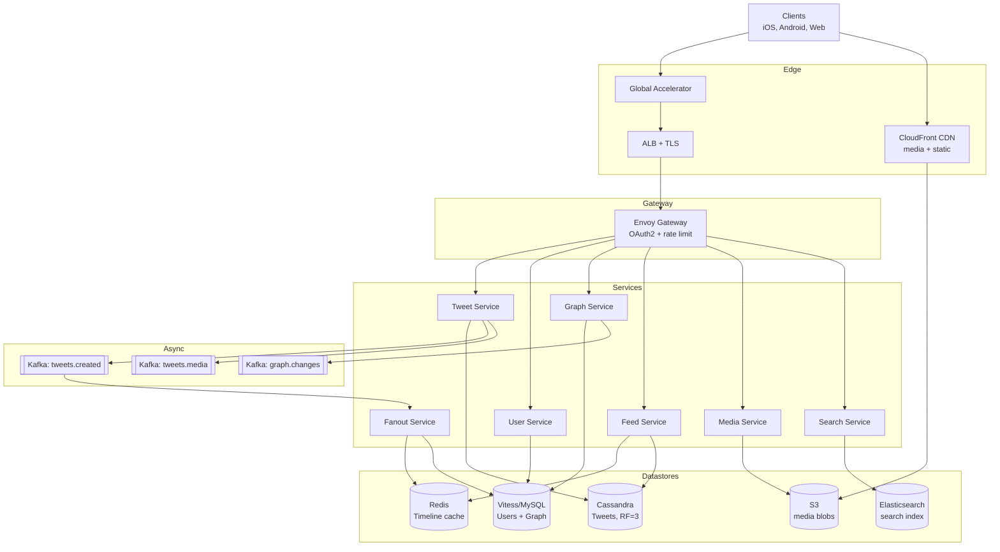

# 2. Simplified Twitter — High-Level Design (HLD)

## 1. Requirements

### Functional
- `createUser(user_id)` — register a new user.
- `postTweet(user_id, tweet_text, [media])` — publish a tweet, up to 280 chars + optional media (image/video).
- `follow(follower, followee)` / `unfollow(follower, followee)`.
- `getNewsFeed(user_id)` — return the **10 most recent** tweets from the user's own timeline + all followees, newest first.
- View a user profile (latest N tweets).
- Like / retweet out of scope for this cut (keep interview scope tight).

### Non-Functional
- **Latency**: `getNewsFeed` 99th percentile (p99) < 200 ms; `postTweet` p99 < 300 ms.
- **Availability**: 99.99% for reads (feed), 99.95% for writes.
- **Durability**: tweets are durable forever (or 5-year retention per assumption); media stored with 11 9s.
- **Consistency**: eventual for feed (Read-Your-Writes (RYW) for the poster's own tweet — they should see their own post immediately).
- **Scale ceiling**: 300M Monthly Active Users (MAU), 55 PB media over 5 years, 70k feed reads/s peak.

## 2. Scale & Estimates (recap)

- 300M MAU, 150M Daily Active Users (DAU), 2 tweets/user/day
- Tweets/day = 300M → **~3.5k/s average, ~7k/s peak**
- Feed reads ≈ 10x tweets (each user checks feed ~20x/day): **~35k/s average, ~70k/s peak**
- Tweet row: 64 B metadata + 140 B text ≈ 200 B; 300M * 200 B/day ≈ **60 GB/day of tweet text**
- Media: 10% have media, ~1 MB avg → 30M * 1 MB = **30 TB/day** media
- 5 years media = **~55 PB** → Amazon Simple Storage Service (S3) + Content Delivery Network (CDN)
- Full math: [estimations doc](../back_of_envelope_estimations_example.md)

## 3. High-Level Component Design

### Edge / Load Balancer (LB)
- **Amazon Web Services (AWS) Global Accelerator** + **CloudFront** for static/media edge.
- **Application Load Balancer (ALB) (Layer 7 (L7))** fronts Application Programming Interface (API) fleet; Transport Layer Security (TLS) terminated here.
- Anycast Internet Protocol (IP) addresses for low-latency global entry.

### API Gateway
- **Envoy**-based gateway (matches Twitter-scale reality; Kong also fine).
- Auth via Open Authorization (OAuth) 2 bearer tokens, short-lived JSON Web Tokens (JWTs).
- Rate limit: 300 tweets/day/user, 900 read req/15 min/user.
- Routes `/v1/tweets/*`, `/v1/feed/*`, `/v1/users/*`, `/v1/graph/*`.

### Services
| Service | Responsibility |
|---------|---------------|
| **Tweet Service** | Persist tweets, generate tweet_id (Snowflake), upload media handoff. |
| **User Service** | Profile CRUD, auth, user metadata. |
| **Graph Service** | Follow / unfollow / followers / followees. |
| **Fanout Service** | Consumes new-tweet events, pushes tweet_ids into followers' timeline caches. |
| **Feed Service** | Serves `getNewsFeed` — reads precomputed timeline cache + pulls celebrity tweets. |
| **Media Service** | Signed S3 upload URLs, transcoding pipeline handoff. |
| **Search Service** | (optional) ES index of tweets for hashtag/keyword. |

### Datastores
- **Cassandra** — tweets table (append-heavy, time-ordered, massive scale).
- **MySQL / Vitess** — user profiles, social graph (followers/followees) — Twitter IRL uses this.
- **Redis** — per-user precomputed timeline list (`LIST` of tweet_ids, capped to 800).
- **S3** — media blob storage; **CloudFront** CDN in front.
- **Elasticsearch (ES)** — search index.

### Async Infra
- **Kafka `tweets.created`** — fanout consumer pulls from here.
- **Kafka `tweets.media`** — transcoding workers.
- **Kafka `graph.changes`** — graph updates trigger cache invalidation.

## 4. API Design

```
POST /v1/users
  body: { handle, display_name, email }
  resp: { user_id }

POST /v1/tweets
  body: { text, media_ids? }
  resp: { tweet_id, created_at }

GET  /v1/feed?limit=10
  resp: { tweets: [ { tweet_id, author, text, media_urls, created_at } ] }

POST /v1/graph/follow    body: { followee_id }
POST /v1/graph/unfollow  body: { followee_id }

GET  /v1/users/{id}/tweets?limit=20&before=tweet_id
```

## 5. Data Storage & Schema Design

### Schema
```
Users(user_id PK, handle UNIQUE, display_name, email, created_at)

Tweets(                      -- Cassandra
  user_id,                   -- partition key
  tweet_id TIMEUUID,         -- clustering key DESC
  text, media_ids LIST, created_at
)

TweetsById(tweet_id PK, user_id, text, media_ids)   -- lookup by id

Follows(                     -- Vitess/MySQL, sharded by follower_id
  follower_id, followee_id, created_at,
  PRIMARY KEY (follower_id, followee_id)
)
Followers(                   -- inverse, sharded by followee_id
  followee_id, follower_id, created_at,
  PRIMARY KEY (followee_id, follower_id)
)

Timeline(                    -- Redis
  key = "timeline:{user_id}"
  value = LIST<tweet_id> capped at 800
)
```

### DB Choice & Justification
- **Why Cassandra for tweets**: write volume (7k/s peak) is append-only time-series; Cassandra's Log-Structured Merge tree (LSM) storage, tunable consistency, linear horizontal scale, and partition-by-user + clustering-by-time are a natural fit. Reading "latest N tweets of user X" is one partition scan. No joins needed.
- **Why Vitess/MySQL for the graph**: the social graph has strong relational structure and needs efficient bi-directional lookups (who I follow + who follows me). Twitter famously runs this on Manhattan + MySQL/Vitess. Follows/Followers are double-written into two sharded tables, each with a fitting partition key. SQL gives us transactional follow/unfollow and the row-level consistency users expect ("I unfollowed, I shouldn't see them").
- **Why not Postgres for tweets**: PG would cap out on write throughput long before Cassandra; VACUUM + hot-tuple bloat on a 300M-writes/day append-only table is painful. Use PG/MySQL where relational semantics matter (users, graph), not where it's a firehose.
- **Why not DynamoDB for tweets**: we'd pay per-request and per-GB for a workload that's 100% append. Cassandra self-hosted is cheaper at this scale and gives us fine control over compaction and Time To Live (TTL). Dynamo is the answer if the team is small and ops budget matters more than unit cost.
- **Why not MongoDB for tweets**: works but the sweet spot for Mongo is flexible documents with rich secondary queries. Our access pattern is "give me user X's tweets by time" — Cassandra's data model was literally designed for this and outperforms Mongo per node.
- **Why not Redis as primary store for tweets**: non-durable at firehose rate; 55 PB in Random Access Memory (RAM) is economically absurd. Redis is perfect for the timeline cache (the hot 800 tweet_ids per user) but not the cold durable store.

### Sharding & Partitioning
- **Cassandra tweets**: partition key `user_id`, clustering `tweet_id DESC`. Hot celebs (Obama, Elon) become hot partitions — handled by celebrity path (read-side pull, see deep dive).
- **Vitess follows**: `follower_id` as keyspace id; inverse table sharded on `followee_id`.
- **Redis timeline cache**: key `timeline:{user_id}`, consistent-hash shard across cluster.
- Tweet IDs: **Snowflake** (64-bit: ts + machine + seq) — sortable by time, globally unique, no central coordinator.

### Replication
- Cassandra Replication Factor (RF)=3, LOCAL_QUORUM reads/writes, multi-region with async replication.
- Vitess: semi-sync primary + 2 replicas per shard.
- Redis: cluster mode, 1 replica per primary, async.

## 6. Scalability & Performance

### Caching
- **Redis timeline cache** is the centerpiece. For each user, a Redis LIST capped to the last ~800 tweet_ids across all their followees. `getNewsFeed(user_id)` = `LRANGE timeline:{user_id} 0 9` → O(1) — then batch-fetch tweet bodies from Cassandra (or a second Redis tier) for the 10 ids.
- **Tweet body cache**: Least Recently Used (LRU) of `tweet_id → serialized tweet`, ~50 GB total, absorbs the hot-tail reads.
- **User profile cache**: very read-heavy, cached at gateway (Envoy local cache + Redis fallback).

### Message Queues
- Kafka `tweets.created` decouples write path from fanout; posting returns as soon as the tweet is durably in Cassandra.
- Fanout workers parallelize per followee-shard; backpressure handled via Kafka lag monitoring, scale consumers on lag > threshold.
- Media transcoding is a separate Kafka topic with its own worker pool.

### Read-heavy vs Write-heavy
- **Massively read-heavy**: 70k feed reads/s vs 7k tweets/s (10:1). Entire design is built around the feed read being a single Redis call for 99% of users.
- Writes are amplified by fanout — each tweet fans out to N followers, so effective writes to Redis are `sum(followers)` per tweet. A 1k-follower user → 1k Redis inserts. Handled by sharding and parallel workers.

## 7. Deep Dive

### Fan-out on write vs fan-out on read vs hybrid
- **Fan-out on write (push)**: when user A tweets, we push the `tweet_id` into every follower's Redis timeline cache. Reads are O(1) — `LRANGE` 10 items. Great for the common case: most users have < 1k followers, and most reads are cheap.
- **Problem**: celebrities with 50M followers. One tweet = 50M Redis writes = write storm, hot shards, 30s tail latency.
- **Fan-out on read (pull)**: at read time, query each followee's recent tweets and merge. O(F) per read where F = number of followees. A user following 500 people does 500 reads per feed load — disaster for reads.
- **Hybrid (our choice)**:
  - For users with followers < 10k → push to follower timelines on write.
  - For celebrities (followers ≥ 10k) → do **not** fan out. Their tweets live only in their own Cassandra partition.
  - At read time, Feed Service does `LRANGE timeline:{me}` for the push half, then pulls the last 10 tweets from each celebrity I follow (cached aggressively, often same celeb cached across millions of users), and merges by timestamp. Typical user follows ≤ 20 celebs, so the pull cost is tiny and cache-friendly.
- **RYW for self**: your own tweet is always inserted into your own timeline cache synchronously so you see it on refresh, regardless of fanout lag.

### Media pipeline (S3 + CDN)
- Client requests `POST /v1/media/upload` → Media Service returns a **pre-signed S3 PUT Uniform Resource Locator (URL)**. Client uploads directly to S3, bypassing our servers (saves bandwidth).
- S3 event → Kafka `tweets.media` → transcoding workers produce multiple renditions (thumbnail, 480p, 1080p).
- URLs are served through **CloudFront** with long TTLs; cache hit ratio > 95% typical.
- 30 TB/day of media * 5 years = 55 PB in Amazon S3 Glacier-IA for cold tier; hot tier ~ last 90 days in S3 Standard.
- Total origin bandwidth drops ~50x thanks to the CDN — the only way this economics works.

## 8. Trade-offs

- **Consistency, Availability, Partition tolerance (CAP)**: AP for tweets and feed. Partition tolerance wins; a slightly stale feed is fine, lost tweets are not (so we make durability a separate axis — tweets are fsynced in Cassandra before ack).
- **Consistency model**: eventual for feed (fanout lag), RYW for the poster's own timeline, strong for follow/unfollow (MySQL).
- **Failure handling**: idempotent tweet posts via `(user_id, client_dedupe_key)`; fanout Kafka consumers are at-least-once with idempotent Redis inserts (`LPUSH` then `LTRIM`); Dead Letter Queue (DLQ) for persistently failing fanouts (e.g. missing Redis shard); circuit breakers between Feed Service and Cassandra to shed load under overload.

## 9. Mermaid Diagram


