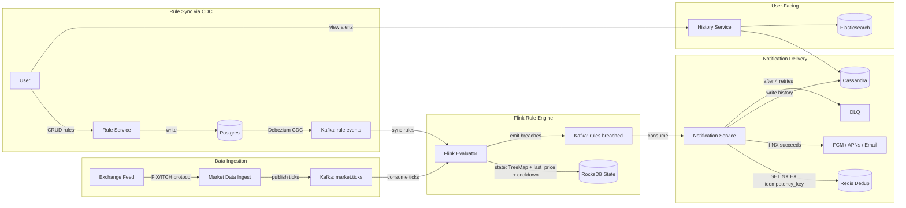

# Stock Price Alert System — HLD (Revision Notes)

---

## NFRs (Frame Every Design Choice Around These)

```
p99 tick-to-notification < 1s
At-most-once notifications (no spam)
99.95% availability during market hours
Scale: 50M users, 50M rules, 10k ticks/s, 15M notifs/day
```

---

## Core Architecture

```
Exchange → Kafka (market.ticks) → Flink → Kafka (rules.breached) → Notification Service → Users
                                    ↑
                          Postgres → Debezium CDC → Kafka (rule.events)
```

---

## Scale Numbers

```
Users          = 50M (10M with alerts, ~5 rules each)
Active rules   = 50M
Stocks         = 10k
Rules/stock    = 50M / 10k = 5000 avg (AAPL/TSLA up to 1M)
Ticks          = 10k/sec during 6.5h trading window
Notifications  = 15M/day (~170/sec avg, 1-2k/sec peak)
Rule storage   = 50M x 200B = 10 GB (fits in Redis)
```

---

## Key Components

### 1. Kafka (Transport + Buffering)

* Topics:
  * `market.ticks` — stock ticks (partitioned by stock_id, 64 partitions)
  * `rule.events` — rule CRUD changes via CDC
  * `rules.breached` — triggered alerts
* Hot stock partitioning: `stock_id + bucket` to spread load

### 2. Flink (Rule Engine)

* Consumes: ticks stream + rule.events (CDC side-input)
* Maintains keyed state in RocksDB per stock:
  * `TreeMap<threshold, List<rules>>` — indexed rules
  * `last_price` — for state transition dedup
  * `last_trigger_ts` per rule — cooldown check
* Emits only valid, deduped breach events

### 3. Notification Service (Delivery + Dedup)

* Consumes `rules.breached`
* Before sending:
  * Redis `SET NX EX` with idempotency key (delivery dedup)
  * If key exists → drop (already sent)
  * If key absent → send push/email + write alert history
* Handles: fanout (FCM/APNs/email/in-app), retries with backoff, DLQ after 4 failures
* For in-app: WebSocket or SSE for immediate delivery; fall back to push/SMS if user is offline (based on presence/last-active signal)

### 4. Rule Service

* CRUD API for rules
* Writes to Postgres (source of truth) + invalidates Redis cache
* Changes flow to Flink via: Postgres → Debezium CDC → Kafka → Flink

---

## Rule Sync (CDC Flow)

```
User edits rule → Rule Service → Postgres
                                    ↓
                              Debezium CDC
                                    ↓
                          Kafka (rule.events)
                                    ↓
                          Flink updates state (INSERT/UPDATE/DELETE)
```

* No DB calls from Flink — rules pushed as stream
* End-to-end lag < 2s for rule edits to take effect

---

## Why Flink (Not Redis) for Rule Evaluation?

| Concern | Flink | Redis |
|---------|-------|-------|
| **Processing model** | Stream processor — reacts to each tick automatically | You'd poll or script Lua — not built for continuous stream processing |
| **State co-location** | State lives on the same node as computation — zero network hops | Every tick = network round-trip to Redis (10k/s x RTT adds up) |
| **Indexed queries** | TreeMap/sorted structures in RocksDB — range queries on threshold | Redis sorted sets work, but orchestrating the logic externally is fragile |
| **Checkpointing** | Built-in exactly-once state snapshots to S3 — crash recovery replays from Kafka offset | Redis AOF/RDB exists but isn't tied to Kafka offsets — no coordinated recovery |
| **Scalability** | Keyed parallelism — add operators per hot symbol | Redis scales storage, not computation logic |
| **CDC integration** | Native side-input from Kafka rule.events — updates state in-place | You'd need a separate consumer to sync rules into Redis |

**Bottom line:** Redis is great as an index/cache, but rule evaluation is a **continuous computation problem** — Flink is purpose-built for that. Redis would require stitching together polling, Lua scripts, and external orchestration to achieve what Flink does natively.

---

## Rule Evaluation Optimization

**Problem:**
```
5000 rules/stock x 10k ticks/sec = 50M checks/sec (impossible)
```

**Solution: Indexed range queries**
```
Per stock in Flink state:
  TreeMap<threshold, List<rules>>

On each tick:
  range(last_price, current_price) → only rules whose threshold was crossed
```

**Result:**
```
~10 rules evaluated per tick → 10k x 10 = 100k checks/sec
Trivial for a 20-node Flink cluster (~5k ops/sec per worker)
```

**Complexity:** `O(log N + K)` where K = rules actually crossed

---

## Dedup Strategy (Two Layers)

### Layer 1: Flink (Logic Dedup)

Prevents repeated alerts while price stays above threshold:
```
State transition: false → true = EMIT
                  true → true  = SKIP

Cooldown check: now - last_trigger_ts > cooldown_sec
```

Handles oscillation (price bouncing around threshold).

### Layer 2: Notification Service (Delivery Dedup via Redis)

Catches duplicates from Flink crash recovery / replays.

**Idempotency Key Formula:**
```
key = rule_id + ":" + floor(tick_ts / cooldown_sec)

Example:
  rule_id = rule_123, cooldown = 900s, tick_ts = 1712830500
  key = "rule_123:" + floor(1712830500 / 900) = "rule_123:1903145"
```

**Redis check in Notification Service:**
```
SET dedupe:rule_123:1903145 1 NX EX 900

NX succeeds → key is new    → send notification
NX fails    → already sent  → drop silently
```

**Why both layers?**
```
Flink checkpoint at t=5, emits alert at t=8, crashes at t=9
Alert already delivered at t=8
Flink restarts → replays from t=5 → emits same alert again
Without Redis → duplicate notification
With Redis    → NX fails → suppressed
```

---

## Hot Stock Handling

**Problem:**
```
AAPL → millions of rules + high tick rate → single partition bottleneck
```

**Solution:**
```
Kafka key = stock_id + bucket (e.g., AAPL-0, AAPL-1, AAPL-2)
Flink operator splits by (symbol, rule_id % K)
K parallel operators per hot symbol, results merged downstream
```

**Tradeoff:** Lose strict ordering → fix in Flink using state

---

## Storage Choices

| Store | Purpose | Why This? |
|-------|---------|-----------|
| **Postgres (Aurora)** | Rules + Users (source of truth) | Strong consistency, low write volume (~100/s), read-your-writes for UI |
| **Redis Cluster** | Rule index + dedup keys (cache only) | O(log n) sorted set lookups in < 1ms, 10GB fits easily |
| **Cassandra** | Tick history + alert history | Append-only, 10k writes/s, TTL for auto-expiry, partition scans |
| **Elasticsearch** | Alert search for user UI | Full-text search over alert history |
| **S3** | Cold tick archive (> 90 days) | Cheap, durable |

### Why Not Alternatives?

* **Why not Redis as primary?** — No durability guarantee. If a shard is lost, rules are gone. Redis is a cache/index, Postgres is the SoR.
* **Why not DynamoDB?** — Range queries on threshold (`threshold < price`) are expensive via GSI at 10k lookups/sec. Ecosystem around Flink joins is weaker.
* **Why not just Postgres for everything?** — 50M rules x 10k tick lookups/s = crushing join traffic. Can't serve the hot evaluation path.

---

## Failure Handling

```
Redis down        → fallback to Cassandra LWT (INSERT IF NOT EXISTS)
FCM/APNs down     → circuit breaker → email fallback
Flink crash       → replay from Kafka offset + RocksDB checkpoint (every 10s)
Notification fail → exponential backoff (1s, 4s, 16s, 60s) → DLQ after 4 retries
Exchange feed     → secondary provider on standby, config flag switchover
```

---

## API Design

```
POST   /v1/rules             # create rule
GET    /v1/rules             # list my rules
PUT    /v1/rules/{id}        # update
DELETE /v1/rules/{id}

GET    /v1/alerts?since=ts   # alert history
GET    /v1/stocks/{sym}/quote
POST   /v1/devices           # register push token
```

Create rule body:
```json
{
  "symbol": "AAPL",
  "type": "PRICE_ABOVE",
  "threshold": 180.50,
  "cooldown_sec": 900,
  "notification_channels": ["push"]
}
```

---

## Common Mistakes

* Scanning all rules per tick (use indexed range queries)
* Relying only on Flink OR only on Redis for dedup (need both layers)
* Thinking Kafka handles fanout (it doesn't — notification service does)
* No hot key handling (AAPL will bottleneck a single partition)
* Making DB calls from inside Flink (use CDC stream instead)
* Ignoring oscillation dedup (price bouncing around threshold = spam)

---

## Architecture Diagram



### Step-by-step flow (read the diagram with this):

```
1. Exchange sends ticks → Market Data Ingest normalizes → publishes to Kafka (market.ticks)
2. User creates rule → Rule Service writes to Postgres → Debezium CDC → Kafka (rule.events)
3. Flink consumes both streams:
   a. Ticks keyed by stock_id
   b. Rule events update local RocksDB state (TreeMap indexed by threshold)
4. On each tick: range query TreeMap(last_price → current_price) → find crossed rules
5. Cooldown check: skip if now - last_trigger_ts < cooldown_sec
6. Emit breach event to Kafka (rules.breached) with idempotency_key
7. Notification Service consumes breach:
   a. Redis SET NX EX with idempotency_key
   b. NX succeeds → send to FCM/APNs/email → write to Cassandra
   c. NX fails → already sent → drop
8. User queries alert history via History Service → reads Cassandra/Elasticsearch
```

---

## Interview Answer Template

> Stock ticks flow from the exchange into Kafka, where Flink consumes them alongside rule updates streamed via CDC from Postgres. Flink maintains indexed rule structures (TreeMap) per stock in RocksDB state, evaluating only rules whose thresholds are crossed using range queries — reducing 50M theoretical checks/sec to ~100k actual. Dedup happens in two layers: Flink checks state transitions and cooldowns before emitting, and the Notification Service uses Redis SET NX EX with an idempotency key (rule_id + time window) to catch replay duplicates. Notifications fan out via FCM/APNs/email with exponential backoff and DLQ for failures.

---

## One-line Takeaway

```
Stream rules via CDC, index in Flink, evaluate via range queries, dedup in two layers, notify via decoupled service.
```
