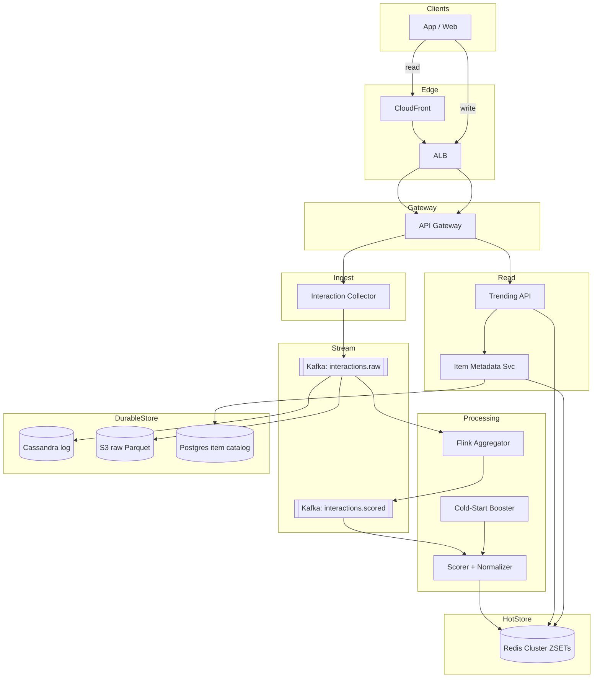

# 4. Trending Items Backend — HLD

## 1. Requirements

### Functional
- Ingest user interactions (view, click, like, share, purchase) on items.
- Compute a "trending score" per item over the last 1 hour (sliding window).
- Return top-N (default 100) trending items globally, per category, per region.
- Support item metadata lookup (title, thumbnail, creator).
- Prevent a single item from dominating top-N (fairness / normalization).
- Handle cold-start items (new → still rankable).
- Recompute leaderboards every minute.

### Non-Functional
- Trending read 95th percentile (p95) < 50 ms (hot path, user-facing).
- Interaction ingest 99th percentile (p99) < 100 ms (fire-and-forget is fine).
- Availability: 99.95% read, 99.9% ingest.
- Eventual consistency — 1 min lag on trending is acceptable.
- Scale ceiling: 1B interactions/day, 100M items, 50M Daily Active Users (DAU).

## 2. Scale & Estimates (recap)

- 50M DAU × 20 interactions/day = **1B events/day**.
- Avg **~12k Queries Per Second (QPS)**, peak **~50k QPS** (events, not reads).
- Sliding window = 60 one-min buckets × 1k categories × 1k top items × ~100 B ≈ **6 GB** in Redis.
- Trending **read QPS ~3k/s** (heavily cached, Content Delivery Network (CDN)/edge handles most).
- Cache Time To Live (TTL) 30 s on the public top-N endpoint.
- Full math: [estimations doc](../back_of_envelope_estimations_example.md)

## 3. High-Level Component Design

### Edge / Load Balancer (LB)
- CloudFront / Fastly in front of `GET /trending` (cache-key = category+region, TTL 30 s). This collapses 3k/s down to ~30/s origin.
- Regional Application Load Balancer (ALB) (Layer 7 (L7)) for origin.

### Application Programming Interface (API) Gateway
- Kong for auth (optional JSON Web Token (JWT) for personalized trending), rate limit, routing.
- Interaction ingest goes through a lightweight gateway path with mutual Transport Layer Security (mTLS)-only if internal.

### Services (microservices)
| Service | Responsibility |
|---------|---------------|
| Interaction Collector | HyperText Transfer Protocol (HTTP)/google Remote Procedure Call (gRPC); validates + publishes to Kafka |
| Stream Aggregator | Flink job: per-minute bucket counts per (item, category) |
| Scorer | Computes decayed score, updates Redis ZSETs, refreshes top-N |
| Trending API | Serves top-N from Redis, resolves item metadata |
| Item Metadata Service | CRUD for item info, feeds cache |
| Normalizer | Applies fairness rules (max share per creator) |
| Cold-Start Booster | Gives new items a minimum score for a grace window |

### Datastores
- **Redis Cluster**: sliding-window sorted sets (ZSETs), top-N cache, item metadata cache.
- **Cassandra / ScyllaDB**: durable interaction log (queryable by item).
- **PostgreSQL**: item catalog + creator info.
- **Amazon Simple Storage Service (S3) + Parquet**: raw events archive for offline recomputation / Machine Learning (ML).
- **Flink state backend (RocksDB on S3)**: windowed aggregation state.

### Async Infra
- Kafka: `interactions.raw`, `interactions.scored`, `trending.updates`.
- Partitioned by `item_id` for ordering per item.

## 4. API Design

```
POST /v1/interactions
     body: { user_id, item_id, type, category, ts, region }
     → 202

GET  /v1/trending?category=music&region=us&limit=100
     → { items: [{item_id, title, thumb, score, rank}], window: "60m", generated_at }

GET  /v1/trending/global?limit=50
GET  /v1/items/{item_id}   (metadata resolver)
```

## 5. Data Storage & Schema Design

### Schema (key tables/collections)
```
-- Redis
ZSET  trending:{category}:{region}:minute:{bucket_id}  score=count  member=item_id
ZSET  trending:{category}:{region}:window              score=decayed_sum  member=item_id
HASH  item:{item_id}                                   -- cached metadata
STRING topn:{category}:{region}                        -- precomputed JSON, TTL 60s

-- Cassandra
InteractionLog(item_id PK, bucket_minute CK, count)     -- COUNTER type
UserInteraction(user_id PK, ts CK, item_id, type)       -- for per-user history

-- Postgres
Item(item_id PK, title, creator_id, category, created_at, thumbnail_url)
Creator(creator_id PK, name, boost_factor)
```

### DB Choice & Justification

- **Why Redis for the hot path**: sub-ms ZSET operations; `ZINCRBY` + `ZRANGEBYSCORE` + `ZREVRANGE` are exactly what we need for a leaderboard. In-memory speed matches the 50 ms read Service Level Objective (SLO). Cluster mode scales to 100+ nodes.
- **Why not a pure Relational Database Management System (RDBMS)**: Postgres can't maintain a 12k QPS counter workload on 100M rows with sub-50ms reads; vacuum and index bloat on counters is painful.
- **Why Cassandra/Scylla for durable log**: high write throughput (50k QPS peak), counter columns, cheap horizontal scale, eventually consistent is fine, and it survives Redis cluster loss (rebuild from here).
- **Why not Amazon DynamoDB**: hot-partition risk on viral items; provisioned throughput cost is high at 50k Write Capacity Units (WCU); counters require careful conditional update patterns.
- **Why not Kafka alone as state**: Kafka is a log, not a queryable index. We still need a point-lookup store for top-N.
- **Why not Elasticsearch (ES)**: indexing 50k/s of counter updates is wasteful; ES excels at text, not numeric aggregation at this scale.
- **Why Flink for aggregation**: event-time windows, exactly-once with checkpoints, handles late events cleanly; simpler than reinventing windowing inside Kafka Streams at this scale.
- **Why Postgres for catalog**: mostly-static relational data with foreign keys and moderate write rate.

### Sharding & Partitioning
- Kafka: by `item_id` hash (orders per item; parallelism = partition count ~256).
- Redis Cluster: by `{category}:{region}` hash tag so all bucket keys for a leaderboard live on one slot and `ZUNIONSTORE` works without cross-slot calls.
- Cassandra: partition key `item_id`, clustering key `bucket_minute DESC`.
- Flink: keyed by `(category, region, item_id)`.

### Replication
- Redis: 1 primary + 1 replica per shard (Append-Only File (AOF) every second). Durability is not critical since Cassandra/Kafka are the source of truth.
- Cassandra: Replication Factor (RF)=3, `LOCAL_QUORUM` reads/writes.
- Kafka: RF=3, `acks=all`.
- Postgres: primary + 2 replicas.

## 6. Scalability & Performance

### Caching
- CDN `Cache-Control: public, max-age=30, stale-while-revalidate=60` → a viral item hitting 1M Requests Per Second (RPS) still only generates ~30k origin requests.
- Redis `topn:{category}:{region}` precomputed JavaScript Object Notation (JSON) blob; Trending API reads exactly one key.
- Item metadata cached in Redis for 10 min; Postgres rarely touched on read path.
- Per-pod in-process Least Recently Used (LRU) (Caffeine) for the hottest 1% of items.

### Message Queues
- Kafka absorbs interaction bursts (viral events can 10× the baseline).
- Back-pressure is natural: Flink slows consumption, not ingestion.
- Consumer lag alert at 30 s.

### Read-heavy vs Write-heavy
- Both — 50k QPS writes (events) and high-fanout reads. Split with Kafka + Redis + CDN so each tier handles what it's good at. Reads never hit Flink or Cassandra on the hot path.

## 7. Deep Dive

### Sliding-window counting
- **Approach A (60 tumbling buckets)**: one ZSET per minute: `trending:{cat}:{reg}:minute:{bucket}`. Every minute, Scorer runs `ZUNIONSTORE` over the last 60 buckets into `trending:{cat}:{reg}:window`, then `ZREVRANGE 0 99` gives top-100. Old buckets expire via Redis TTL. Pros: exact counts, easy. Cons: ZUNIONSTORE over 60 big sets is O(N) — bounded by keeping each bucket to top-1000 only.
- **Approach B (exponential decay)**: single ZSET, each event `ZINCRBY key (delta * e^(-λ·age))`. Scorer periodically decays everything (`ZRANGEBYSCORE` + rewrite) every minute. Pros: cheap reads, no union. Cons: approximate, decay parameter tuning.
- **Chosen**: Approach A for accuracy + debuggability. Cap per-bucket to top-1000 per category to bound memory and union cost.

### Fairness normalization & cold-start
- **Fairness**: after top-1000 is computed, Normalizer re-ranks capping any single creator at max 20% of slots; enforced via a post-processing step before writing `topn:{cat}:{reg}`. Prevents one creator's videos from filling the entire chart.
- **Cold-start**: items younger than 24 h get a multiplicative boost `(1 + α · (1 - age/24h))` so early signal is amplified. Without this, a new item can't compete with 23-hour-old items that already have thousands of interactions.
- **Bot filtering**: Collector rejects bursts from the same user on the same item within 60 s; deeper filtering via an offline ML model that flags suspicious user Identifiers (IDs) and feeds a deny-list cache.

## 8. Trade-offs

- **Consistency, Availability, Partition tolerance (CAP)**: **AP** on both paths — we would rather serve a stale trending list than nothing.
- **Consistency model**: eventual; staleness bound ~60 s (recomputation cadence) + 30 s (CDN TTL) ≈ 90 s max.
- **Failure handling**:
  - Collector publishes to Kafka with `acks=all`; if Kafka is down, buffers to local disk for 5 min.
  - Flink checkpoints every 30 s to S3; recovery resumes from last checkpoint with at-least-once semantics (idempotent Redis updates via bucket-minute keys — re-applying the same bucket overwrites, doesn't double).
  - Redis node loss: failover to replica; worst case rebuild leaderboard from Cassandra (takes ~2 min for last hour).
  - Circuit breaker on metadata resolver; fallback to showing item_id + generic thumbnail.

## 9. Enhancements

### Weekly & Monthly Leaderboards

**Key concept: TTL works on keys, not on members inside a ZSET.**
```
60 minute-bucket keys → TTL deletes each key after 1h → clean ✅
1 rolling ZSET with accumulated scores → TTL deletes the ENTIRE leaderboard → wrong ❌
```

So the cleanup strategy depends on the granularity:

**Two approaches:**

| Granularity | Strategy | Cleanup | Read Cost |
|-------------|----------|---------|-----------|
| **Hourly** | 60 minute-bucket keys | TTL per key (auto) | ZUNIONSTORE over 60 |
| **Weekly** | 7 daily-bucket keys | TTL per key (auto) | ZUNIONSTORE over 7 (cheap) |
| **Monthly** | 1 rolling ZSET | Nightly batch subtracts day-30-ago | Single ZREVRANGE (fast) |

**Why different strategies?**
```
Weekly:  ZUNIONSTORE over 7 ZSETs = cheap → use buckets + TTL (simpler cleanup)
Monthly: ZUNIONSTORE over 30 ZSETs = expensive → use rolling ZSET (fast reads)
```

**Hourly (existing):**
```
trending:{cat}:{reg}:minute:{bucket}  TTL 3600s
→ 60 separate keys, each auto-expires
→ ZUNIONSTORE or precompute every minute for top-K
```

**Weekly (daily buckets + TTL):**
```
trending:{cat}:{reg}:daily:2026-04-19  TTL 8d
trending:{cat}:{reg}:daily:2026-04-18  TTL 8d
...
→ TTL auto-deletes old days
→ ZUNIONSTORE over 7 daily keys for top-K (cheap)
```

**Monthly (rolling ZSET + nightly batch):**
```
trending:{cat}:{reg}:monthly:rolling  (single ZSET, no TTL on key)

Update: ZINCRBY on each Flink emit (same as hourly)
Cleanup: nightly batch job:
  1. Read day-30-ago snapshot from Cassandra
  2. ZINCRBY monthly_rolling <-old_score> item_id  (subtract)
  3. ZREMRANGEBYSCORE monthly_rolling -inf 0  (drop zeroed items)

Tradeoff: slight drift between batch runs, acceptable for monthly
```

**API:**
```
GET /v1/trending?category=music&region=us&window=weekly
GET /v1/trending?category=music&region=us&window=monthly
```

---

### Ultra-Low-Latency Top-K (If Sub-10ms Is Required)

**Current design already delivers ~1-5ms** for top-K reads via Redis `ZREVRANGE`. Redis is essentially purpose-built for this.

**If interviewer pushes for alternatives:**

| Option | Write Latency | Read Latency (Top-K) | Tradeoff |
|--------|--------------|---------------------|----------|
| **Redis ZSET** (current) | < 1ms | < 1ms | In-memory only, need backing store |
| **DynamoDB + DAX** | < 10ms | < 1ms (DAX hit) | DAX is in-memory cache over DynamoDB, managed |
| **DynamoDB + Redis** | < 10ms (DDB) | < 1ms (Redis) | DynamoDB for durable writes, Redis for leaderboard reads |

**Why not DynamoDB alone for top-K?**
```
DynamoDB excels at point lookups (get item by key)
Top-K = "give me highest 100 scores" = range scan across all items
→ requires GSI on score → hot GSI partition on popular scores
→ not what DynamoDB is optimized for
```

**Why not Rockset?**
```
Rockset (real-time analytics on DynamoDB streams) was shut down in 2024
(acquired by OpenAI, service discontinued)
```

**Bottom line:** For leaderboard top-K, Redis ZSET is the natural choice. It's hard to beat `ZREVRANGE` at < 1ms. Add a durable backing store (Cassandra/DynamoDB) for recovery, not for serving reads.

---

## 10. Mermaid Diagram


