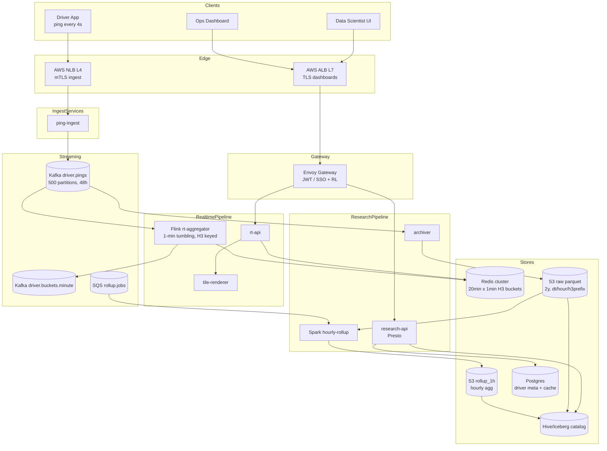

# 4. Uber Driver Location Heatmap — HLD

## 1. Requirements

### Functional
- **Real-time tool**: ops dashboard shows driver density per geohash cell for the last 20 minutes in 1-minute buckets. Refreshes every few seconds.
- **Research tool**: data scientists query historical driver density with 24-hour delay, in 1-hour buckets, retained 2 years. Supports arbitrary city/time filters.
- Drivers ping Global Positioning System (GPS) every 4s while online.
- Aggregation by geohash cell (or Uber H3 hexagonal hierarchical geospatial indexing system (H3) index) at configurable precision.
- Both tools expose heatmap tiles and per-cell counts.

### Non-Functional
- **Latency**: real-time 99th percentile (p99) < 1s; research query p99 < 10s over 1 month of data.
- **Availability**: 99.9% real-time; 99.5% research.
- **Durability**: every ping must land in Amazon Simple Storage Service (S3) (never lose driver telemetry).
- **Consistency**: eventual for real-time (≤ 5s lag); strong audit guarantees for research (no duplicates, no drops).
- **Scale ceiling**: 5M drivers, 2M online peak, 500k pings/s avg → 1M pings/s peak.

## 2. Scale & Estimates (recap)

- **Drivers**: 5M total, 2M peak online.
- **Ping frequency**: every 4s while online.
- **Ingest Queries Per Second (QPS)**: 2M / 4 = **500k pings/s avg, 1M pings/s peak**.
- **Ping size**: ~80 B (driver_id 8, lat 8, lon 8, ts 8, metadata ~48).
- **Ingest bandwidth**: 80 MB/s avg, **40 MB/s** steady × safety ≈ 3.5 TB/day raw.
- **Hot store (real time)**: 20 min × 1 min × 100k active geohash cells × 120 B ≈ **12 GB in Redis**.
- **Geohash bucketed summary**: ~80 MB per snapshot.
- **Research cold store**: 2 years × 3.5 TB/day ≈ **2.5 PB** in S3 (Parquet + compression → ~800 TB).
- Full math: [estimations doc](../back_of_envelope_estimations_example.md)

## 3. High-Level Component Design

### Edge / Load Balancer (LB)
- Network Load Balancer (NLB) (Layer 4 (L4)) for driver ping ingestion — low-latency raw Transmission Control Protocol (TCP)/google Remote Procedure Call (gRPC), no Layer 7 (L7) parsing needed.
- Application Load Balancer (ALB) (L7) for ops dashboard and research User Interface (UI).
- Transport Layer Security (TLS) terminated at the LB; drivers authenticate with device-bound mutual Transport Layer Security (mTLS).
- Ingest is region-local; drivers always hit their nearest region.

### Application Programming Interface (API) Gateway
- Internal Envoy in front of dashboard services.
- Driver ping path skips the gateway (direct NLB → ingest) to shave latency.
- Ops JSON Web Token (JWT) auth; research tool uses corp Single Sign-On (SSO) (Okta).
- Rate limit: driver capped at 1 ping/3s via server-side throttle (prevents rogue clients).

### Services (microservices)

| Service | Responsibility |
|---------|----------------|
| ping-ingest | Accept driver ping, validate, publish to Kafka `driver.pings`. Stateless, autoscaled. |
| rt-aggregator (Flink) | Consume pings, bucketize by (geohash, minute), emit to Redis. |
| rt-api | Serve real-time heatmap queries from Redis. |
| research-api | Serve research queries via Spark/Presto over S3. |
| archiver | Sink Kafka → Amazon Simple Storage Service (S3) Parquet partitioned by hour. |
| hourly-rollup (Spark) | Every hour, roll last hour of S3 into coarse-grain hour buckets for research. |
| tile-renderer | Convert cell counts into PNG/vector tiles for map UI. |

### Datastores (one bullet per store, what it holds)
- **Kafka `driver.pings`**: durable raw ingest, 48h retention, 500+ partitions.
- **Redis cluster**: real-time 20-min × 1-min buckets by geohash; ~12 GB.
- **S3 (Parquet)**: raw pings and hourly rollups, partitioned by `dt/hour/geohash_prefix`.
- **Hive Metastore / Iceberg**: catalog over S3 Parquet, used by Presto and Spark.
- **Postgres**: driver metadata (status, vehicle), heatmap-tile cache metadata.

### Async Infra
- **Kafka `driver.pings`**: 500 partitions, key=driver_id, Replication Factor (RF)=3, 48h retention.
- **Kafka `driver.buckets.minute`**: Flink sink topic for durable minute aggregates (feeds Redis + backup).
- **Amazon Simple Queue Service (SQS) `rollup.jobs`**: hourly batch job triggers.

## 4. API Design

```
POST /v1/driver/ping            (internal, mTLS)
  { driver_id, lat, lon, ts, speed, heading }

GET  /v1/rt/heatmap?bbox=..&precision=7&window=20m
  -> { cells:[{geohash, count, last_minute_count}], updated_at }

GET  /v1/rt/cell/{geohash}?window=20m&granularity=1m
  -> { points:[{ts, count}] }

GET  /v1/research/heatmap?bbox=..&from=..&to=..&granularity=1h
  -> async job_id

GET  /v1/research/job/{job_id}
  -> { status, result_url }
```

## 5. Data Storage & Schema Design

### Schema (key tables/collections)

```
# Kafka driver.pings (Avro)
PingEvent { driver_id:i64, lat:f64, lon:f64, ts:i64, speed:f32, heading:i16, region:str }

# Redis - hot real-time
Key: rt:{geohash}:min:{minute_ts}
  STRING (int count) or HLL (HyperLogLog) for unique-driver count
  TTL 25 min

Key: rt:bbox:{bbox_hash}:snapshot
  JSON { cells:[...] }  TTL 5s    (pre-rendered ops snapshots)

# S3 Parquet raw (2 years)
s3://uber-pings/raw/dt={YYYYMMDD}/hour={HH}/ghp={geohash_prefix3}/part-*.parquet
  columns: driver_id, lat, lon, ts, speed, heading

# S3 Parquet hourly rollup
s3://uber-pings/rollup_1h/dt={YYYYMMDD}/hour={HH}/part-*.parquet
  columns: geohash7, unique_drivers, total_pings, avg_speed
```

### DB Choice & Justification

- **Why Kafka for ingest**: 1M pings/s sustained; Kafka scales horizontally via partitions, durable, supports replay. Any synchronous Database (DB) would bottleneck.
- **Why Redis for real-time 20-min window**: ops dashboard needs sub-second reads; 12 GB fits comfortably; INCR/HyperLogLog (HLL) ops are O(1); natural Time To Live (TTL) on keys. No durability needed because Kafka retains 48h for replay.
- **Why S3 + Parquet for research 2y store**: 800 TB compressed is cheap ($20k/mo S3 Standard-IA). Parquet's column pruning + predicate pushdown gives fast scans with Presto/Spark. 24h delay means we can write once, in big batches.
- **Why not Cassandra for research**: storing 2.5 PB in Cassandra costs 10–20× more than S3, and we don't need low-latency point reads — research queries are scans. Cassandra's write path handles ingest but compaction at this volume is painful.
- **Why not DynamoDB for real-time**: DynamoDB at 1M writes/s costs a fortune; hot partitions on dense cities will throttle. Also no native HLL.
- **Why not Postgres anywhere in the hot path**: single-writer bottleneck; PostGIS falls over at 10k+ writes/s; unsuited to 2 PB.
- **Why not TimescaleDB**: it works for the real-time slice but caps at ~100k writes/s per node; we'd need 10+ shards and still wouldn't match Redis latency.
- **Why not Elasticsearch (ES) geo**: dense aggregations at 500k/s will crush cluster; useful for search, not counters.
- **Two stores, not one** (Redis + S3): the 24h delay in the research path is a *feature* — it decouples the real-time path (small, fast, lossy-OK) from the research path (big, slow, lossless). One store trying to serve both leads to compromises.

### Sharding & Partitioning
- **Kafka**: key=driver_id → 500 partitions; preserves per-driver ordering.
- **Redis**: hash-slot by `geohash`; 20 shards handle write throughput.
- **S3**: partitioned `dt/hour/ghp` (geohash-prefix) to let Presto prune by city.
- **Flink job**: keyed by `geohash`; parallelism 200 to match peak cardinality.

### Replication
- **Kafka**: RF=3, min.insync.replicas=2.
- **Redis**: 1 primary + 1 replica per shard, async replication. Loss of a replica is fine; raw data is in Kafka/S3.
- **S3**: 11 nines built-in; cross-region replication for Disaster Recovery (DR).

## 6. Scalability & Performance

### Caching
- Redis *is* the real-time cache.
- Pre-rendered tile cache: tile-renderer pushes PNG/vector tiles to CloudFront with 10s TTL; covers 99% of ops dashboard views.
- Research results cached by `(bbox_hash, from, to)` in Postgres for 24h so repeated researcher queries are free.

### Message Queues
- Kafka decouples ingest from aggregation and from archival.
- Both `rt-aggregator` (Flink) and `archiver` consume the same `driver.pings` topic in separate consumer groups — failure in one doesn't affect the other.
- This is the core of the **dual-pipeline** design.

### Read-heavy vs Write-heavy
- **Write-heavy on the hot side** (1M/s pings vs maybe 10 QPS ops reads).
- **Scan-heavy on the cold side** (terabyte scans triggered by research jobs, scheduled async).
- Both paths never compete for the same resource.

## 7. Deep Dive

### Topic 1: Split Pipelines — real-time vs research
- **Why split**:
  - Real-time needs sub-second freshness but can lose/duplicate a ping.
  - Research needs perfect durability and schema stability but 24h lag is fine.
  - Serving both from one store forces either too much RAM or too much latency on researchers.
- **Real-time pipeline**:
  ```
  Driver → NLB → ping-ingest → Kafka driver.pings
       → Flink rt-aggregator (tumbling 1-min, keyed by geohash)
       → Redis (INCR or PFADD for HLL)
       → rt-api → ops dashboard
  ```
  - Flink parallelism 200; checkpoints every 5s to S3.
  - Exactly-once not strictly required — ops tolerates ±1% drift; we use at-least-once for lower latency.
  - Redis key `rt:{geohash}:min:{minute}` with 25-min TTL (20-min window + 5-min buffer). Old keys auto-expire.
- **Research pipeline**:
  ```
  Kafka driver.pings → archiver → S3 raw/dt=.../hour=...
       → (24h later) Spark hourly-rollup → S3 rollup_1h/...
       → Presto/Spark → research-api
  ```
  - Archiver writes Parquet files of 128 MB each, one per partition per hour.
  - Exactly-once via Kafka transactions + idempotent S3 writes (`_COMMITTED` marker per batch).
  - 24h delay lets us run a **dedup + late-arrival reconciliation** step before publishing a partition as "frozen".
- **Crossover case**: if researchers want "last 2 hours at minute granularity", the system can stitch rt-api minute buckets with research partitions — handled at the service layer.

### Topic 2: Geohash vs Quad tree vs H3 for heatmap aggregation
- **Geohash**:
  - Pros: string prefix = hierarchy; easy Kafka key; trivial Redis keying; Parquet partition-friendly.
  - Cons: non-uniform cell sizes (narrower near poles); boundary artifacts near prefix edges create visual seams in the heatmap.
- **Quad tree**:
  - Pros: adaptive density.
  - Cons: mutable structure, hard to distribute/shard, stateful aggregator. Bad fit for a streaming counter.
- **H3 (hex)**:
  - Pros: uniform neighbor distances, no axial bias, Uber's in-house library is battle-tested for this exact use case (heatmaps, surge).
  - Cons: slightly more complex tile rendering (hex → raster).
- **Choice: H3 at resolution 8** (~0.7 km² cells) for the real-time path; at resolution 7 (~5 km²) for research.
  - Reasons: uniform cells → no density bias in visual heatmap; Uber stack already has H3 libs; hex neighborhoods let us compute flow vectors (not part of this problem, but cheap future extension).
  - Implementation detail: the design above says "geohash" colloquially; in production we substitute H3 cell indexes everywhere geohash appears (Kafka key, Redis key, Parquet partition column). The bucketing math is identical.
- **Bucket store design: 1-min vs 1-hour**:
  - Real-time uses 1-min buckets because ops reaction times are minutes.
  - Research uses 1-hour buckets because (a) 60× less storage, (b) 60× faster scans, (c) researcher time-granularity of interest is hours/days.
  - If a researcher needs minute granularity retroactively, they can re-aggregate from the raw S3 parquet — expensive but available.

## 8. Trade-offs

- **Consistency, Availability, Partition tolerance (CAP)**: real-time = AP (loses pings under partition); research = CP (reconciliation ensures correctness at the cost of delay).
- **Consistency model**: eventual (≤ 5s) for real-time; strong "batch consistency" (frozen partitions) for research.
- **Failure handling**:
  - Circuit breaker at ping-ingest → Kafka: if Kafka slow, shed load by sampling (accept 1-in-2 pings rather than collapse).
  - Retries: driver client retries with exponential backoff up to 30s; carries monotonic seq_no so ingest can dedupe.
  - Idempotency: `(driver_id, ts)` is the dedupe key at Flink and at Spark hourly rollup.
  - Dead Letter Queue (DLQ) `driver.pings.dlq` for malformed events.
  - Redis restart: Flink rebuilds hot state from Kafka in ≈ 2 min (replay last 25 min).
  - S3 archiver writes `_COMMITTED` markers; incomplete partitions are hidden from Presto until marked.

## 9. Mermaid Diagram


