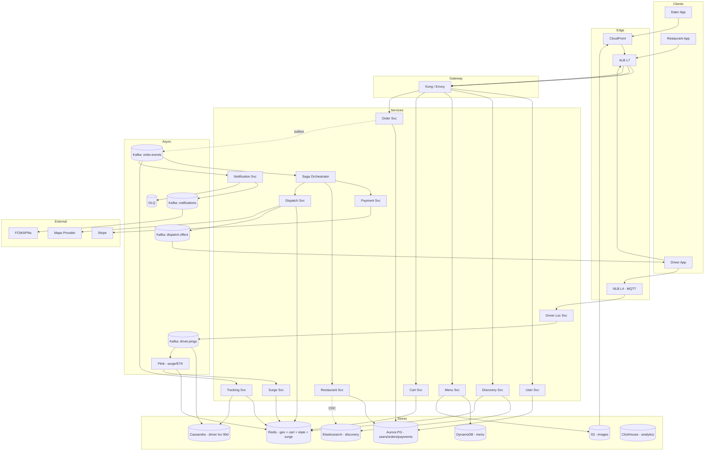

# 4. Uber Eats (General) — High-Level Design (HLD)

## 1. Requirements

### Functional
- Browse restaurants near me (geo-filtered, sorted by Estimated Time of Arrival (ETA), rating, offers).
- View restaurant menu + item details + customizations.
- Place an order (multi-item, payment, tip, delivery instructions).
- Track restaurant preparation + driver assignment + live delivery.
- Dispatch a driver to a restaurant for an accepted order.
- Order state machine: `CREATED → ACCEPTED → PREPARING → READY → PICKED_UP → DELIVERED` (+ `CANCELLED` branches).
- Ratings & reviews post-delivery.
- Restaurant-side: receive orders, accept/reject, mark ready.
- Driver-side: accept offer, navigate, mark picked up / delivered.
- Notifications at every state change.
- Surge pricing during peak.

### Non-Functional
- Browse latency 99th percentile (p99) < 300 ms (mobile experience).
- Order placement p99 < 500 ms.
- Availability 99.99% for browse, 99.95% for order write path.
- Consistency: strong on order state + payment; eventual on browse/discovery.
- Scale ceiling: 100M Monthly Active Users (MAU), 30M Daily Active Users (DAU), 5M orders/day.
- 5-year retention on orders; 90 days on driver location history.

## 2. Scale & Estimates (recap)

- 100M MAU, 30M DAU.
- Orders: 5M/day × 3 items = 15M order-items/day. Order Queries Per Second (QPS) ≈ **60/s average**, peak ~8× at dinner = **~500/s**.
- Browse actions: 30M × 10 = 300M/day → **~3.5k/s average, ~15k/s peak**.
- Restaurants: 1M total, 500k online at peak.
- Drivers: ~2M, 500k concurrent peak; Global Positioning System (GPS) pings every 4s → **~125k pings/s**.
- Order storage: 5M × 2 KB ≈ 10 GB/day → **~18 TB / 5y**.
- Menu storage: 1M restaurants × avg 100 items × 1 KB ≈ **10 GB**.
- Full math: [estimations doc](../back_of_envelope_estimations_example.md)

## 3. High-Level Component Design

### Edge / Load Balancer (LB)
- **CloudFront** Content Delivery Network (CDN) for static assets, menu images, restaurant photos.
- **Application Load Balancer (ALB) Layer 7 (L7)** for Representational State Transfer (REST)/google Remote Procedure Call (gRPC) Application Programming Interfaces (APIs), Transport Layer Security (TLS) termination.
- **Network Load Balancer (NLB) Layer 4 (L4)** for driver MQTT/gRPC streaming.
- Route53 latency-based routing; geo pinning for regulatory regions.

### API Gateway
- **Kong / Envoy** at edge; auth (Open Authorization 2 (OAuth2) for users, mutual Transport Layer Security (mTLS) for drivers), rate limit, request transformation.
- Separate gateway pools for eater / restaurant / driver apps (different Service Level Objectives (SLOs)).

### Services (microservices)
| Service | Responsibility |
|---------|---------------|
| User Service | Accounts, addresses, payment methods. |
| Restaurant Service | Restaurant profiles, hours, online/offline status. |
| Menu Service | Menu items, prices, customizations, availability. |
| Discovery Service | Geo search for restaurants (uses H3/Geohash + Elasticsearch (ES)). |
| Cart Service | In-progress carts, price quotes, surge. |
| Order Service | Order lifecycle + state machine. |
| Payment Service | Tokenized payment auth/capture (wraps Stripe/Braintree). |
| Dispatch Service | Matches orders to drivers; runs the auction/assignment loop. |
| Driver Location Service | Ingests driver GPS; serves nearest-driver queries. |
| Tracking Service | Eater-facing live tracking (merges location + order state). |
| Notification Service | Push/Short Message Service (SMS) for state transitions. |
| Rating Service | Post-delivery reviews. |
| Surge Pricing Service | Computes demand/supply multipliers per zone. |
| Saga Orchestrator | Coordinates cross-service order workflow. |

### Datastores
- **PostgreSQL (Aurora, sharded)** — users, orders, payments (strong consistency, Atomicity Consistency Isolation Durability (ACID)).
- **Cassandra** — driver location history (high-write time-series).
- **DynamoDB** — menu items (Key-Value (KV) by restaurant_id + item_id).
- **Redis Cluster** — session cache, cart, surge multipliers, nearest-driver geo index, order state cache.
- **Elasticsearch** — restaurant search + discovery (geo + text).
- **Amazon Simple Storage Service (S3) + CloudFront** — images.
- **ClickHouse** — analytics / ops dashboards.

### Async Infra
- **Kafka** topics:
  - `order.events` — state transitions (partitioned by order_id).
  - `driver.pings` — GPS (partitioned by driver_id).
  - `dispatch.offers` — offers sent to drivers.
  - `notifications.outbox` — outbound notifications.
  - `saga.commands` — compensating transactions.
- **Flink** for real-time analytics, surge calculation, driver ETA.
- **Amazon Simple Queue Service (SQS) Dead Letter Queue (DLQ)** for payment failures, notification retries.

## 4. API Design

```
# Eater
GET  /v1/restaurants?lat=&lon=&r=     # discovery
GET  /v1/restaurants/{id}/menu
POST /v1/cart                         # create/update
POST /v1/orders                       # place (idempotency-key)
GET  /v1/orders/{id}                  # status + tracking
GET  /v1/orders/{id}/track            # SSE stream
POST /v1/orders/{id}/cancel

# Restaurant
POST /v1/rest/orders/{id}/accept
POST /v1/rest/orders/{id}/ready

# Driver
POST /v1/driver/ping                  # (MQTT)
POST /v1/driver/offers/{id}/accept
POST /v1/driver/orders/{id}/picked
POST /v1/driver/orders/{id}/delivered
```

Place order:
```json
{
  "user_id": "u_9", "restaurant_id": "r_3",
  "items": [{"menu_item_id": "m_12", "qty": 2, "mods": [...]}],
  "delivery_address_id": "a_1",
  "payment_method_id": "pm_4",
  "tip_cents": 300,
  "idempotency_key": "client-uuid"
}
```

## 5. Data Storage & Schema Design

### Schema

```
User(user_id PK, email, phone, default_address_id, created_at)

Address(address_id PK, user_id, lat, lon, formatted, instructions)

Restaurant(restaurant_id PK, name, lat, lon, h3_cell, status,
           rating, cuisine_tags, online, opens_at, closes_at)

MenuItem(restaurant_id PK, item_id CK, name, price_cents,
         description, image_s3_key, available)

Order(order_id PK, user_id, restaurant_id, driver_id, status,
      total_cents, tip_cents, surge_mult, created_at, sla_ts,
      idempotency_key UNIQUE)

OrderItem(order_id PK, line_seq CK, menu_item_id, qty, price_cents, mods_json)

OrderStateLog(order_id PK, ts CK, from_state, to_state, actor, reason)

Payment(payment_id PK, order_id, provider, status, amount_cents, auth_id)

DriverLocation(driver_id PK, ts CK DESC, lat, lon, speed, heading)
  # Cassandra, partition (driver_id, day_bucket)

# Redis
nearest:{h3_cell}    → GEOSET of drivers
surge:{h3_cell}      → String multiplier
order:{id}           → Hash (state cache)
cart:{user_id}       → Hash
```

### DB Choice & Justification

- **Why Postgres (Aurora) for orders + payments + users**: ACID is essential — order creation must atomically write `Order`, `OrderItem`, `Payment(pending)`, and the idempotency key in one transaction. Relational model is natural (user → order → order_items → payment). Serializable isolation prevents double-charge. Aurora's 6-way storage and fast failover give 99.99%. We shard by `user_id` once we approach Aurora single-instance limits (we'll hit ~1-2 TB for 5y orders and need horizontal split).
- **Why Cassandra for driver locations**: 125k writes/s is Cassandra's sweet spot. Partition `(driver_id, day_bucket)`, clustered by `ts DESC`, gives perfect time-series locality + bounded partition size. Time To Live (TTL) auto-drops pings older than 90 days. Tunable consistency (LOCAL_QUORUM write, ONE read) matches our Availability + Partition tolerance (AP) needs for location.
- **Why DynamoDB for menu items**: menu reads are massive (every browse → menu fetch), writes are rare (restaurants edit menus occasionally). DynamoDB's KV model on `(restaurant_id, item_id)` gives sub-5 ms reads at arbitrary scale, managed auto-partitioning, and pay-per-request suits spiky dinner-hour traffic. Global Secondary Index (GSI) by `category` enables "vegan items near me" queries.
- **Why Redis for driver geo + surge + cart**: `GEOADD`/`GEOSEARCH` in Redis makes nearest-driver lookup O(log n) in-memory, at sub-ms. Cart must survive session but is short-lived (hours) and fits in-memory. Surge multiplier is tiny (per H3 cell) and read on every quote — Redis is the only thing fast enough.
- **Why Elasticsearch for restaurant discovery**: geo + text + facet search (cuisine, price, rating, ETA) with ranking. Indexed from Restaurant table via Change Data Capture (CDC).
- **Why not Postgres for driver locations**: 125k writes/s would destroy Postgres; vacuum storms and index bloat would kill read latency. Timescale extension helps up to ~30k/s.
- **Why not DynamoDB for orders**: order placement needs multi-table transactions (order + items + payment + idempotency). DynamoDB transactions are limited to 100 items and double the WCU cost; saga complexity increases. Postgres gives free multi-row ACID.
- **Why not MongoDB**: no compelling reason over Postgres for orders; worse than Cassandra for time-series pings; worse than DynamoDB for managed KV at scale.
- **Why not Redis as primary for orders**: durability concerns; orders are legally important records that must survive any cluster failure. Redis is cache + hot state, Postgres is System of Record (SoR).
- **Why not Cassandra for orders**: weak transactional story; Lightweight Transactions (LWT) have 4× cost and don't span rows. Order workflow demands cross-row atomicity.
- **Why not a single graph database** (Neo4j etc): we don't run relationship queries at serving tier; no benefit.

### Sharding & Partitioning
- Postgres orders: shard by `user_id` hash once >1 TB (Citus or app-level). Restaurant-side queries go via async read path (CDC → ES / ClickHouse).
- Cassandra pings: `(driver_id, day_bucket)` — 1-day partitions cap at ~21k rows × 100 B ≈ 2 MB.
- DynamoDB menu: partition key `restaurant_id`, sort key `item_id`.
- Redis: 32-shard cluster; driver geo keyed by `nearest:{h3_cell}` (H3 level 8 ≈ 0.7 km² cells).
- Kafka `order.events`: 64 partitions by `order_id`; `driver.pings`: 128 partitions by `driver_id`.

### Replication
- Aurora: writer + 3 readers, 6-way storage, cross-region global database for Disaster Recovery (DR).
- Cassandra: Replication Factor (RF)=3, LOCAL_QUORUM writes.
- DynamoDB: managed multi-Availability Zone (AZ), global tables optional.
- Redis: 1 primary + 2 replicas per shard, Redis Database (RDB) snapshot hourly.
- Kafka: RF=3, min.insync.replicas=2, acks=all on `order.events`.

## 6. Scalability & Performance

### Caching
- **Restaurant discovery cache**: top-K per H3 cell in Redis, TTL 30s; CloudFront caches /restaurants JavaScript Object Notation (JSON) keyed by cell.
- **Menu cache**: Redis hot set of most-browsed menus (Least Recently Used (LRU)), 5-min TTL, invalidated on restaurant edit via CDC.
- **Order state cache**: Redis `order:{id}` hash for tracking reads; updated on every state transition.
- **Session + cart** in Redis with 24h TTL.
- **Surge map**: precomputed every 30s per H3 cell, served from Redis.

### Message Queues
- Order placement is synchronous up to DB commit, then fans out via outbox pattern to `order.events`.
- Driver ping stream absorbed by Kafka, decoupling ingest from consumers.
- Dispatch offers pushed to drivers via WebSocket, with Kafka as the durable transport.
- Retries + DLQ on payment + notifications.

### Read-heavy vs Write-heavy
- **Browse/discovery**: extremely read-heavy (15k/s peak). Served mostly from CDN + Redis; ES is the cold path.
- **Driver pings**: write-heavy (125k/s). Cassandra + Kafka partitioning.
- **Order placement**: low QPS (500/s peak) but high consistency — served by Aurora.

## 7. Deep Dive

### Order State Machine & Saga

States: `CREATED → ACCEPTED → PREPARING → READY → ASSIGNED → PICKED_UP → DELIVERED` (with `CANCELLED` branches from any pre-PICKED state, `FAILED` from payment/dispatch).

Placing an order touches multiple services (Order, Payment, Dispatch, Restaurant). A distributed transaction is impossible — we use a **saga** with a dedicated orchestrator.

**Orchestrated saga**:
1. `POST /orders` → Order Svc: insert Order (status=CREATED) + OrderItems + idempotency key in one Postgres transaction. Publish `order.created` to Kafka via outbox.
2. Saga Orchestrator consumes `order.created`:
   - Calls Payment Svc `authorize(amount)`. On success → `order.payment_authorized`.
   - On failure → `order.failed` + Order Svc sets status=FAILED. End.
3. On payment authorized: orchestrator calls Restaurant Svc `offer(order)` (in-app push to restaurant tablet).
   - Restaurant accepts → Order status=ACCEPTED. Restaurant rejects → compensation: `Payment.void()`, Order status=CANCELLED_BY_RESTAURANT.
   - Timeout 90s → auto-reassign or cancel with compensation.
4. Restaurant marks PREPARING then READY (events flow through `order.events`).
5. Dispatch Svc reacts to `order.accepted` (or earlier, based on estimated prep time): finds nearest available driver (Redis GEOSEARCH), sends offer via `dispatch.offers` Kafka → driver WebSocket (WS).
6. Driver accepts: Order.driver_id set, status=ASSIGNED.
7. Driver marks PICKED_UP then DELIVERED. On DELIVERED: Payment Svc `capture()`, final compensation not needed.

**Compensations**:
- Every forward action has a compensating event. E.g., payment_auth ↔ payment_void, driver_assigned ↔ driver_released.
- Orchestrator state persisted in Postgres (`SagaInstance` table) for crash recovery.
- All handlers are idempotent keyed on `(order_id, step)`.

**Why orchestrated over choreographed**: order flow is complex (6+ services, multiple branches); a central orchestrator is easier to reason about, test, and observe. Choreography scales better but is harder to debug.

### Restaurant Discovery (Geo Search)

Goal: `given (lat, lon, radius)`, return top 50 open restaurants ranked by ETA + rating + offers, < 300 ms p99.

**Approach: H3 hex grid + Elasticsearch + Redis cache**.

1. Every restaurant has `h3_cell_l8` (~0.7 km² cells) stored on write.
2. Discovery Svc computes user's H3 cell + k-ring (k=2 → ~7 hex neighbors).
3. First looks up Redis cache key `discovery:{h3_cell}:{sort}` — 30s TTL.
4. On miss: queries Elasticsearch with `geo_distance` filter + function score (rating, prep_time, distance, promo).
5. Populates cache + returns.

**Why not PostGIS**: at 15k QPS peak, PostGIS would need heavy replication and still be slower than ES's optimized geo-point queries. Also, ES supports complex ranking with function_score naturally.

**Why H3 over geohash**: H3's hex cells have uniform neighbors (geohashes have uneven neighbor distances near edges). Uber invented H3 for exactly this problem.

**Cold start**: for a user in a cell with few restaurants, k-ring expansion up to k=5 until we have ≥50 candidates.

### Driver Dispatch Matching (briefly, secondary deep-dive)
- Batch dispatch every 2s per zone (H3 cell): collect pending orders + eligible drivers, run min-cost bipartite matching (Hungarian algorithm with time budget).
- Cost function: `w1*driver_eta_to_restaurant + w2*distance_from_dropoff + w3*driver_idle_time`.
- Single-driver optimization (greedy) when queue is small.

## 8. Trade-offs

- **Consistency, Availability, Partition tolerance (CAP)**:
  - Orders + payments (Postgres): **Consistency + Partition tolerance (CP)** — reject writes during partition.
  - Driver locations (Cassandra) + discovery (ES): **AP** — stale reads tolerable.
  - Cart + surge (Redis): **AP within shard**.
- **Consistency model**: strong for order + payment (Read-Your-Writes (RYW) guaranteed, reads go to primary). Eventual for discovery (up to 30s stale). Eventual for driver location (up to 4s lag).
- **Failure handling**:
  - Idempotency keys on POST /orders + all internal handlers.
  - Outbox pattern to prevent lost events between DB commit and Kafka publish.
  - Saga orchestrator persists state; crash recovery resumes from last step.
  - Circuit breakers on payment provider, map provider, Firebase Cloud Messaging (FCM). Fallbacks to degraded modes.
  - DLQ + ops alerts on saga failures.
  - Regional failover via Aurora Global Database + Route53 health checks.
  - Graceful degradation: if discovery is down, serve last-known top restaurants from CDN.
  - Backpressure on driver pings (sample to 1/2 if consumer lag > 10s).

## 9. Mermaid Diagram


