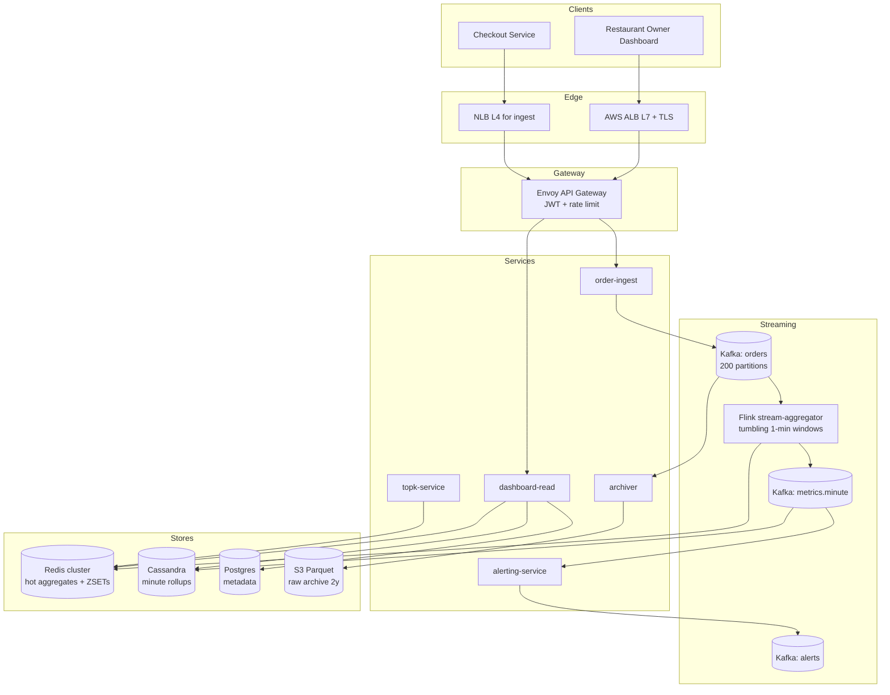

# 1. Uber Eats Restaurant Dashboard — HLD

## 1. Requirements

### Functional
- Per-restaurant real-time metrics dashboard refreshed every 5s.
- Metrics per window (1h, 1d, 7d):
  - Total order count.
  - Total revenue ($).
  - Top-3 dishes by order count.
- Restaurant owner authenticates and sees only their own restaurant(s).
- Historical comparison (today vs yesterday, this week vs last week).
- Drill-down: list of recent orders (paginated), filterable by status.
- Alerts: e.g., order rate drop > 50% vs baseline.

### Non-Functional
- **Latency**: dashboard load 99th percentile (p99) < 500 ms; metric freshness < 10 s (end-to-end order → dashboard).
- **Availability**: 99.9% (dashboard is a read-only analytics surface; degraded stale reads acceptable).
- **Durability**: raw order stream must be durable (Kafka + Amazon Simple Storage Service (S3) archive, 30d retention in Kafka).
- **Consistency**: eventual; owner may see a 5–10s lag. Strong consistency not needed.
- **Scale ceiling**: 10k restaurants, 100k orders/sec global ingestion, 2k dashboard reads/s.

## 2. Scale & Estimates (recap)

- **Restaurants**: 10k.
- **Global order ingest**: 100k orders/sec peak.
- **Avg orders per restaurant**: 10/s (100k / 10k).
- **Event size**: ~500 B → ingest bandwidth = 50 MB/s = 4.3 TB/day raw.
- **7-day window per restaurant**: 10 × 86400 × 7 ≈ 6M orders.
- **Per-minute buckets × 10k restaurants**: ~20 GB in Redis (buckets + top-K structures).
- **Dashboard read Queries Per Second (QPS)**: 2k/s (10k restaurants × 5s refresh × ~10% active owners).
- **Retention**: 30d hot (raw in Kafka), 2y cold (S3 + Parquet).
- Full math: [estimations doc](../back_of_envelope_estimations_example.md)

## 3. High-Level Component Design

### Edge / Load Balancer (LB)
- Amazon Web Services (AWS) Application Load Balancer (ALB) (Layer 7 (L7)) for dashboard HyperText Transfer Protocol (HTTP)/WebSocket (WS) traffic; terminates Transport Layer Security (TLS).
- Route53 geo routing to nearest region; dashboards are region-local.
- Layer 4 (L4) Network Load Balancer (NLB) fronting order-ingest google Remote Procedure Call (gRPC) service for lower latency on writes.

### Application Programming Interface (API) Gateway
- Envoy (or Kong) in front of microservices.
- AuthN via JSON Web Token (JWT) (owner token); AuthZ via restaurant_id claim → Access Control List (ACL) check.
- Rate limit: 10 req/s/owner for dashboard, 1k req/s/restaurant for order ingest.
- Routes `/v1/dashboard/*` to dashboard-read service; `/v1/orders` to order-ingest.

### Services (microservices)

| Service | Responsibility |
|---------|----------------|
| order-ingest | Accept order events from checkout service, validate, publish to Kafka `orders` topic. |
| stream-aggregator (Flink) | Consume `orders`, compute tumbling 1-min buckets per (restaurant, dish), emit to sink. |
| dashboard-read | Serve dashboard queries: merge minute buckets into 1h/1d/7d windows, return JSON. |
| topk-service | Maintain per-restaurant top-3 dish heap per window; backed by Redis sorted sets. |
| alerting-service | Watch metric drops/spikes, push notifications/email. |
| archiver | Sink raw Kafka events to S3 in Parquet for long-term/batch recompute. |

### Datastores (one bullet per store, what it holds)
- **Kafka (`orders` topic)**: durable raw order events, 30d retention, partitioned by `restaurant_id`.
- **Redis cluster**: per-minute aggregates and top-K sorted sets, keyed by `restaurant_id:minute`.
- **Cassandra**: durable pre-aggregated metrics (minute/hour granularity) for replay and long-range queries.
- **S3 (Parquet)**: raw order archive, 2y, queried by Athena/Spark for backfill.
- **Postgres (metadata)**: restaurant, dish, owner accounts. Serves as a Relational Database Management System (RDBMS).

### Async Infra
- **Kafka topic `orders`**: 200 partitions, keyed by restaurant_id, 30d retention.
- **Kafka topic `metrics.minute`**: Flink sink with 1-min aggregates; consumed by dashboard-read/Cassandra writer.
- **Kafka topic `alerts`**: alerting-service consumes, fans out to Amazon Simple Notification Service (SNS).

## 4. API Design

```
POST /v1/orders                       # internal, from checkout service
  { order_id, restaurant_id, items:[{dish_id, qty, price}], total, ts }

GET  /v1/dashboard/{restaurant_id}/summary?window=1h|1d|7d
  -> { orders: 1234, revenue: 45678.90, top_dishes:[{id,name,count}], updated_at }

GET  /v1/dashboard/{restaurant_id}/timeseries?window=1d&granularity=5m
  -> { points:[{ts, orders, revenue}] }

GET  /v1/dashboard/{restaurant_id}/orders?cursor=...
  -> paginated recent orders

WS   /v1/dashboard/{restaurant_id}/stream     # push updates every 5s
```

## 5. Data Storage & Schema Design

### Schema (key tables/collections)

```
# Kafka event (JSON/Avro)
OrderEvent(order_id, restaurant_id, user_id, items[], total_cents, created_at)

# Redis - hot aggregates
Key: agg:{restaurant_id}:min:{yyyymmddhhmm}
  HASH { orders: int, revenue_cents: int }

Key: topk:{restaurant_id}:min:{yyyymmddhhmm}
  ZSET member=dish_id, score=count

# Cassandra - durable rollups
metrics_minute(restaurant_id, minute_ts, orders, revenue_cents, top_dishes_blob)
  PK: ((restaurant_id), minute_ts)  -- clustered desc

# Postgres - metadata
restaurants(id, name, owner_id, tz, city, ...)
dishes(id, restaurant_id, name, price_cents)
```

### DB Choice & Justification

- **Why Redis for hot aggregates**: sub-ms reads for 2k QPS dashboard; sorted-set ZADD/ZINCRBY perfect for top-K; 20 GB fits a small cluster. Durability is non-critical because raw data lives in Kafka and can be replayed.
- **Why Cassandra for durable rollups**: write-heavy (10k restaurants × 1 write/min = 167 writes/s, bursty), time-series by (restaurant, minute). Clustering key lets a 7d query do one partition scan. Linear scaling, no single-master bottleneck. Tunable consistency (LOCAL_QUORUM) acceptable. Primary Key (PK) design matters here.
- **Why not Postgres/MySQL for rollups**: write amplification and vacuum pressure at 10k+ writes/s sustained; range scans over 10k × 10k minute rows become hot partitions; hard to shard automatically. OK for small metadata tables, which is why it's kept for `restaurants`/`dishes`.
- **Why not DynamoDB**: would work functionally, but cost at 50 MB/s write is much higher than self-managed Cassandra, and we lose flexibility of custom compaction. Also, hot partition on top restaurants can throttle.
- **Why not MongoDB**: no natural time-series partitioning; aggregation pipeline is slower than Flink for streaming; secondary-index writes add latency we don't need.
- **Why not Redis as primary**: not durable enough for long-range (7d+) history; RAM cost for 6M orders × 10k restaurants is prohibitive. Redis is layered *on top of* Cassandra for the hot path.

### Sharding & Partitioning
- **Kafka**: partition key = `restaurant_id` → preserves ordering per restaurant; 200 partitions handle 100k msgs/s.
- **Cassandra**: partition key = `restaurant_id`; clustering key = `minute_ts DESC`. Each restaurant's 7d data (~10k rows) fits one partition.
- **Redis**: key hash-slot by `restaurant_id`; cluster of 6 nodes, 3 primaries, 3 replicas.

### Replication
- **Kafka**: Replication Factor (RF)=3, min.insync.replicas=2.
- **Cassandra**: RF=3 per Availability Zone (AZ), LOCAL_QUORUM on reads/writes.
- **Redis**: 1 primary + 1 replica per shard, async replication, AOF every 1s.

## 6. Scalability & Performance

### Caching
- Redis is the first-line cache. Time To Live (TTL) 2h on minute buckets; beyond 2h dashboard-read queries Cassandra and memoizes.
- Dashboard-read computes 1h/1d/7d windows by summing minute buckets. Result cached in Redis per `(restaurant_id, window)` with 5s TTL — collapses 2k QPS into at most 1 recompute per 5s per restaurant.
- Content Delivery Network (CDN) (CloudFront) in front of static JS/CSS.

### Message Queues
- Kafka is the backbone: decouples ingest from aggregation, enables replay (for schema changes, bug fixes, new metrics).
- Flink consumer group maintains checkpoints in S3; exactly-once semantics via Kafka transactions.
- Dead Letter Queue (DLQ) topic `orders.dlq` for events failing validation, monitored by on-call.

### Read-heavy vs Write-heavy
- Write ingest (100k/s) dominates. Reads are amplified by fan-out (Flink → Cassandra + Redis + alerts), but dashboard reads themselves are only 2k/s and collapsed via caching.
- Hot-path optimization: Flink produces pre-aggregated minute buckets — dashboard never scans raw orders.

## 7. Deep Dive

### Topic 1: Streaming aggregation — Flink tumbling windows + top-K
- **Tumbling 1-min windows** keyed by `restaurant_id`. Watermark = event_time − 10s tolerates minor ingest delay.
- State: Flink keyed state stores `{orders, revenue, dish_counts Map}` per open window.
- On window close: emit `MinuteAgg` to Kafka `metrics.minute`; downstream consumers write Cassandra and HINCRBY Redis.
- **Top-3 dishes**:
  - Option A (exact): per-window HashMap<dish_id,int>, at window close do partial sort keep top-3. Cheap because dishes per restaurant < 200.
  - Option B (approximate, for very wide-catalog cases): Count-Min Sketch (CMS) + heavy-hitter heap. Not needed here because dish cardinality is bounded.
  - Choice: **exact via HashMap**, memory-safe at this cardinality.
- 1h/1d/7d windows are computed at read time by summing 60/1440/10080 minute buckets (cheap) rather than keeping three sliding windows in Flink state.
- **Sliding vs tumbling**: tumbling chosen because sliding windows (e.g., continuous 1h) would blow up state (every event in 60 windows simultaneously). Recombination at read-side is strictly cheaper.
- **Late-arriving events**: Flink side-output for events past watermark → written directly to Cassandra with a correction flag; Redis bucket HINCRBY'd retroactively; dashboard cache invalidated for affected window.

### Topic 2: Top-3 dish correctness across 7d window
- Naïve approach: sum per-minute top-3 lists. This is WRONG — a dish ranked #4 every minute could be #1 overall.
- Fix: Flink emits full `Map<dish_id,count>` per minute (bounded because dishes per restaurant < 200). Dashboard-read merges maps across minute buckets, sorts, picks top-3.
- Storage cost per minute per restaurant: 200 dishes × 12 B = 2.4 KB → 2.4 KB × 10080 min × 10k = 240 GB for 7d in Cassandra. Acceptable.
- For O(1) top-3 lookups, pre-materialize 1h top-K into a secondary Redis ZSET via a lightweight rollup job every 5 min.

## 8. Trade-offs

- **Consistency, Availability, Partition tolerance (CAP)**: AP. During partition, dashboard serves stale data from Redis (eventual consistency is acceptable for an analytics surface).
- **Consistency model**: eventual, ~5–10s lag. Read-your-writes (RYW) not required because the owner isn't writing — the system writes on their behalf from order events.
- **Failure handling**:
  - Circuit breakers between dashboard-read → Cassandra (fall back to Redis-only when Cassandra slow).
  - Retries: Kafka producer with idempotence; Flink checkpoints every 10s.
  - Idempotency: `order_id` is primary dedupe key; Flink uses Kafka transactions for exactly-once sinks.
  - DLQ for malformed events; alerting on DLQ depth > 1000.
  - Flink job restart: resumes from last checkpoint; Redis rebuilt from Cassandra in ~2 min.

## 9. Mermaid Diagram


