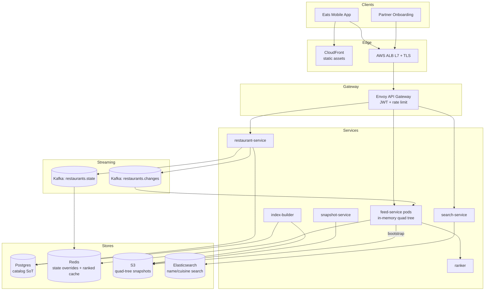

# 3. Uber Eats Restaurant Feed — HLD

## 1. Requirements

### Functional
- Given user (lat, lon) and radius (or viewport bbox), return top-N nearby restaurants for the feed.
- Support filters: cuisine, rating, delivery time, open-now, promotion.
- Paginated, ranked result: distance + rating + personalization score.
- Restaurants added/updated/closed throughout the day.
- System must rebuild index state on node shutdown and bootstrap new nodes from serialized state.
- Low-latency autocomplete for restaurant name search (separate path, mentioned briefly).

### Non-Functional
- **Latency**: feed query 99th percentile (p99) < 150 ms.
- **Availability**: 99.95% (feed is the front door of the app).
- **Durability**: restaurant catalog in Postgres; geo-index is derived and rebuildable.
- **Consistency**: eventual (≤ 60s) is fine for feed; strong for "is this restaurant currently open/accepting orders".
- **Scale ceiling**: 1M restaurants (500k active), 150M feed queries/day, 7k peak Queries Per Second (QPS).

## 2. Scale & Estimates (recap)

- **Restaurants total**: 1M (500k active).
- **Daily Active Users (DAU)**: 30M × 5 feed queries/session → 150M queries/day.
- **Feed QPS**: avg 1.7k, peak 7k.
- **Writes**: ~1k updates/day (negligible).
- **Per-restaurant record**: ~5 KB (name, geo, hours, menu summary, ratings) → 5 GB total, **fits entirely in memory**.
- **Quad tree**: ~10k nodes if we cap 100 restaurants per leaf (1M / 100).
- **Geohash precision 6** (~1.2 km cells): ~30k active cells.
- Full math: [estimations doc](../back_of_envelope_estimations_example.md)

## 3. High-Level Component Design

### Edge / Load Balancer (LB)
- Application Load Balancer (ALB) (Layer 7 (L7)), Transport Layer Security (TLS) termination. Geo routing via Route53 to nearest region; feed is replicated per region.
- CloudFront for static restaurant images and menu thumbnails.

### Application Programming Interface (API) Gateway
- Envoy gateway.
- Auth: user JSON Web Token (JWT).
- Rate limit: 30 feed queries/min/user.
- Routes `/v1/feed` to feed-service; `/v1/restaurants/*` to restaurant-service.

### Services (microservices)

| Service | Responsibility |
|---------|----------------|
| feed-service | Query quad-tree, filter, rank, paginate. In-memory geo index. |
| restaurant-service | CRUD on restaurant catalog; writes Postgres, publishes change events. |
| index-builder | Batch + incremental job that builds/refreshes quad tree from Postgres + Kafka. |
| ranker | Personalization + ML ranking on top-K candidates. |
| snapshot-service | Periodically serializes quad tree to S3 for fast bootstrap. |
| search-service | (Brief) autocomplete via Elasticsearch (ES) edge n-gram. |

### Datastores (one bullet per store, what it holds)
- **Postgres**: source of truth for restaurant catalog (mutable).
- **Redis cluster**: hot overrides — current open/closed state, live Estimated Time of Arrival (ETA), current promotions.
- **Amazon Simple Storage Service (S3)**: serialized quad-tree snapshots (for bootstrap).
- **Elasticsearch**: restaurant name / cuisine search.
- **In-memory quad tree** (per feed-service pod): geo index, 5 GB resident.

### Async Infra
- **Kafka `restaurants.changes`**: insert/update/close events from restaurant-service; consumed by every feed-service pod for incremental index updates.
- **Kafka `restaurants.state`**: frequent state changes (open/closed/eta) at higher volume.

## 4. API Design

```
GET /v1/feed?lat=..&lon=..&radius=5km&cursor=..&filters=..
  -> { results:[{id,name,dist_m,eta_min,rating,cuisine,image}], next_cursor }

GET /v1/feed/viewport?bbox=minLat,minLon,maxLat,maxLon
  -> similar

POST /v1/restaurants                 # internal, from partner onboarding
GET  /v1/restaurants/{id}
PATCH /v1/restaurants/{id}           # e.g., hours, open/closed

GET /v1/search?q=..                  # autocomplete (ES)
```

## 5. Data Storage & Schema Design

### Schema (key tables/collections)

```
# Postgres (source of truth)
restaurants(
  id PK, name, cuisine[], lat, lon, geohash6, city_id,
  rating, price_tier, hours_json, active, created_at, updated_at
)
restaurant_menu_summary(restaurant_id PK, top_items JSONB, avg_prep_min)

# Redis
rest:state:{id} -> HASH { open, eta_min, promo_id } TTL 5m
rest:meta:{id}  -> JSON snapshot for quick hydrate

# S3 snapshot (serialized quad tree)
s3://eats-geoindex/quadtree/{region}/{yyyymmddhh}.bin

# ElasticSearch
restaurants_idx { id, name, cuisine, city_id, lat, lon }
```

### In-memory quad tree node

```
QuadNode {
  bbox: (minLat, minLon, maxLat, maxLon)
  children: [NW, NE, SW, SE] or null
  leaf: bool
  restaurants: List<RestaurantRef>   # only if leaf, capacity ≤ 100
  count: int                          # subtree count for pruning
}
```

### DB Choice & Justification

- **Why Postgres for catalog**: 1M rows, 1k writes/day, needs Atomicity Consistency Isolation Durability (ACID) for merchant onboarding flows; PostGIS gives us a fallback geo index for backfill / correctness checks; JSONB for flexible menu.
- **Why in-memory quad tree (custom, not a DB) for queries**: 7k peak QPS with p99 < 150 ms and filter-rank-paginate is cheapest when data lives in process memory. 5 GB fits comfortably. Any network hop to a DB adds 5–20 ms and fails the latency budget.
- **Why Redis for state overrides**: open/closed/eta changes every few minutes; we don't want to rewrite the quad tree. Keep immutable data in the tree; overlay mutable state via Redis lookup during ranking.
- **Why not PostGIS / Postgres alone**: query latency for radius search on 500k rows with filters is 20–100 ms; OK for 50th percentile (p50) but fails p99. Also scales poorly to 7k QPS without aggressive replication. Postgres remains as source of truth but not the query path.
- **Why not Elasticsearch geo_point for feed**: ES handles geo well but cluster cost at 7k QPS is ~5× higher than in-memory, and ranking is less flexible (we want custom code). Good for text search, not feed.
- **Why not MongoDB 2dsphere**: same latency profile as PostGIS; operational complexity to introduce another DB.
- **Why not Redis GEO**: GEORADIUS is fast but (a) does not support arbitrary filters (cuisine, price) without client-side scan, (b) RAM cost is similar to in-process, (c) 500k members in one GEO key is a single-shard hotspot.
- **Why not Cassandra/Dynamo**: no native geo index; we'd have to implement geohash bucketing on top, reinvent the quad tree, and pay for network hops.

### Sharding & Partitioning
- **Feed-service**: each pod holds the *entire* quad tree for its region (5 GB). Sharding is by *region*, not by restaurant — all pods in a region are identical replicas.
- **Postgres**: partition `restaurants` by city_id hash.
- **Redis**: hash-slot by restaurant id.

### Replication
- **Postgres**: primary + 2 replicas.
- **Feed-service**: stateless replicas behind ALB; any pod can serve any query.
- **Redis**: primary + replica per shard.
- **S3 snapshot**: S3 provides 11 nines durability by default.

## 6. Scalability & Performance

### Caching
- The quad tree itself IS the cache — no extra layer needed for geo lookups.
- Ranked results cached per `(geohash5, filter_hash, user_bucket)` in Redis with 30s Time To Live (TTL). Same-cell users reuse the same ranked list.
- Redis state overlay is looked up in parallel during result hydration.

### Message Queues
- `restaurants.changes` at ~1k/day — each feed-service pod consumes from its own consumer group (per pod) so every replica stays in sync.
- `restaurants.state` at ~10k/min (open/close/eta) goes to Redis; quad tree ignores state, only reads it at query time.

### Read-heavy vs Write-heavy
- **Strongly read-heavy**: 7k read QPS vs ~0 writes/s. Entire design optimizes reads: in-memory tree, replica fan-out, zero-copy ranking.

## 7. Deep Dive

### Topic 1: Quad Tree vs Geohash vs Google S2 geometry library (S2) vs Uber H3 hexagonal hierarchical geospatial indexing system (H3)
- **Geohash**:
  - Pros: dead simple; Redis-friendly (prefix scans); good for bucketed indexes.
  - Cons: cell sizes vary with latitude; boundary problem (two nearby points can have totally different prefixes); no adaptive density.
- **Quad tree**:
  - Pros: adaptive to density — dense cities get deeper subdivisions (leaf cap 100 restaurants); bbox queries are native; easy to range-scan within a viewport.
  - Cons: mutable tree is harder to serialize and concurrently update.
- **S2 (Google)**:
  - Pros: spherical, hierarchical cell IDs, excellent for global coverage; uniform-ish cells; cell tokens sort by locality.
  - Cons: heavier library; overkill for city-level feed where we operate per-region anyway.
- **H3 (Uber's own)**:
  - Pros: hexagonal cells have uniform neighbor distances; Uber uses it for driver heatmaps. Best for grid operations.
  - Cons: awkward for rectangular viewports (the app's map uses bboxes); hex tiling doesn't line up with leaves.
- **Choice: Quad tree**, because:
  1. Native bbox (viewport) queries.
  2. Adaptive density handles NYC (5k restaurants/km²) and rural (5/km²) with the same structure.
  3. Small enough data set (1M) that in-memory custom tree wins on latency.
- **Hybrid**: we also store geohash6 on each restaurant row for a Postgres fallback if the quad tree is unavailable.

### Topic 2: Quad Tree Lifecycle — Build, Rebuild, Serialize, Bootstrap
- **Initial build** (index-builder):
  1. Read all active restaurants from Postgres (`SELECT … WHERE active=true`).
  2. Start with one root node spanning the region bbox.
  3. Insert each restaurant; split a leaf when it exceeds 100 entries into 4 children.
  4. Write count metadata up the tree for pruning.
  5. Serialize and upload to S3.
- **Serialization format** (compact binary):
  ```
  NodeHeader: bbox (4×f32), flags (leaf bit), count (u32)
  Leaf body : [restaurant_id (u64)] × count
  Internal  : 4 child offsets (u32) pointing within the file
  Tail      : restaurant lookup table (id → offset in meta blob)
  ```
  - Pre-order traversal so bootstrap can mmap and walk linearly.
  - Typical size: 10k nodes × 64 B + 1M × 16 B ≈ 17 MB.
- **Bootstrap a new pod**:
  1. Pod starts, fetches newest snapshot from S3.
  2. mmap file → O(1) load, ready in < 2s.
  3. Subscribes to `restaurants.changes` from the snapshot's Log Sequence Number (LSN) / offset watermark.
  4. Catches up incremental updates in < 10s.
  5. Marks itself healthy for ALB.
- **Incremental updates**:
  - Insert: descend to leaf; if over cap, split. O(log N).
  - Update (hours/rating): update in place on the leaf's restaurant ref.
  - Delete (closed): remove from leaf; if leaf drops under 25 entries and sibling leaves also sparse, **merge** siblings back into parent to reclaim memory.
- **Merge/rebuild on node closure**:
  - Merge trigger: 4 sibling leaves all below 25 entries → fold back into parent leaf.
  - Merge is performed under a per-subtree write lock; readers use a pre-split snapshot pointer (copy-on-write for the affected subtree) so concurrent queries never block.
- **Shutdown**: pod flushes the current in-memory tree to S3 as a new snapshot if it's been > 10 min since the last one — ensures the next cold start is fast.
- **Concurrency**: quad tree is behind a read-write lock per subtree; writes are batched every 5s from the Kafka consumer to amortize locking overhead.

## 8. Trade-offs

- **Consistency, Availability, Partition tolerance (CAP)**: AP. During partition, pods serve from stale in-memory index (up to a few minutes old). Users don't notice 2-minute stale ratings.
- **Consistency model**: eventual (≤ 60s for catalog changes), strong for "is it currently accepting orders" (Redis lookup checked at order time, not at feed time).
- **Failure handling**:
  - Circuit breaker around Redis state lookups — if Redis is down, assume `open=true` and let the order service reject if needed.
  - Retries on Postgres fetch during bootstrap with jitter.
  - Idempotent Kafka consumers; duplicate messages are absorbed because each event carries `restaurant_id, updated_at` and older updates are ignored.
  - Dead Letter Queue (DLQ) for malformed change events.
  - Snapshot fallback: if Kafka lag > 5 min, pod refetches full snapshot.

## 9. Mermaid Diagram


