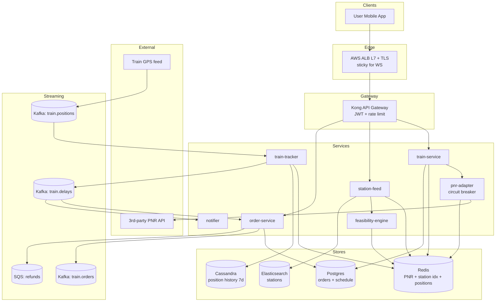

# 2. Uber Eats Train PNR — HLD

## 1. Requirements

### Functional
- User enters a Passenger Name Record (PNR) while traveling on a train.
- System fetches journey: train number, route, current station, upcoming stations, Estimated Times of Arrival (ETAs).
- For each upcoming station, show restaurants that can deliver to the platform *in time for train arrival*.
- Only show restaurants whose prep + delivery ETA ≤ train-arrival-at-station − safety margin (e.g., 5 min).
- User places order; order is bound to `(train_no, station_code, arrival_ts)`.
- Track train in near-real-time; re-evaluate feasibility and alert if train delays/cancels.
- Refund / re-route order if train skips station.

### Non-Functional
- **Latency**: PNR lookup 99th percentile (p99) < 800 ms (includes external Application Programming Interface (API)); station feed p99 < 300 ms.
- **Availability**: 99.9%; degrade gracefully if PNR provider is down (allow manual entry of train+station).
- **Durability**: orders must be durable (Postgres + Write-Ahead Log (WAL) replication).
- **Consistency**: strong for order placement; eventual for train location.
- **Scale ceiling**: 250k sessions/day, 3 queries/session, ~20 Queries Per Second (QPS) peak PNR, 60 QPS peak station-feed.

## 2. Scale & Estimates (recap)

- **Target region train passengers/day**: 5M.
- **Feature adoption**: 5% → 250k sessions/day.
- **Queries per session**: 3 (PNR lookup + 2 station refreshes).
- **Avg session QPS**: 250k × 3 / 86400 ≈ **9 QPS**; peak ~20 QPS PNR, 60 QPS station feed.
- **PNR external API calls**: cache aggressively — target external call rate 10/s (by 2-min Time To Live (TTL) on PNR results).
- **Station → restaurant index**: 10k stations × ~50 restaurants avg × ~1 KB = 500 MB in Redis.
- **Restaurants**: 500k active, already indexed by geo service (reused).
- **Order write QPS**: 250k / 86400 × 0.3 conversion ≈ 1 write/s, peak 10/s.

- Full math: [estimations doc](../back_of_envelope_estimations_example.md)

## 3. High-Level Component Design

### Edge / Load Balancer (LB)
- Application Load Balancer (ALB) (Layer 7 (L7)), Transport Layer Security (TLS) termination, sticky on session_id for WebSocket (WS) train-tracking stream.
- Route53 latency routing; target region is India — single primary region (ap-south-1) with Disaster Recovery (DR) in ap-southeast-1.

### API Gateway
- Kong gateway.
- Auth via user JSON Web Token (JWT) (reuses main Eats identity).
- Rate limit 5 PNR lookups/min/user (prevents scraping), 30 station queries/min/user.
- Routes `/v1/train/*` to train-service; `/v1/train-order/*` to order-service.

### Services (microservices)

| Service | Responsibility |
|---------|----------------|
| train-service | PNR lookup, train schedule, live position, ETA computation. |
| pnr-adapter | Wraps 3rd-party PNR/IRCTC-like API; caches aggressively; retries; circuit-breaker. |
| station-feed | For a given (train, station, arrival_ts), return feasible restaurants. |
| feasibility-engine | Given restaurant prep ETA + station delivery ETA + train arrival, decide eligibility. |
| order-service | Place, track, refund train orders; delegates fulfillment to Eats core. |
| train-tracker | Consumes train-GPS feed; updates live ETA; publishes delay events. |
| notifier | Push/Short Message Service (SMS) on delay, order status, platform-arrival reminder. |

### Datastores (one bullet per store, what it holds)
- **Redis (PNR cache)**: PNR → journey object, TTL 2 min.
- **Redis (station→restaurant index)**: station_code → list of restaurant_ids serving that platform.
- **Postgres**: train-bound orders, station metadata, train static schedule.
- **Cassandra**: train live-position history (time series) for analytics and re-computation.
- **Elasticsearch (ES)**: station search / autocomplete ("Kanpur" → station list).

### Async Infra
- **Kafka `train.positions`**: streaming Global Positioning System (GPS) feed, 10s updates per train.
- **Kafka `train.delays`**: delay/cancel events; consumed by notifier and order-service.
- **Kafka `train.orders`**: order lifecycle events.
- **Amazon Simple Queue Service (SQS) `refunds`**: refund processing with retries.

## 4. API Design

```
POST /v1/train/lookup
  { pnr: "1234567890" }
  -> { train_no, from, to, coach, berth, journey:[{station, arrival, departure, eta}] }

GET  /v1/train/{train_no}/stations/{station_code}/restaurants?arrival=<ts>
  -> { restaurants:[{id, name, eta_min, feasible:true, prep_min, deliver_min}] }

POST /v1/train-order
  { pnr, train_no, station_code, arrival_ts, restaurant_id, items:[...] }
  -> { order_id, status:"CONFIRMED", deliver_by }

GET  /v1/train-order/{order_id}
  -> { status, train_eta, station, delivery_eta }

WS   /v1/train/{train_no}/stream   # live position + ETA updates
```

## 5. Data Storage & Schema Design

### Schema (key tables/collections)

```
# Postgres
trains(train_no PK, name, route_id, operator)
stations(code PK, name, lat, lon, platforms, tz)
train_schedule(train_no, station_code, arrival_offset_min, departure_offset_min, day)
train_orders(order_id PK, user_id, pnr, train_no, station_code,
             planned_arrival_ts, restaurant_id, status, created_at, updated_at)

# Redis
pnr:{pnr} -> JSON journey (TTL 120s)
station_rest:{station_code} -> SET of restaurant_id (warm, refresh nightly)
train_pos:{train_no} -> HASH {lat, lon, speed, last_station, delay_min, updated_at}

# Cassandra (time series)
train_positions(train_no, ts, lat, lon, delay_min)
  PK: ((train_no), ts)  -- clustered asc, TTL 7d

# Elasticsearch
stations_idx: {code, name, aliases, lat, lon}
```

### DB Choice & Justification

- **Why Postgres for orders & schedule**: Atomicity Consistency Isolation Durability (ACID) needed for order placement (money + fulfillment). Strong consistency on `train_orders` — a user must not double-charge or double-book. Low write QPS (10/s peak) means Postgres is massively sufficient; JSONB gives us flexibility for items.
- **Why Redis for PNR + station index**: PNR lookups are read-heavy, expensive upstream; a 2-min TTL cuts external calls 100×. Station→restaurant is a static 500 MB map with nightly refresh — Redis SET lookup is O(1). Redis is not authoritative so replaceability is fine.
- **Why Cassandra for train positions**: time-series append-only, 2k trains × 10s updates = 200 writes/s, bursty and unbounded. Partition by train_no; 7d TTL free via Cassandra TTL. Retrieval by `(train_no, time range)` is a single partition scan.
- **Why not Postgres for train positions**: at 200 writes/s × 7d = 120M rows and constant inserts, vacuum pressure and index bloat hurt; no native TTL.
- **Why not DynamoDB**: workable but unnecessary cost; we self-host Cassandra already for other services.
- **Why not MongoDB**: we need relational joins (orders ⋈ schedule ⋈ stations) for reconciliation reports — Postgres is the natural fit.
- **Why Elasticsearch for station search**: fuzzy/partial match + aliases ("CSMT" vs "Mumbai CST"). A Postgres trigram index could work but ES gives better ranking and is already in the stack.
- **Why not Redis as primary for orders**: no durability guarantee; losing 1 minute of orders is a customer-facing disaster. Redis is a cache only.

### Sharding & Partitioning
- **Postgres**: single primary suffices at 10 writes/s; partition `train_orders` by `created_at` month for retention.
- **Cassandra**: partition by `train_no`, clustering `ts ASC`.
- **Redis**: small enough for one cluster (3 shards); hash-slot by key.

### Replication
- **Postgres**: primary + 2 streaming replicas (1 sync, 1 async); failover via Patroni.
- **Cassandra**: Replication Factor (RF)=3, LOCAL_QUORUM.
- **Redis**: primary + replica per shard, AOF every 1s.

## 6. Scalability & Performance

### Caching
- PNR Redis cache is the biggest lever — drops external API from 20/s to 10/s.
- Station→restaurant index is a materialized view; rebuilt nightly from geo-service by running a point-in-polygon for each station's 5 km radius.
- Train live position cached for 10s (matches GPS update cadence).
- Content Delivery Network (CDN) (CloudFront) for static assets only; APIs bypass CDN.

### Message Queues
- Kafka `train.positions` is the source of truth for live tracking; train-tracker service consumes it and publishes delta events.
- `train.delays` fans out to notifier (push) and order-service (re-evaluate feasibility).
- `refunds` on SQS because we want retry + visibility timeout, not ordering.

### Read-heavy vs Write-heavy
- **Read-heavy**: 90% of traffic is reads (PNR, station-feed, tracking stream).
- Hot path optimization: feasibility computed once per `(train_no, station_code, arrival_ts)` and cached in Redis for 30s. 60 QPS collapses to ~5 QPS of actual computation.

## 7. Deep Dive

### Topic 1: PNR + Train Schedule Integration
- **Upstream providers**: 3rd-party PNR APIs (IRCTC-equivalent) are slow (1–3 s), rate-limited (e.g., 30/min), and flaky.
- **Adapter design**:
  - `pnr-adapter` is the *only* service that calls upstream.
  - Circuit breaker (Hystrix / resilience4j): 50% error rate over 30s → open circuit for 60s.
  - Retry policy: 2 retries with exponential backoff + jitter; idempotent because PNR lookups are read-only.
  - Request coalescing: if 5 users query the same PNR within 2 min, only 1 upstream call is made (singleflight pattern).
- **Cache key**: `pnr:{pnr}` TTL 120s. Why 120s? Journey data changes slowly; 2 min is within user's tolerance.
- **Refresh strategy**:
  - Passive: TTL expiry on miss.
  - Active: after user opens session, we subscribe to `train.positions` for that train; on delay > 5 min, we invalidate the cache and push a fresh journey object via WS.
- **Schedule data**: static daily schedule is loaded into Postgres from the operator feed once per day; `train_positions` gives the delta (delay_min). ETA at next station = schedule_arrival + delay_min.

### Topic 2: ETA vs Train-Arrival Feasibility Check
- **Formula**:
  ```
  feasible = (now + prep_min + deliver_min + safety) <= train_arrival_at_station
  ```
  where `safety = 5 min` buffer.
- **Inputs**:
  - `prep_min` from restaurant (cached per-restaurant EWMA over last 100 orders).
  - `deliver_min` from geo-service, using station platform as destination.
  - `train_arrival_at_station = schedule + delay_min` from train-tracker.
- **Handling delay updates**:
  - `train-tracker` publishes `train.delays` whenever delay crosses a 2-min threshold.
  - `order-service` consumes and re-evaluates affected orders:
    - If new feasibility still OK: silently update `delivery_eta`, push WS notification.
    - If no longer feasible: mark order `AT_RISK`, notify user with options (reassign to later station, refund).
    - If station is skipped entirely: auto-refund via SQS → payment service; notify.
- **Cancellation**: `train.delays` event with `cancelled=true` → batch-cancel all orders for that train, refund, notify.
- **Race condition**: user places order right as train delays — use optimistic concurrency, re-check feasibility inside the order-service transaction before confirming.

## 8. Trade-offs

- **Consistency, Availability, Partition tolerance (CAP)**: CP for orders (Postgres), AP for PNR/tracking (Redis+Cassandra).
- **Consistency model**: strong for order placement and payment; eventual (≤ 30s) for live train ETA.
- **Failure handling**:
  - Circuit breaker on PNR adapter; on open, return last known good from cache with `stale=true` flag.
  - Retries with jitter for upstream PNR; idempotent.
  - Idempotency keys on order creation (`user_id + pnr + station + restaurant + round(now,5min)`).
  - Dead Letter Queue (DLQ) on `train.orders` and SQS dead-letter on `refunds`.
  - Graceful degradation: if station-feed is down, show cached station list with a warning banner.

## 9. Mermaid Diagram


