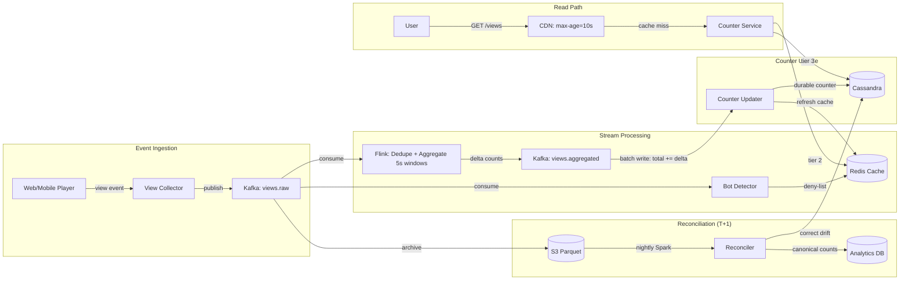

# YouTube View Count System — HLD (Revision Notes)

---

## NFRs (Frame Every Design Choice Around These)

```
Write QPS: 58k avg, 200k peak
Read QPS: ~500k/s (served via CDN, origin ~5k/s)
Live count visibility: < 10s p95
Availability: 99.99% read (CDN), 99.9% write
Scale: 5B views/day, 500M videos, 2B MAU
Consistency: eventual for live counter, exact at T+1 (creator payouts)
```

---

## Core Idea

> Emit → Dedupe → Aggregate → Serve

```
Client → API → Kafka (views.raw) → Flink (dedupe + aggregate) → Cassandra (durable counter)
                                                                       ↓
                                                                 Redis (cache) → CDN → User
```

**Two paths:**
- **Fast path:** Redis INCR for live count (served via CDN)
- **Accurate path:** Flink dedupe + aggregate → Cassandra → nightly Spark reconciliation

---

## Scale Numbers

```
DAU            = 500M, 10 views/day each
Views/day      = 5B → 58k/s avg, 200k/s peak
Event size     = ~200 B → 1 TB/day raw
Counter store  = 500M videos x 16 B = 8 GB (fits in Redis easily)
Read QPS       = 500k/s total, CDN absorbs 99% → ~5k/s origin
```

---

## Key Components

### 1. View Collector (HTTP → Kafka Bridge)

* **What:** Thin stateless service that translates HTTP from clients into Kafka messages
* **Why it exists:** Clients speak HTTP, Kafka speaks its own protocol — need a bridge
* **What it does (minimal work per request):**
  1. Receive HTTP POST from client (only sent when watch ≥ 30s or 50%)
  2. Validate session cookie + HMAC (lightweight, no DB call)
  3. Check bot deny-list in Redis (single key lookup)
  4. Publish to Kafka `views.raw` → return 202 Accepted
* **How it handles 200k/s peak:**
  * Stateless → horizontally scalable (just add pods behind LB)
  * No DB calls, no heavy auth, no business logic → fire-and-forget to Kafka
  * One instance handles ~10-20k req/s → 10-20 pods cover 200k/s peak
  * The collector is NOT the buffer — **Kafka is the buffer**
  * If Kafka is slow → drop events with loud alarm (losing a few views is acceptable)

```json
{ "video_id": "v1", "user_id": "u1", "session_id": "s1",
  "watch_ms": 35000, "client_ts": "...", "country": "US", "device": "mobile" }
```

### 2. Kafka (Backbone)

* Topics:
  * `views.raw` — all incoming view events (partitioned by video_id, 1024 partitions)
  * `views.aggregated` — deduplicated delta counts from Flink
  * `bot.signals` — flagged suspicious sessions
* Separate consumer groups: aggregator, archiver, bot detector
* 7-day retention for replay/DR

### 3. Flink (Dedupe + Aggregate)

* Keyed by `video_id`, tumbling 5s windows
* Dedupe key: `hash(session_id + video_id + bucket_30s)` in RocksDB state (TTL 1h)
* Emits `(video_id, delta_count)` to `views.aggregated`
* Reduces 200k/s raw events → ~5k batched writes/s to Cassandra

### 4. Counter Updater

* Consumes `views.aggregated`
* Issues ONE `UPDATE total_views += delta` per video per 5s window
* Updates Redis cache on each delta

### 5. Counter Service (Read Path)

* Serves `GET /videos/{id}/views`
* Read order: CDN → Redis → Cassandra
* CDN: `Cache-Control: public, max-age=10, stale-while-revalidate=30`
* Process-local LRU for top 1000 videos

### 6. Bot Detector

* Separate Flink job on `views.raw`
* Computes per-user view-rate z-scores
* Flags above threshold → `bot.signals` → deny-list in Redis
* Collector rejects events from denied sessions

### 7. Nightly Reconciler (T+1 Canonical Count)

* Spark job over `views.raw` Parquet in S3
* Removes duplicates + bot traffic
* Computes canonical per-day count
* Compares to Cassandra, corrects drift (typically < 0.1%)
* Creator Studio / payouts read from reconciled table, not live counter

---

## Fast Path vs Accurate Path

```
FAST PATH (live count):
  Event → Kafka → Flink (5s window) → Counter Updater → Redis INCR → CDN serves
  Latency: < 10s, approximate, eventual consistency OK

ACCURATE PATH (T+1):
  Event → Kafka → S3 Parquet → Spark (nightly) → canonical DB
  Latency: T+1 day, exact, used for creator payouts
```

---

## Deduplication Strategy

### Same user watching repeatedly:
```
dedupe_key = hash(session_id + video_id + floor(ts / 30s))
Flink RocksDB state, TTL 1h
5 refreshes in 30s → 1 view counted
```

### Bot filtering:
```
Flink job → per-user view-rate z-score → deny-list in Redis
Collector rejects denied sessions upstream
```

---

## Hot Video Handling (Shard Everywhere, Then Merge)

**Problem:** A viral video creates a hot key bottleneck at **every layer** — not just one.

**Key insight:** Replication does NOT solve write hotspots. Replicas help reads, but writes still hit the primary. You must **shard writes** at every layer.

---

### Layer 1: Kafka (Key Salting)

**Problem:**
```
partition_key = video_id
Viral video → all events land on 1 partition → consumer bottleneck
```

**Solution:**
```
partition_key = video_id + ":" + random(0..N)

Example: v1:0, v1:1, v1:2 ... v1:9
→ events spread across N partitions
```

---

### Layer 2: Flink (Two-Stage Aggregation)

**Problem:**
```
keyBy(video_id)
→ all events for viral video go to 1 task slot → bottleneck
```

**Solution:**
```
Stage 1 (parallel): key = (video_id, shard_id)
  → partial count per shard (runs on N workers)

Stage 2 (merge): re-key by video_id
  → SUM all shard counts → emit final delta
```

```
Kafka (sharded events)
    ↓
Flink Stage 1: count per (video_id, shard) — parallel
    ↓
Flink Stage 2: SUM per video_id — merge
    ↓
Counter Updater → Cassandra + Redis
```

---

### Layer 3: Redis (Sharded Counters)

**Problem:**
```
INCR view_count:v1
→ viral video = single key hot on one Redis primary → bottleneck
→ replication does NOT help (replicas don't serve writes)
```

**Solution:**
```
Write: shard = random % 16
       INCR view_count:v1:<shard>

Read:  SUM(view_count:v1:0, view_count:v1:1, ... view_count:v1:15)
       → cache result in CDN (10s TTL)
```

---

### Layer 4: Cassandra (Same Idea)

```
Write: UPDATE view_counter SET views += delta WHERE video_id = 'v1' AND shard = random(0..15)
Read:  SUM all 16 shards (or pre-merge in Counter Updater)
```

---

### Full Hot Video Flow

```
Client → Kafka (v1:shard) → Flink Stage 1 (partial agg) → Flink Stage 2 (merge)
                                                                    ↓
                                                          Cassandra (sharded counters)
                                                          Redis (sharded counters)
                                                                    ↓
                                                              CDN → User
```

### Interview Answer for Hot Videos

> "To handle hot videos, we shard the load across all layers. In Kafka, we use key salting to distribute events across partitions. In Flink, we apply two-stage aggregation — first aggregating per shard, then merging per video. In Redis and Cassandra, we use sharded counters instead of a single key to avoid write hotspots. Replication alone is insufficient since it doesn't distribute write load."

---

## Storage Choices

| Store | Purpose | Why This? |
|-------|---------|-----------|
| **Cassandra** | Durable counters | Native COUNTER type, linear scalability, handles 200k/s writes, RF=3 |
| **Redis** | Live counter cache + bot deny-list | Sub-ms reads, TTL 10s, tier-2 cache behind CDN |
| **Kafka** | Event backbone | Absorbs 200k/s bursts, 7-day replay, partitioned by video_id |
| **S3 + Parquet** | Raw event archive | 1 TB/day, cheapest durable storage, Spark-friendly |
| **Postgres** | Video metadata | Small relational data, read-heavy, cached |
| **CDN** | Read path tier-1 | 99% of 500k/s reads never reach origin |

### Why Not Alternatives?

* **Why not Postgres for counters?** — 200k/s counter updates = catastrophic lock contention + WAL pressure
* **Why not DynamoDB?** — Hot partition risk on viral videos, provisioned WCU cost at 200k/s is steep
* **Why not Redis as primary counter store?** — In-memory only, lose counters on cluster restart, need Cassandra as durable backing
* **Why not just Cassandra reads for watch page?** — Sub-ms latency needed at 500k/s, CDN + Redis cache layer required

---

## CDN Caching Strategy

```
Cache-Control: public, max-age=10, stale-while-revalidate=30

500k/s total reads
  → CDN absorbs 99% → ~5k/s to Redis
  → Redis absorbs most → ~5k/s to Cassandra

Ultra-hot videos (live premiere): drop TTL to 3s, CDN handles the load
```

---

## Failure Handling

```
Kafka broker down    → acks=all + min.isr=2, no data loss
Flink crash          → checkpoint every 10s to S3, replay from Kafka offset
Cassandra node down  → hinted handoff + read repair, tolerate RF-1 failures
Cassandra fully down → Counter Service serves Redis cache + "~" stale prefix
Redis down           → Counter Service reads directly from Cassandra (higher latency)
Bot detector lag     → separate consumer group, doesn't slow counter updates
Drift over time      → nightly Spark reconciliation corrects < 0.1% drift
```

---

## API Design

```
POST /v1/views                              → 202 Accepted
  body: { video_id, user_id, session_id, watch_ms, client_ts, country, device }

GET  /v1/videos/{video_id}/views            → { count, as_of }  (CDN-cached 10s)


GET  /v1/channels/{cid}/analytics?from&to   → { series }  (creator studio, T+1)
```

---

## Common Mistakes

* Writing every event directly to DB (use Kafka + Flink batching)
* No hot key handling at ALL layers (viral video melts Kafka, Flink, Redis, Cassandra — shard everywhere)
* Thinking replication solves write hotspots (it doesn't — replicas only help reads)
* Using Redis as primary counter store (no durability)
* Ignoring bot/spam filtering (inflated counts = wrong payouts)
* Serving reads directly from DB at 500k/s (need CDN + cache layers)
* Conflating live count with canonical count (different consistency needs)

---

## Architecture Diagram



### Step-by-step flow:

```
1. Client watches video ≥ 30s → sends view event to View Collector
2. Collector validates (session + HMAC), checks bot deny-list → publishes to Kafka (views.raw)
3. Flink consumes, keys by video_id, dedupes via hash(session+video+30s_bucket):
   - Drops duplicates (same user, same 30s window)
   - Aggregates into 5s tumbling windows
   - Emits (video_id, delta_count) to Kafka (views.aggregated)
4. Counter Updater consumes deltas → batch writes to Cassandra (1 write per video per 5s)
5. Counter Updater also refreshes Redis cache
6. User reads count: CDN (10s TTL) → Redis → Cassandra
7. Parallel pipeline: Bot Detector flags spam → deny-list in Redis
8. Nightly Spark job over S3 Parquet → reconciles drift → canonical count for creator payouts
```

---

## Interview Answer Template

> View events flow from the client into Kafka via a thin collector. Flink deduplicates using session-based keys in RocksDB state and aggregates counts in 5-second windows, reducing 200k/s raw events to ~5k batched writes. Redis serves as the live view counter via INCR, served through CDN with a 10-second TTL. Cassandra stores durable counters as the backing store. For viral videos, client-side counter sharding across 16 keys prevents hot partitions. A nightly Spark reconciliation over S3 Parquet produces canonical T+1 counts for creator payouts. Bot detection runs as a parallel Flink job feeding a Redis deny-list.

---

## Key Mental Model

```
Write path:  Client → Kafka → Flink (dedupe + batch) → Cassandra → Redis cache
Read path:   CDN → Redis → Cassandra (3-tier, each absorbs 90%+ of traffic)
Hot video:   Shard everywhere (Kafka, Flink, Redis, Cassandra), then merge
Accuracy:    Live = approximate, T+1 = exact (Spark reconciliation)
```
