# Workflow Execution End-to-End Flow

## 1. Listener Node Flow (async — `/execute` only registers a trigger)

```mermaid
%%{init: {'theme':'base', 'themeVariables': {
  'fontSize': '20px',
  'background': '#000000',
  'primaryColor': '#1f1f1f',
  'primaryTextColor': '#ffffff',
  'primaryBorderColor': '#bbbbbb',
  'lineColor': '#dddddd',
  'secondaryColor': '#2a2a2a',
  'tertiaryColor': '#1f1f1f',
  'actorBkg': '#222222',
  'actorBorder': '#bbbbbb',
  'actorTextColor': '#ffffff',
  'actorLineColor': '#bbbbbb',
  'signalColor': '#ffffff',
  'signalTextColor': '#ffffff',
  'labelBoxBkgColor': '#333333',
  'labelBoxBorderColor': '#bbbbbb',
  'labelTextColor': '#ffffff',
  'loopTextColor': '#ffffff',
  'noteBkgColor': '#3a3a1a',
  'noteTextColor': '#ffffff',
  'noteBorderColor': '#bbbbbb',
  'activationBkgColor': '#444444',
  'activationBorderColor': '#bbbbbb',
  'sequenceNumberColor': '#000000'
}}}%%
sequenceDiagram
    autonumber
    participant UI as Client UI
    participant API as FastAPI<br/>(api_server.py)
    participant WF as WorkflowFacade<br/>(workflow_builder_facade.py)
    participant LF as ListenerFacade<br/>(listener_facade.py)
    participant EB as AWS EventBridge<br/>Scheduler
    participant LAM as Workflow Lambda<br/>(workflow_builder_lambda_controller)
    participant EH as ExecutionHelper<br/>(execution.py)
    participant SFN as AWS Step<br/>Functions
    participant NL as Node Lambda<br/>(node_engine/lambda_handler)
    participant NF as NodeFacade<br/>+ PipedreamListenerNode
    participant S3 as S3
    participant PD as External Source<br/>(Pipedream / Webhook)

    rect rgb(20, 30, 60)
    Note over UI,EB: PHASE 1 — Activation: /execute creates the EventBridge schedule
    UI->>API: POST /workflow/{id}/execute
    API->>WF: execute_full_workflow()
    WF->>WF: check_if_listener_node_activation_needed()
    WF->>LF: activate_listener_for_test()
    alt CRON listener
        LF->>LF: _create_scheduler_listener()
        LF->>EB: create_recurring_schedule(<br/>cron_expr, target=execute_workflow_lambda_arn,<br/>payload={workflow_id, listener_id, trigger_data})
    else PIPEDREAM / Webhook listener
        LF->>PD: _handle_pipedream_activation()<br/>(connect external source)
        LF->>EB: schedule_lambda_invocation(<br/>target=timeout_lambda_arn, delay=2min,<br/>action_after_completion=DELETE)
    end
    LF-->>API: listener activated
    API-->>UI: 200 OK (no immediate workflow run)
    end

    rect rgb(20, 50, 30)
    Note over EB,SFN: PHASE 2 — Trigger fires → Step Function starts
    alt CRON fires on schedule
        EB->>LAM: invoke execute_full_workflow<br/>(scheduled event payload)
        LAM->>LF: handle_scheduled_trigger()
    else Webhook arrives
        PD->>API: POST /webhooks/listeners/{listener_id}
        API->>LF: handle_webhook_listener()
        LF->>S3: store_webhook_data() (raw payload)
        LF->>LF: _execute_live_workflow()
    end
    LF->>EH: execute_full_workflow(trigger_data={listener_id, s3_url})
    EH->>EH: create WorkflowExecutionDB +<br/>node_execution rows
    EH->>SFN: start_execution(state_machine_arn, input)
    end

    rect rgb(60, 50, 20)
    Note over SFN,S3: PHASE 3 — Step Function runs the listener node
    SFN->>NL: invoke node Lambda (execute_node task)
    NL->>NF: execute_node(node_execution_id, trigger_data)
    NF->>S3: get_json_s3_file(trigger_data.s3_url)
    S3-->>NF: webhook payload JSON
    NF->>NF: parse → DataFrame → s3_output_url(_csv)
    NF-->>NL: status, result, next_node_index
    NL-->>SFN: task result
    SFN->>SFN: continue to next node in graph
    end

    rect rgb(70, 25, 25)
    Note over NF,SFN: PHASE 3b (only for async / wait-for-callback nodes)
    NF->>EB: create_callback_processor_scheduler<br/>(fallback cleanup, target=callback Lambda)
    NF->>NF: persist task_token + scheduler_arn
    Note over NF,SFN: Step Function task is paused, waiting on token
    PD-->>API: external callback / webhook arrives
    API->>NF: process_node_execution_callbacks()
    NF->>SFN: send_task_success(task_token, output)
    SFN->>SFN: resume + continue
    end
```

---

## 2. Regular (Non-Listener) Node Flow — `/execute` runs the workflow synchronously

For workflows **without** a listener node, the `/execute` request immediately compiles the workflow graph into a Step Functions ASL definition, starts the state machine, and returns an `execution_arn` to the UI. The UI then polls for status.

```mermaid
%%{init: {'theme':'base', 'themeVariables': {
  'fontSize': '20px',
  'background': '#000000',
  'primaryColor': '#1f1f1f',
  'primaryTextColor': '#ffffff',
  'primaryBorderColor': '#bbbbbb',
  'lineColor': '#dddddd',
  'secondaryColor': '#2a2a2a',
  'tertiaryColor': '#1f1f1f',
  'actorBkg': '#222222',
  'actorBorder': '#bbbbbb',
  'actorTextColor': '#ffffff',
  'actorLineColor': '#bbbbbb',
  'signalColor': '#ffffff',
  'signalTextColor': '#ffffff',
  'labelBoxBkgColor': '#333333',
  'labelBoxBorderColor': '#bbbbbb',
  'labelTextColor': '#ffffff',
  'loopTextColor': '#ffffff',
  'noteBkgColor': '#3a3a1a',
  'noteTextColor': '#ffffff',
  'noteBorderColor': '#bbbbbb',
  'activationBkgColor': '#444444',
  'activationBorderColor': '#bbbbbb',
  'sequenceNumberColor': '#000000'
}}}%%
sequenceDiagram
    autonumber
    participant UI as Client UI
    participant API as FastAPI<br/>(workflow_execution_endpoints.py)
    participant WF as WorkflowFacade<br/>(workflow_builder_facade.py)
    participant EH as ExecutionHelper<br/>(execution.py)
    participant SFE as SFN Engine<br/>(workflow_execution_engine_sfn.py)
    participant DB as Postgres<br/>(WorkflowExecutionDB,<br/>NodeExecutionDB)
    participant SFN as AWS Step<br/>Functions
    participant NL as Node Lambda<br/>(node_engine/lambda_handler)
    participant NF as NodeFacade<br/>+ Concrete Node
    participant S3 as S3
    participant EVB as EventBridge<br/>(event bus)
    participant EH2 as NodeExecutionsEnded<br/>EventHandler

    rect rgb(20, 30, 60)
    Note over UI,SFN: PHASE 1 — Request → compile graph → start Step Function
    UI->>API: POST /workflow/{id}/execute
    API->>WF: execute_full_workflow()
    WF->>WF: check_if_listener_node_activation_needed()<br/>(returns False — no listener)
    WF->>EH: execute_full_workflow()
    EH->>DB: insert WorkflowExecutionDB<br/>(status=RUNNING)
    EH->>DB: insert NodeExecutionDB rows<br/>(one per node, status=PENDING)
    EH->>SFE: get_executable_definition(workflow_graph)
    Note right of SFE: Builds ASL JSON dynamically:<br/>• NREV_FIRST_NODE_PASS<br/>• NODE_{n}_RUN (Task→Lambda)<br/>• WAIT_{n} (Wait state)<br/>• CHOICE_{n} (Choice state)<br/>• NREV_PENDING_NODE_MARKER
    EH->>SFE: execute_workflow(state_machine_arn, input)
    SFE->>SFN: start_execution(input={node_execution_ids,<br/>workflow_execution_id, user_id, tenant_id})
    SFN-->>EH: execution_arn
    EH-->>WF: WorkflowExecutionDB (RUNNING + execution_arn)
    WF-->>API: ExecutionResponse
    API-->>UI: 200 OK (execution_arn)
    end

    rect rgb(20, 50, 30)
    Note over SFN,NF: PHASE 2 — Step Function walks the graph, one node at a time
    SFN->>SFN: NrevFirstNodePass<br/>(init current_execution_mode_index=0)
    loop for each node in graph
        SFN->>NL: NODE_{n}_RUN<br/>lambda:invoke execute_node task
        NL->>NF: node_engine_controller.execute_node()
        NF->>DB: load node settings + parent outputs
        NF->>S3: read parent node outputs (CSV/JSON)
        NF->>NF: _validate_input() + _execute_node_logic()
        NF->>S3: write s3_output_url + s3_output_url_csv
        NF->>DB: update NodeExecutionDB (status, file_info)
        NF-->>NL: {execution_status, time_to_wait_s,<br/>next_node_execution_mode_index}
        NL-->>SFN: task result
        SFN->>SFN: CHOICE_{n} routes on result:
        alt status=running & time_to_wait_s>0
            SFN->>SFN: WAIT_{n} → loop back to NODE_{n}_RUN<br/>(re-poll, e.g. async API)
        else status=running & time_to_wait_s=0
            SFN->>SFN: loop back to NODE_{n}_RUN<br/>(next execution mode / next chunk)
        else status=completed
            SFN->>SFN: advance to NODE_{n+1}_RUN
        else status=stopped / failed
            SFN->>SFN: jump to cleanup
        end
    end
    end

    rect rgb(60, 50, 20)
    Note over SFN,EH2: PHASE 3 — Cleanup, status update, notifications
    SFN->>EVB: PutEvents NODE_EXECUTIONS_ENDED<br/>{workflow_execution_id, node_execution_ids, status}
    SFN->>SFN: 1-hour wait (lets pending callbacks land)
    EVB->>EH2: deliver event → core_event_logic()
    EH2->>WF: node_executions_cleanup()
    WF->>DB: update NodeExecutionDB rows<br/>(RUNNING → COMPLETED/FAILED)
    WF->>WF: fetch credit usage (FlexPrice)
    WF->>DB: update WorkflowExecutionDB<br/>(status=COMPLETED/FAILED, credits_used)
    WF->>WF: Slack alert if failure /<br/>notify AI agent if agent-triggered
    SFN->>SFN: 24-hour wait → final marker state
    end

    rect rgb(70, 25, 25)
    Note over UI,DB: PHASE 4 — UI sees the result by polling
    UI->>API: GET /workflow/{id}/executions/{execution_id}
    API->>DB: read WorkflowExecutionDB + NodeExecutionDB
    API-->>UI: status, per-node outputs, credits_used
    end
```

### Notes on the regular flow

- **State machine is generated per workflow.** [workflow_execution_engine_sfn.py:40](domains/workflow_builder/core/workflow_execution_engine_sfn.py#L40) `get_executable_definition()` compiles the workflow graph into ASL JSON on the fly — there is no static state machine.
- **Per node, three SFN states are emitted** (Task → Wait → Choice). The Choice state is the router that decides loop / advance / fail.
- **`next_node_execution_mode_index`** is how a node tells SFN "I have more chunks to process — invoke me again." Used by chunked / paginated nodes.
- **`time_to_wait_s > 0`** is the polling pattern for slow async APIs (e.g., enrichment vendor takes 30s) — the Wait state pauses inside SFN, then the same node Lambda is invoked again.
- **Semi-execution** (`POST /workflow/{id}/node/{node_id}/execute`, single-node test) goes through the same path but uses `get_semi_executable_definition()` which filters the ASL down to the target node + its ancestors, and pre-seeds completed-ancestor outputs in the first Pass state.
- **The UI does not get results synchronously** — it gets back an `execution_arn` and polls. Final status is set asynchronously by the EventBridge cleanup handler.

---

## Key file references

### Listener flow

**Phase 1 — Activation (UI `/execute` → EventBridge schedule)**
- [domains/workflow_builder/application/workflow_execution_endpoints.py:18](domains/workflow_builder/application/workflow_execution_endpoints.py#L18) — `POST /workflow/{id}/execute`
- [domains/workflow_builder/core/workflow_builder_facade.py:603](domains/workflow_builder/core/workflow_builder_facade.py#L603) — `execute_full_workflow()`, listener detection at L653
- [domains/workflow_builder/core/listener_facade.py:160](domains/workflow_builder/core/listener_facade.py#L160) — `activate_listener_for_test()`
- [domains/workflow_builder/core/listener_facade.py:1465](domains/workflow_builder/core/listener_facade.py#L1465) — `_create_scheduler_listener()` (CRON path)
- [domains/workflow_builder/domain_infrastructure/aws_eventbridge_client_impl.py:102](domains/workflow_builder/domain_infrastructure/aws_eventbridge_client_impl.py#L102) — `create_recurring_schedule()` → boto3 `scheduler.create_schedule` at L126

**Phase 2 — Schedule fires → Step Function start**
- [domains/workflow_builder/application/workflow_builder_lambda_controller.py:61](domains/workflow_builder/application/workflow_builder_lambda_controller.py#L61) — Lambda entry, scheduler routing at L91-104
- [domains/workflow_builder/application/listener_endpoints.py:219](domains/workflow_builder/application/listener_endpoints.py#L219) — `POST /webhooks/listeners/{listener_id}`
- [domains/workflow_builder/core/helpers/execution/execution.py:239](domains/workflow_builder/core/helpers/execution/execution.py#L239) — `execute_full_workflow()`
- [domains/workflow_builder/core/workflow_execution_engine_sfn.py:184](domains/workflow_builder/core/workflow_execution_engine_sfn.py#L184) — `start_execution()` on Step Functions
- [infrastructure/step_function_client.py:25](infrastructure/step_function_client.py#L25) — boto3 `start_execution`

**Phase 3 — Step Function → node Lambda → listener node**
- [domains/node_engine/lambda_handler.py:16](domains/node_engine/lambda_handler.py#L16) — Lambda entry
- [domains/node_engine/application/node_engine_controller.py:64](domains/node_engine/application/node_engine_controller.py#L64) — `execute_node()`
- [domains/node_engine/core/nodes/pipedream_integration/pipedream_listener_node.py:40](domains/node_engine/core/nodes/pipedream_integration/pipedream_listener_node.py#L40) — listener node `_execute_node_logic()`, S3 load at L76

**Phase 3b — Async callback (mid-flow waiting node)**
- [domains/node_engine/core/nodes/base_node.py:1428](domains/node_engine/core/nodes/base_node.py#L1428) — `schedule_callback_processing()` creates fallback EventBridge schedule
- [domains/node_engine/core/nodes/base_node.py:620](domains/node_engine/core/nodes/base_node.py#L620) — `process_node_execution_callbacks()`
- [domains/node_engine/domain_infrastructure/aws_step_function_client_impl.py:20](domains/node_engine/domain_infrastructure/aws_step_function_client_impl.py#L20) — `return_callback_processor_task_token()` → `send_task_success`

### Regular (non-listener) flow

**Phase 1 — Compile + start state machine**
- [domains/workflow_builder/application/workflow_execution_endpoints.py:18](domains/workflow_builder/application/workflow_execution_endpoints.py#L18) — `POST /workflow/{id}/execute`
- [domains/workflow_builder/core/workflow_builder_facade.py:603](domains/workflow_builder/core/workflow_builder_facade.py#L603) — non-listener delegation at L671
- [domains/workflow_builder/core/helpers/execution/execution.py:239](domains/workflow_builder/core/helpers/execution/execution.py#L239) — creates `WorkflowExecutionDB` + per-node rows
- [domains/workflow_builder/core/workflow_execution_engine_sfn.py:40](domains/workflow_builder/core/workflow_execution_engine_sfn.py#L40) — `get_executable_definition()` builds ASL JSON
- [domains/workflow_builder/core/workflow_execution_engine_sfn.py:91](domains/workflow_builder/core/workflow_execution_engine_sfn.py#L91) — `get_semi_executable_definition()` (single-node test)

**Phase 2 — Step Function loop (Task → Choice → Wait/Loop/Advance)**
- [domains/workflow_builder/core/workflow_execution_engine_sfn.py:312](domains/workflow_builder/core/workflow_execution_engine_sfn.py#L312) — Task state definition (Lambda invoke)
- [domains/workflow_builder/core/workflow_execution_engine_sfn.py:329](domains/workflow_builder/core/workflow_execution_engine_sfn.py#L329) — Choice state routing rules
- [domains/node_engine/application/node_engine_controller.py:64](domains/node_engine/application/node_engine_controller.py#L64) — `execute_node()` returns `{execution_status, time_to_wait_s, next_node_execution_mode_index}`
- [domains/node_engine/core/node_engine_facade.py:317](domains/node_engine/core/node_engine_facade.py#L317) — facade dispatches to concrete node
- [domains/node_engine/core/nodes/base_node.py:327](domains/node_engine/core/nodes/base_node.py#L327) — `BaseNode.execute_v2()`

**Phase 3 — Cleanup + status update**
- [domains/workflow_builder/core/workflow_execution_engine_sfn.py:383](domains/workflow_builder/core/workflow_execution_engine_sfn.py#L383) — final EventBridge `PutEvents` for `NODE_EXECUTIONS_ENDED`
- [domains/workflow_builder/application/events/all_event_handlers/node_executions_ended_event_handler.py:50](domains/workflow_builder/application/events/all_event_handlers/node_executions_ended_event_handler.py#L50) — handler entry
- [domains/workflow_builder/core/workflow_builder_facade.py:1235](domains/workflow_builder/core/workflow_builder_facade.py#L1235) — `node_executions_cleanup()` (final status, credits, alerts)

---

## 3. `time_to_wait_s` — two completely different mechanisms

There are **two different ways** a node tells the system "I'm not done, come back later." They use different SFN primitives, different resume triggers, and apply to different node types.

| | Non-webhook node (rate-limit backoff) | Webhook node (callback-driven) |
|---|---|---|
| Internal setting | `external_webhook_cleanup_time_delay = 0` | `external_webhook_cleanup_time_delay > 0` |
| SFN Task resource | `lambda:invoke` | `lambda:invoke.waitForTaskToken` |
| Pause mechanism | SFN built-in `Wait` state (`WAIT_<node>`) | SFN Task held open, waiting on a `task_token` |
| What resumes it | Wait timer expires → Lambda re-invoked, retries the rate-limited rows | `send_task_success(task_token)` from FastAPI / cleanup Lambda |
| Use of `time_to_wait_s` | **`Seconds` value of the Wait state** — value extracted from the vendor's `Retry-After` (or equivalent) header on a 429 response | Vestigial / fallback only — the real wait is the cleanup-timer scheduler |
| Examples | RocketReach, LinkedIn Sales Navigator, any synchronous vendor that returns 429 + `Retry-After` | OpenAI Responses API, Parallel Web, any provider that webhooks back |

### 3a. Non-webhook node: `time_to_wait_s` is rate-limit backoff, not async polling

The node calls the vendor synchronously row-by-row. When the vendor responds with a 429 (or equivalent rate-limit status), the node reads the `Retry-After` header via `get_time_to_wait()` ([http_request_error_mapper.py:76](domains/node_engine/core/utils/http_request_error_mapper.py#L76)):

```python
def get_time_to_wait(exception: Exception, response_header_key: str) -> int:
    if isinstance(exception, httpx.HTTPStatusError):
        headers = exception.response.headers
        if response_header_key in headers:
            return int(headers[response_header_key])
    return 0
```

The rate-limited rows are marked for retry. The node returns `{status: "running", time_to_wait_s: <retry_after>}` so SFN sleeps for that duration server-side, then re-invokes the Lambda which retries only the rate-limited rows.

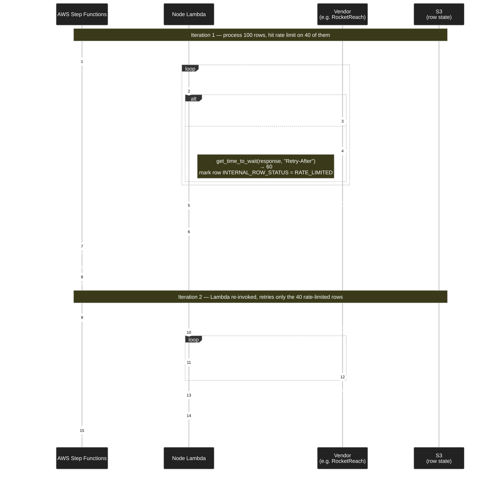

**Key point:** `time_to_wait_s` is interpreted by SFN as the **`Seconds` value of the Wait state** ([sfn.py:373](domains/workflow_builder/core/workflow_execution_engine_sfn.py#L373)):

```python
wait_state_def = {
    "Type": "Wait",
    "Seconds": "",
    "Next": node_run_name,
}
```

Real-world usage:

- [extract_sales_navigator_people_node.py:422](domains/node_engine/core/nodes/linkedin_scraping/extract_sales_navigator_people_node.py#L422) — `row_wait = get_time_to_wait(result, "Retry-After") or DEFAULT_RATE_LIMIT_WAIT_SECONDS`
- [rocketreach_enrich_people_node.py:282](domains/node_engine/core/nodes/people_data/rocketreach_enrich_people_node.py#L282) — `time_to_wait_for_retry = get_time_to_wait(enriched_row, ROCKETREACH_RETRY_AFTER_HEADER)`
- [rocketreach_search_people_node.py:515](domains/node_engine/core/nodes/people_data/rocketreach_search_people_node.py#L515) — same pattern

Each invocation can return a different `time_to_wait_s` (because the vendor's `Retry-After` shifts), so the backoff is dynamic. No Lambda runs during the wait. No EventBridge involved — just SFN's internal timer.

### 3b. Webhook node: `task_token` + per-row S3 aggregation + cleanup timer

The webhook case is more complex because the response **lands one row at a time on the FastAPI server**, but Step Functions only has one `task_token` per node execution.

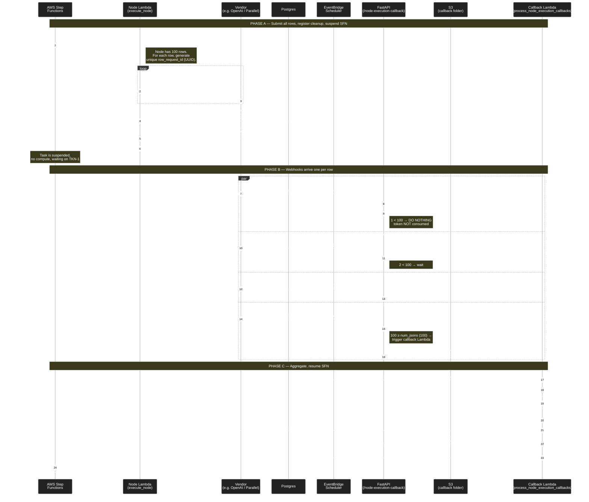

#### Why one task token works for many rows

Look at the per-row webhook URL ([base_node.py:1607](domains/node_engine/core/nodes/base_node.py#L1607)):

```
/node-execution-callback/{workflow_execution_id}/{node_execution_id}/{folder_name}/{nrev_request_id}
```

Each row gets a unique `nrev_request_id`. The vendor calls back with that path. The handler at [node_execution_callback_webhook.py:15](domains/workflow_builder/application/node_execution_callback_webhook.py#L15) does **two things only**:

1. **Uploads the row's JSON to S3** (one S3 object per row).
2. **Counts S3 objects in the folder.** Compares to `num_jsons` (the total row count, persisted at [base_node.py:1476](domains/node_engine/core/nodes/base_node.py#L1476)).

It calls `send_task_success` only when **count ≥ num_jsons** ([node_execution_callback_webhook_facade.py:87](domains/workflow_builder/core/node_execution_callback_webhook_facade.py#L87)):

```python
if num_objects_in_s3 >= node_execution_obj.node_execution_callback_processor_data.num_jsons:
    self.aws_lambda_client.invoke(self.node_lambda_arn,
        {"body": {"key": "process_node_execution_callbacks", ...}})
```

**Yes — once `send_task_success` fires, the task token is consumed and any later webhook for the same node execution is rejected** ([node_execution_callback_webhook_facade.py:78-84](domains/workflow_builder/core/node_execution_callback_webhook_facade.py#L78)):

```python
if folder_name != db_folder_name or token_consumed:
    logger.error("Node callback data received too late...")
    return  # webhook ignored
```

Late webhooks still upload to S3 (so you don't lose the data on disk), but they don't restart the workflow. So the **answer to your question** is:

> The token is per-node-execution, not per-row. We do NOT call `send_task_success` after each row. We aggregate row results in S3 and call `send_task_success` exactly once — when all `num_jsons` rows are accounted for, OR when the cleanup timer fires.

#### What if some webhooks never arrive — the cleanup safety net

You guessed correctly. The cleanup mechanism is the EventBridge Scheduler created at [base_node.py:1466-1471](domains/node_engine/core/nodes/base_node.py#L1466):

```python
scheduled_datetime = datetime.now(UTC) + timedelta(seconds=external_webhook_cleanup_time_delay)
scheduler_arn = self.aws_scheduler_client.create_callback_processor_scheduler(
    node_execution_id=..., schedule_at=scheduled_datetime,
)
```

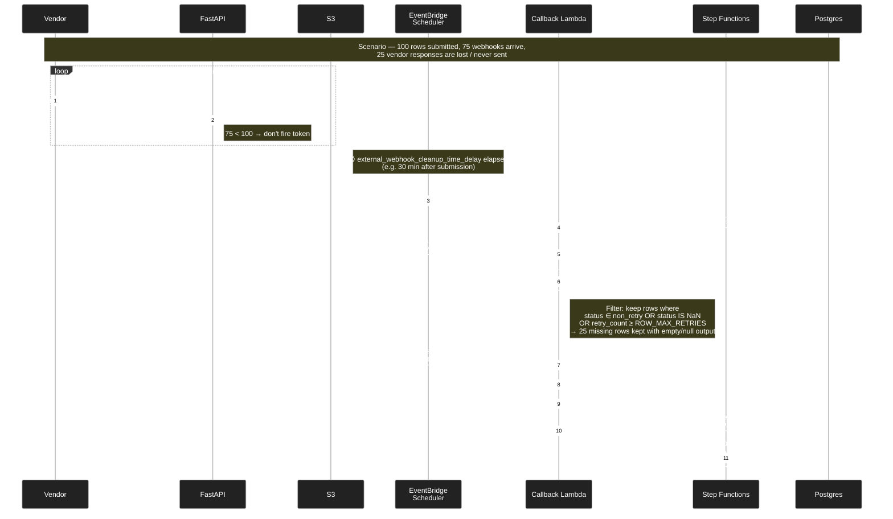

The relevant filter logic is at [base_node.py:682-686](domains/node_engine/core/nodes/base_node.py#L682):

```python
processed_df = processed_df[
    (processed_df[INTERNAL_ROW_STATUS_COLUMN].isin(InternalRowStatus.get_non_retry_status_values_list()))
    | (processed_df[INTERNAL_ROW_STATUS_COLUMN].isna())
    | (processed_df[INTERNAL_RETRY_COUNT_COLUMN] >= ROW_MAX_RETRIES)
]
```

So your understanding is right: **rows that never got a webhook back are emitted with empty/null output values** in the result DataFrame, and the workflow continues. They don't block the entire node forever.

### Race conditions handled

Note the two guards together prevent double-fires:

1. **Last webhook arrives before timer:** `count >= num_jsons` → fires `send_task_success` → sets `token_consumed = true`. When the timer later fires, the cleanup Lambda sees `token_consumed = true` and exits early.
2. **Timer fires before last webhook:** Cleanup Lambda fires `send_task_success` first, sets `token_consumed = true`. When late webhooks land, the API handler sees `token_consumed = true` and ignores them (S3 still gets the late row, but no double-resume).
3. **Lambda re-tries / Step Function reschedules same node:** `folder_name` is regenerated per attempt, so old folder webhooks are rejected at the folder-name mismatch check.

### File references

- [domains/node_engine/core/nodes/base_node.py:1428](domains/node_engine/core/nodes/base_node.py#L1428) — `schedule_callback_processing()` (creates scheduler, persists task_token + num_jsons)
- [domains/node_engine/core/nodes/base_node.py:1466](domains/node_engine/core/nodes/base_node.py#L1466) — fallback timer creation
- [domains/node_engine/core/nodes/base_node.py:620](domains/node_engine/core/nodes/base_node.py#L620) — `process_node_execution_callbacks()` (aggregates + resumes SFN)
- [domains/node_engine/core/nodes/base_node.py:682](domains/node_engine/core/nodes/base_node.py#L682) — missing-row filter (null/timeout handling)
- [domains/workflow_builder/application/node_execution_callback_webhook.py:15](domains/workflow_builder/application/node_execution_callback_webhook.py#L15) — `POST /node-execution-callback/...`
- [domains/workflow_builder/core/node_execution_callback_webhook_facade.py:87](domains/workflow_builder/core/node_execution_callback_webhook_facade.py#L87) — count-based callback Lambda trigger
- [domains/workflow_builder/core/node_execution_callback_webhook_facade.py:78](domains/workflow_builder/core/node_execution_callback_webhook_facade.py#L78) — late-webhook + token-consumed guard
- [domains/workflow_builder/core/workflow_execution_engine_sfn.py:325](domains/workflow_builder/core/workflow_execution_engine_sfn.py#L325) — `waitForTaskToken` resource on Task state
- [domains/workflow_builder/core/workflow_execution_engine_sfn.py:373](domains/workflow_builder/core/workflow_execution_engine_sfn.py#L373) — `Wait` state with dynamic `Seconds = time_to_wait_s`

### 3c. Webhook node + rate limit — when `time_to_wait_s` AND task tokens combine

This is the trickiest case. A webhook node is mid-submission to the vendor and gets rate-limited. The system has to:

1. Hold the rows already submitted (waiting on their webhooks).
2. Hold the rows not yet submitted (rate-limited).
3. Honor the vendor's `Retry-After` window before re-submitting.
4. Eventually resume the SFN with the remaining work.

#### When the task token is generated

The token is created by **AWS Step Functions itself** the moment SFN enters the Task state — *before* any vendor request is made. SFN injects it into the Lambda's input via [sfn.py:307](domains/workflow_builder/core/workflow_execution_engine_sfn.py#L307):

```python
"task_token": "" if callback_node_cleanup else None,
```

Order of operations:

```
SFN enters NODE_X_RUN
  → SFN generates token TKN-1
    → SFN invokes Lambda with body.task_token = TKN-1
      → Lambda starts processing rows (token already in hand)
        → Lambda calls vendor row by row
          → Lambda registers callback timer with TKN-1
        → Lambda exits
      → SFN remains paused on TKN-1 until send_task_success fires
```

A **fresh token** is issued every time SFN re-enters the Task state. A rate-limit retry produces TKN-1, then TKN-2, then TKN-3, etc. The token is per-Task-state-invocation, not per-node-execution lifetime.

#### Why the Lambda can't directly trigger the SFN Wait

`Resource = lambda:invoke.waitForTaskToken` ([sfn.py:325](domains/workflow_builder/core/workflow_execution_engine_sfn.py#L325)) makes SFN ignore the Lambda's return value entirely. SFN only advances when `send_task_success(token, output)` is called. So `time_to_wait_s` has to travel:

```
Lambda detects 429 → persists time_to_wait_s in DB alongside the token
                  → Lambda exits
                  → callback Lambda eventually fires
                     (either webhook count meets num_jsons OR cleanup timer expires)
                  → send_task_success(token, {time_to_wait_s, status: running})
                  → SFN reads payload → CHOICE_X → WAIT_X → re-invoke Lambda
```

The `time_to_wait_s` is preserved through the callback at [base_node.py:635](domains/node_engine/core/nodes/base_node.py#L635) and forwarded back into the SFN via [base_node.py:739](domains/node_engine/core/nodes/base_node.py#L739).

#### Full diagram — 100 rows, 70 submitted, 429 + Retry-After 10s on row 71

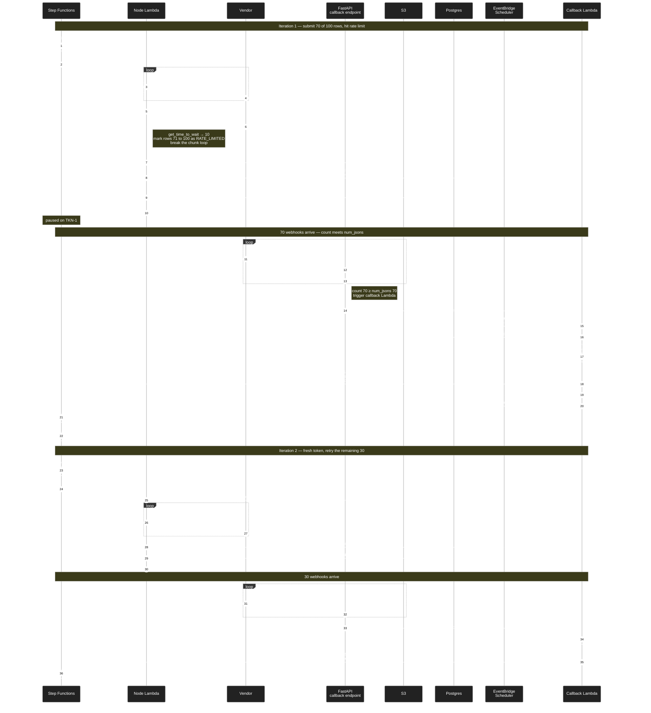

#### TL;DR table

| Question | Answer |
|---|---|
| When is the token generated? | **Before** any vendor request — by SFN, on Task-state entry. Lambda receives it as input. |
| One token reused across all chunks/retries? | **No.** Each Task-state invocation gets a new token. Rate-limit retries produce TKN-1, TKN-2, etc. |
| Does `time_to_wait_s` work for webhook nodes too? | **Yes.** Persisted to DB with the token; carried through `send_task_success`; SFN's Choice routes to `WAIT_X` exactly like the non-webhook case. |
| Why can't the Lambda return `time_to_wait_s` directly to SFN? | `lambda:invoke.waitForTaskToken` makes SFN ignore the Lambda return value. The wait must travel via `send_task_success`. |
| Where does the cleanup timer fit? | Fallback. If the 70 submitted rows' webhooks never all arrive, the EventBridge scheduler eventually fires the same callback Lambda — which still calls `send_task_success` with whatever data exists. Missing rows propagate as null and the workflow continues. |

#### Additional file references

- [domains/node_engine/core/nodes/base_node.py:566](domains/node_engine/core/nodes/base_node.py#L566) — webhook-node branch: forwards `time_to_wait_s` into `schedule_callback_processing`
- [domains/node_engine/core/nodes/base_node.py:635](domains/node_engine/core/nodes/base_node.py#L635) — callback Lambda re-reads `time_to_wait` from `callback_processor_data`
- [domains/node_engine/core/nodes/base_node.py:739](domains/node_engine/core/nodes/base_node.py#L739) — `return_callback_processor_task_token` forwards `time_to_wait_s` into `send_task_success`'s output
- [domains/node_engine/core/utils/http_request_error_mapper.py:76](domains/node_engine/core/utils/http_request_error_mapper.py#L76) — `get_time_to_wait()` extracts `Retry-After`

### 3d. Where the task_token actually lives — and how chunks discriminate without sending it to the vendor

A natural concern when reading the vendor-call code (e.g. [ask_ai_node.py:540-550](domains/node_engine/core/nodes/ai_toolkit/ask_ai_node.py#L540)):

```python
metadata = {
    INTERNAL_CHUNKED_MODE_PID_COLUMN: str(row.get(INTERNAL_CHUNKED_MODE_PID_COLUMN)),
    INTERNAL_CALLBACK_REQUEST_ID_COLUMN_NREV: str(nrev_request_id),
    "node_execution_id": str(self.node_execution_id),
    "aws_request_id": str(self.lambda_context.aws_request_id),
    "workflow_execution_id": str(self.workflow_execution_id),
    "tenant_id": str(self.tenant_id),
}
```

**There's no `task_token` here.** So how does the system know which token to consume when a chunk's webhooks land?

#### The token lives in Postgres, not in the vendor metadata

There is **only one active task_token per `node_execution` at any moment** — it lives on the `node_executions` row in the `node_execution_callback_processor_data` JSONB column ([base_node.py:1482-1485](domains/node_engine/core/nodes/base_node.py#L1482)):

```python
self.db_client.update_node_execution(
    node_execution_id=self.node_execution_id,
    node_execution_callback_processor_data=node_execution_callback_processor_data.model_dump(mode="json"),
)
```

The persisted record:

```json
{
  "task_token": "TKN-1",
  "num_jsons": 70,
  "folder_name": "aws-request-id-of-the-current-Lambda-invocation",
  "scheduler_arn": "arn:aws:scheduler:...",
  "time_to_wait": 10,
  "current_node_execution_mode_index": 0,
  "token_consumed": false
}
```

#### How chunks discriminate without sending the token to the vendor

The vendor only needs to call the webhook URL back. The URL itself carries the discriminators ([base_node.py:1607](domains/node_engine/core/nodes/base_node.py#L1607)):

```
/node-execution-callback/{workflow_execution_id}/{node_execution_id}/{folder_name}/{nrev_request_id}
                                                  ↑                  ↑              ↑
                                          identifies the      identifies the   identifies the
                                          node_execution      Lambda chunk     row within chunk
```

Two things in the URL do the work:

1. **`node_execution_id`** → looks up the Postgres row → finds the *currently active* `(task_token, folder_name, num_jsons)`.
2. **`folder_name`** = the Lambda invocation's `aws_request_id` ([base_node.py:577](domains/node_engine/core/nodes/base_node.py#L577)) — this is the **chunk discriminator**.

When `schedule_callback_processing` runs, it **overwrites** the entire `node_execution_callback_processor_data` with the current chunk's `(token, folder_name, num_jsons)`. So at any moment, the DB only knows about the *current* chunk's token.

#### Why "one active token" is enough

Step Functions semantics guarantee it. With `lambda:invoke.waitForTaskToken`, **only one Task-state instance is paused at a time per node_execution**. Issued tokens are mutually exclusive across iterations:

```
NODE_X_RUN (TKN-1 issued, Lambda runs, persists TKN-1 to DB, exits)
   ↓ SFN paused on TKN-1
   ↓ ... callback fires send_task_success(TKN-1) ... TKN-1 consumed
   ↓ SFN evaluates Choice → WAIT_X
   ↓ wait expires
NODE_X_RUN (TKN-2 issued, Lambda runs, OVERWRITES DB with TKN-2, exits)
   ↓ SFN paused on TKN-2
```

TKN-1 is dead by the time TKN-2 exists. There is no concurrent "two tokens in flight" state, so storing one is sufficient.

#### The folder_name guard against stale webhooks

Late webhooks for an old chunk (TKN-1's chunk) might still arrive after TKN-2 has been issued. The handler at [node_execution_callback_webhook_facade.py:78-84](domains/workflow_builder/core/node_execution_callback_webhook_facade.py#L78) compares the URL's `folder_name` to the DB's:

```python
if (node_execution_obj.node_execution_callback_processor_data.folder_name != str(folder_name)) or (
    node_execution_obj.node_execution_callback_processor_data.token_consumed
):
    logger.error(
        f"Node callback data received too late. DB Folder name: ..., "
        f"Webhook Folder name: {folder_name}, token_consumed: ..."
    )
    return
```

URL folder_name ≠ DB folder_name → stale chunk → ignored. The row JSON is still saved to S3 for forensics, but no token resume happens.

#### Storage / discrimination diagram

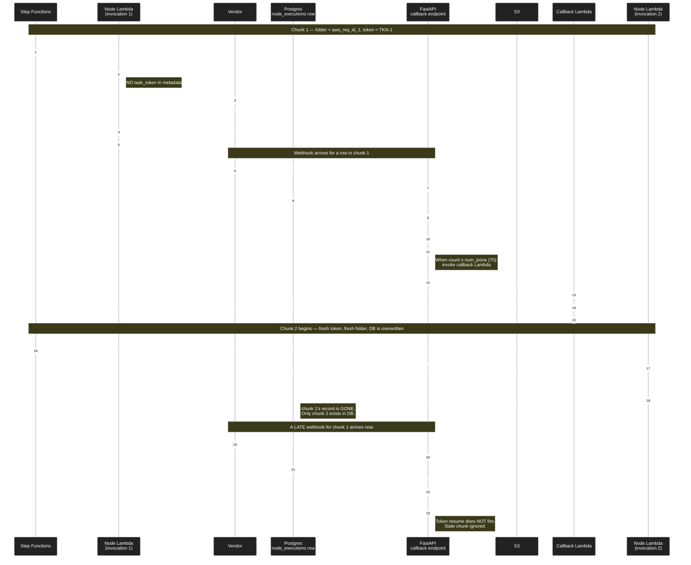

#### Why this design works

| Concern | Handled by |
|---|---|
| Vendor never holds sensitive task_token | Token stays server-side in DB |
| Multiple chunks in the lifetime of one node_execution | Each chunk has its own `folder_name` (= Lambda `aws_request_id`); DB row is rewritten each chunk |
| Old-chunk webhooks landing after a new chunk started | folder_name mismatch check rejects them |
| Token reuse / replay | `token_consumed` flag flips to `true` once `send_task_success` fires |
| Race — last webhook lands the same moment the cleanup timer fires | Both invoke the callback Lambda; whichever calls `send_task_success` first sets `token_consumed = true`, the second is rejected |

#### TL;DR

> The vendor metadata only carries `node_execution_id`, `aws_request_id` (= folder_name), `nrev_request_id`, and `workflow_execution_id`. That tuple is enough for the FastAPI handler to look up the *current* token in Postgres. The token itself never leaves our infrastructure. Each new chunk overwrites the DB row — there is no need to keep multiple tokens because SFN only ever waits on one at a time.

#### File references for 3d

- [domains/node_engine/core/nodes/ai_toolkit/ask_ai_node.py:540](domains/node_engine/core/nodes/ai_toolkit/ask_ai_node.py#L540) — example metadata sent to vendor (no token)
- [domains/node_engine/core/nodes/base_node.py:577](domains/node_engine/core/nodes/base_node.py#L577) — `folder_name = self.lambda_context.aws_request_id`
- [domains/node_engine/core/nodes/base_node.py:1472-1485](domains/node_engine/core/nodes/base_node.py#L1472) — DB write of `NodeExecutionCallbackProcessorData`
- [domains/workflow_builder/core/node_execution_callback_webhook_facade.py:78](domains/workflow_builder/core/node_execution_callback_webhook_facade.py#L78) — folder_name + token_consumed guard

---

## 4. Listener nodes vs non-listener nodes — execution-time differences

### Quick taxonomy of the two website-visitor nodes

| Node | Type | Why |
|---|---|---|
| [DetectWebsiteVisitorsNode](domains/node_engine/core/nodes/website_visitor_tracking/detect_website_visitors_node.py) | **Listener / trigger node** | Docstring: *"Acts as a listener/trigger node. When Midbound identifies a visitor, the webhook endpoint fans out to this node via `handle_webhook_listener`."* Reads the webhook payload from `trigger_data.s3_file`. Has `evaluate_trigger_condition()` for filter-on-trigger. |
| [GetWebsiteVisitLogsNode](domains/node_engine/core/nodes/website_visitor_tracking/get_website_visit_logs_node.py) | **Regular non-listener node** | Takes input rows from upstream, iterates them, calls `db_client.get_website_visits(...)` against our own `website_visits` Postgres table. No external trigger, no listener registration. |

So your assumption was half right — `DetectWebsiteVisitorsNode` is a listener; `GetWebsiteVisitLogsNode` looks similar at the *table* level but is a normal data-fetch node at the *execution* level.

### What "listener" actually means at execution time

A listener node has three properties that a regular node does not:

1. **It is the FIRST node of the workflow** (the workflow has `listener_nodes`; `is_trigger=True` and `is_listener=True` on the node).
2. **The `/execute` request does NOT run the workflow** — it activates a webhook URL / EventBridge schedule and returns. The workflow only runs when an external event arrives.
3. **Its input is a single S3 JSON blob (`trigger_data.s3_file`), not parent-node outputs.** It parses that JSON into a small DataFrame (typically 1 row — the event itself).

A regular node:

1. **Can be anywhere in the graph.**
2. **Runs immediately** when `/execute` is called (or when the upstream node finishes).
3. **Reads its input from parent-node outputs in S3** (or from the workflow's static input variables for the very first node of a non-listener workflow).

### Side-by-side execution flow

```mermaid
%%{init: {'theme':'base', 'themeVariables': {
  'fontSize': '20px',
  'background': '#000000',
  'primaryColor': '#1f1f1f',
  'primaryTextColor': '#ffffff',
  'primaryBorderColor': '#bbbbbb',
  'lineColor': '#dddddd',
  'tertiaryColor': '#1f1f1f',
  'clusterBkg': '#1a1a1a',
  'clusterBorder': '#888888'
}}}%%
flowchart LR
    subgraph LISTENER["LISTENER NODE FLOW (DetectWebsiteVisitorsNode)"]
        direction TB
        L1["UI POST /workflow/{id}/execute"]
        L2["WorkflowFacade detects<br/>workflow.listener_nodes is non-empty"]
        L3["ListenerFacade.activate_listener_for_test()<br/>creates webhook URL or<br/>EventBridge schedule"]
        L4["return 200 OK<br/>(workflow has NOT run)"]
        L5{{"⏳ wait for external trigger"}}
        L6["External event<br/>(Midbound POSTs visitor data)"]
        L7["POST /webhooks/listeners/{listener_id}<br/>store payload in S3"]
        L8["evaluate_trigger_condition(settings, payload)<br/>(e.g. visitor_filter='new_visitors_only')<br/>→ if false, drop event and stop"]
        L9["execution_helper.execute_full_workflow<br/>trigger_data = {listener_id, s3_file}"]
        L10["SFN starts"]
        L11["NODE_DETECT_RUN<br/>(the listener node itself)"]
        L12["DetectWebsiteVisitorsNode<br/>._handle_execute_node_logic__chunked_data()"]
        L13["_get_webhook_data()<br/>→ s3_client.get_json_s3_file(trigger_data.s3_file)<br/>→ extract payload.data"]
        L14["build 1-row DataFrame<br/>with WEBSITE_VISITOR_OUTPUT_COLUMNS<br/>(visitor_id, linkedin, page_visited, ...)"]
        L15["write s3_output_url"]
        L16["downstream nodes consume<br/>(e.g. AskAI to qualify the visitor)"]

        L1 --> L2 --> L3 --> L4 --> L5
        L5 -.-> L6 --> L7 --> L8 --> L9
        L9 --> L10 --> L11 --> L12 --> L13 --> L14 --> L15 --> L16
    end

    subgraph REGULAR["REGULAR NODE FLOW (GetWebsiteVisitLogsNode)"]
        direction TB
        R1["UI POST /workflow/{id}/execute"]
        R2["WorkflowFacade detects<br/>workflow.listener_nodes is EMPTY"]
        R3["execution_helper.execute_full_workflow<br/>(immediate, trigger_data = None)"]
        R4["SFN starts immediately"]
        R5["NODE_GET_LOGS_RUN<br/>(GetWebsiteVisitLogsNode)"]
        R6["GetWebsiteVisitLogsNode<br/>._handle_execute_node_logic__chunked_data()"]
        R7["read parent node outputs from S3<br/>(input_dataframe with rows like<br/>linkedin_url, …)"]
        R8["for each input row:<br/>db_client.get_website_visits(<br/>tenant_id, time_range, classification, ...)"]
        R9["write multi-row output DataFrame<br/>(one row per matching visit)"]
        R10["downstream nodes consume<br/>(e.g. analytics, export)"]

        R1 --> R2 --> R3 --> R4 --> R5 --> R6 --> R7 --> R8 --> R9 --> R10
    end
```

### Concrete example

#### Listener flow — "fire a Slack alert when a hot account visits our pricing page"

Workflow graph:

```
DetectWebsiteVisitorsNode  →  AskAINode (qualify visitor)  →  SlackNotifyNode
```

1. User clicks "Execute" → `POST /workflow/{id}/execute`.
2. ListenerFacade activates the Midbound webhook listener. **No workflow runs yet.** UI shows "listener active".
3. Hours later, a visitor lands on `/pricing` from `acme.com`. Midbound POSTs to `/webhooks/listeners/{listener_id}`:
   ```json
   {
     "payload": {
       "data": {
         "visitor_id": "v_abc",
         "visitor_linkedin": "linkedin.com/in/jane-doe",
         "page_visited": "/pricing",
         "visitor_classification": "new",
         "num_visits": 1,
         "visit_time": "2026-04-26T14:00:00Z"
       }
     }
   }
   ```
4. The listener facade stores this in S3 (`s3://.../listeners/{listener_id}/events/<uuid>.json`), checks `evaluate_trigger_condition({visitor_filter: "new_visitors_only"}, payload)` → returns True (classification is "new").
5. `execute_full_workflow` is called with `trigger_data = {listener_id, s3_file: <s3 url>}`.
6. SFN starts. `DetectWebsiteVisitorsNode._handle_execute_node_logic__chunked_data` runs:
   - Loads JSON from `trigger_data.s3_file`.
   - Builds a **1-row DataFrame** with `visitor_id=v_abc, visitor_linkedin=…, page_visited=/pricing`, etc.
   - Writes that as its output to S3.
7. Next node `AskAINode` reads that 1-row DataFrame and qualifies the lead. `SlackNotifyNode` fires.

#### Regular flow — "weekly report of all visitors from last 7 days"

Workflow graph:

```
WorkflowVariables (CSV with linkedin URLs)  →  GetWebsiteVisitLogsNode  →  ExportCsvNode
```

1. User clicks "Execute" → `POST /workflow/{id}/execute`.
2. WorkflowFacade sees no listeners → goes straight to `execute_full_workflow` → starts SFN immediately.
3. `GetWebsiteVisitLogsNode._handle_execute_node_logic__chunked_data` runs:
   - Reads input DataFrame from upstream (e.g., 50 LinkedIn URLs from a CSV variable).
   - For each row, calls `db_client.get_website_visits(tenant_id, start_ts=last_week, visitor_linkedin=row['linkedin_url'], ...)`.
   - Joins each input row with possibly multiple visit rows from Postgres → produces a multi-row output DataFrame.
4. Output flows into `ExportCsvNode`.

Note: this is the same `website_visits` table that Midbound writes into when the listener flow runs — so the regular flow is essentially "after-the-fact querying" of what the listener already captured. They share data, but their **execution paths are completely different**.

### Where the divergence happens in code

| Decision point | File / line |
|---|---|
| Is this a listener workflow? | [workflow_builder_facade.py:653](domains/workflow_builder/core/workflow_builder_facade.py#L653) — `check_if_listener_node_activation_needed()` |
| If yes → activate, return | [workflow_builder_facade.py:657](domains/workflow_builder/core/workflow_builder_facade.py#L657) → [listener_facade.py:160](domains/workflow_builder/core/listener_facade.py#L160) `activate_listener_for_test()` |
| If no → start SFN immediately | [workflow_builder_facade.py:671](domains/workflow_builder/core/workflow_builder_facade.py#L671) → [execution.py:239](domains/workflow_builder/core/helpers/execution/execution.py#L239) |
| Webhook arrives → start workflow with trigger_data | [listener_endpoints.py:219](domains/workflow_builder/application/listener_endpoints.py#L219) → [listener_facade.py:811](domains/workflow_builder/core/listener_facade.py#L811) `handle_webhook_listener()` → [listener_facade.py:1738](domains/workflow_builder/core/listener_facade.py#L1738) `_execute_live_workflow()` |
| Listener node reads `trigger_data.s3_file` | [detect_website_visitors_node.py:119](domains/node_engine/core/nodes/website_visitor_tracking/detect_website_visitors_node.py#L119) `_get_webhook_data()` |
| Regular node reads parent outputs | [base_node.py:327](domains/node_engine/core/nodes/base_node.py#L327) `BaseNode.execute_v2()` (loads parent S3 outputs into `input_dataframe`) |
| Regular node calls own DB | [get_website_visit_logs_node.py:138](domains/node_engine/core/nodes/website_visitor_tracking/get_website_visit_logs_node.py#L138) `self.db_client.get_website_visits(...)` |

### TL;DR

| Aspect | Listener node | Regular non-listener node |
|---|---|---|
| Position in graph | Always first | Anywhere |
| `/execute` behavior | Activates webhook/cron, returns; **workflow does NOT run** | Starts SFN immediately |
| What kicks off the workflow | External event (Midbound, Pipedream, OpenAI, cron) | The `/execute` request itself |
| Trigger condition filter | `evaluate_trigger_condition()` on payload before executing | N/A |
| Input source | `trigger_data.s3_file` (single webhook payload JSON) | Parent-node outputs in S3 (DataFrames) |
| Typical row count | 1 (the event) | Many (whatever upstream produced) |
| External I/O during execution | Usually none (just S3 read + parse) | Vendor APIs, our own DB, etc. |
| Examples | `PipedreamListenerNode`, `DetectWebsiteVisitorsNode`, CRON listeners | `RocketReachEnrichPeopleNode`, `AskAINode`, `GetWebsiteVisitLogsNode`, etc. |

---

## 5. The four listener types — only one uses EventBridge

Earlier diagrams showed `activate_listener_for_test()` taking either an "EventBridge schedule" branch or a "webhook URL" branch. That was over-simplified — there are actually **four listener types**, and only **CRON** uses EventBridge. The others are all change/event-driven via a webhook URL ([listeners.py:11](constants/models/listeners.py#L11)):

```python
class ListenerType(str, Enum):
    PIPEDREAM = "pipedream"              # Pipedream watches the source, posts to our webhook
    CRON = "cron"                        # time-based EventBridge schedule
    WEBHOOK = "webhook"                  # raw webhook URL we publish; user wires it up themselves
    WEBSITE_VISITOR = "website_visitor"  # Midbound visitor identification posts to our webhook
```

The dispatch lives in `activate_listener_for_test` ([listener_facade.py:188-251](domains/workflow_builder/core/listener_facade.py#L188)).

### Comparison table

| Type | Activation creates | Who detects the change? | Resume mechanism | Example trigger |
|---|---|---|---|---|
| **PIPEDREAM** | Pipedream component subscription + a webhook URL Pipedream posts to | **Pipedream** (3rd-party SaaS watches the source) | Pipedream POST → `/webhooks/listeners/{id}` | "New row added to Google Sheet", "Stripe charge succeeded", "Slack message in #sales" |
| **CRON** | AWS EventBridge recurring schedule pointing at `execute_workflow_lambda_arn` | Nobody — it just fires on a clock | EventBridge invokes Lambda directly (no FastAPI) | "Every Monday 9am", "Every 15 minutes" |
| **WEBHOOK** | A webhook URL is published in DB, no external integration | **External system you own** (your CRM, your form, your custom service) | External system POST → `/webhooks/listeners/{id}` | "When my CRM closes a deal, hit this URL" |
| **WEBSITE_VISITOR** | Same webhook URL pattern; mediated by Midbound | **Midbound** (your own product, but architecturally external to this service) | Midbound POST → `/webhooks/listeners/{id}` | "When someone views /pricing", "When a known visitor returns" |

So when I said "creates webhook URL or EventBridge schedule" earlier — the **webhook URL** path covers three of the four types and is the change/event-driven path. The **EventBridge schedule** path is the time-driven path and only applies to CRON.

### 5a. CRON listener — sample example

> **Scenario:** "Every Monday at 9 AM, fetch new leads added to my Apollo saved-search this past week and email me a digest."

#### What happens during `/execute` (activation)

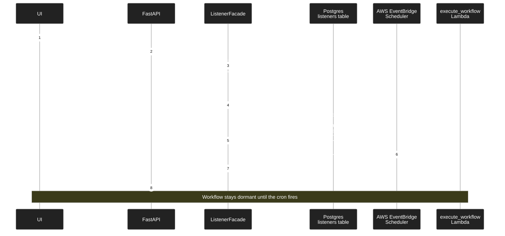

#### What happens when the cron fires (Monday 9 AM)

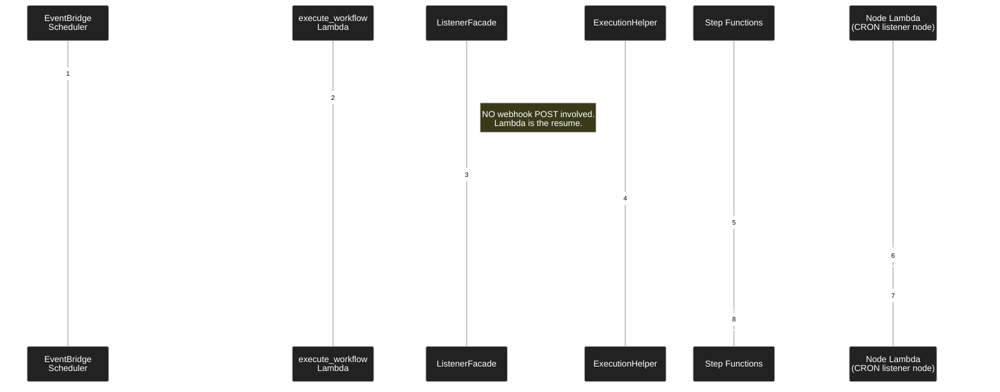

**Key:** the only listener type that bypasses the FastAPI webhook endpoint. EventBridge invokes the workflow Lambda directly.

### 5b. PIPEDREAM listener — sample example

> **Scenario:** "When a new row is added to my Google Sheet 'Inbound Leads', enrich the lead and post to Slack."

This is the change-driven case you described — the source (a Google Sheet) is being **watched by Pipedream** on our behalf. Pipedream is the polling-and-change-detection service. We never poll the sheet ourselves.

#### Activation

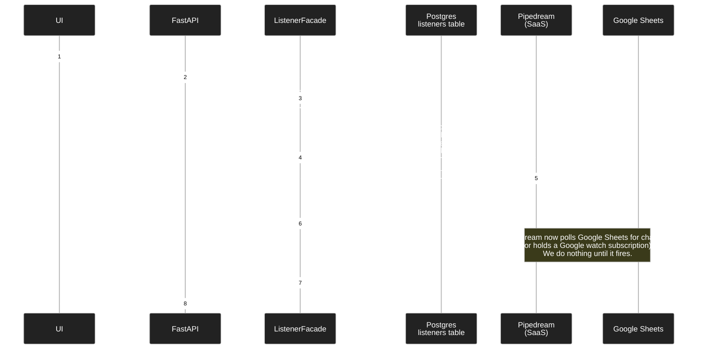

#### When a new row is added (the change event)

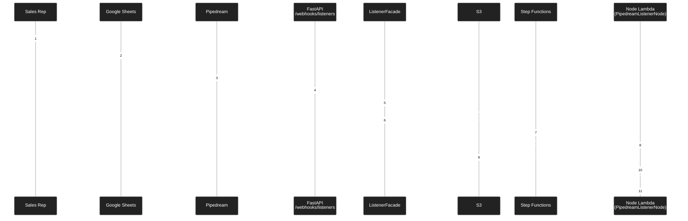

**Key:** Pipedream is the change detector. We never connect to Google Sheets directly. The `external_listener_id` we store is Pipedream's deployment ID — we use it to deactivate the subscription later.

### 5c. WEBHOOK listener — sample example

> **Scenario:** "Our internal CRM emits a webhook whenever a deal closes. Wire that into a workflow that sends a celebration message in Slack and adds the customer to onboarding."

The simplest type. We just publish a URL; the user is responsible for plugging it into their external system.

#### Activation

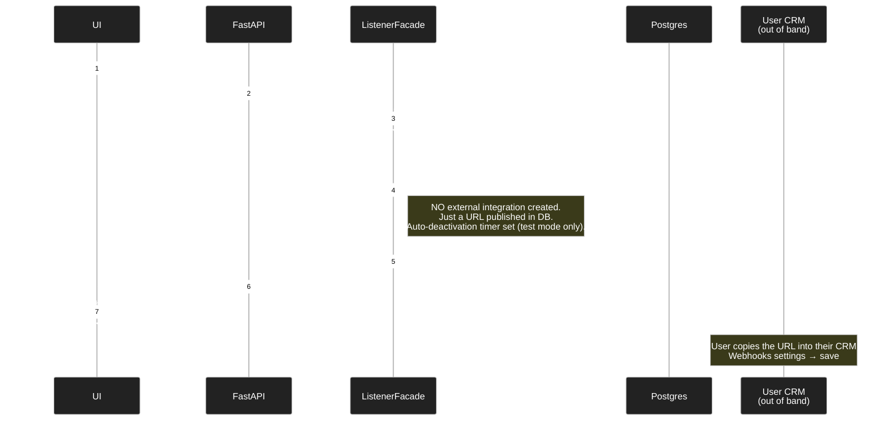

#### When the CRM fires

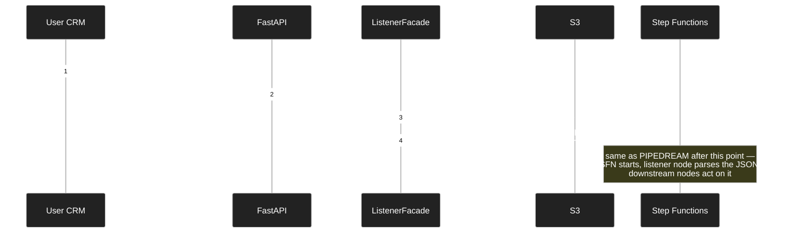

**Key:** Identical end-to-end shape to PIPEDREAM after the webhook lands. The difference is **only** at activation time — WEBHOOK creates no external integration, PIPEDREAM creates a Pipedream component subscription. Both store the same kind of `webhook_url` and use the same `/webhooks/listeners/{id}` endpoint.

### 5d. WEBSITE_VISITOR listener — sample example

This is `DetectWebsiteVisitorsNode` from section 4. Mechanically the same as WEBHOOK (Midbound POSTs to `/webhooks/listeners/{id}`), but with one twist: at **activation time** in test mode, the system synthesizes a payload from the latest stored visitor data and runs the workflow once immediately ([listener_facade.py:237-251](domains/workflow_builder/core/listener_facade.py#L237)). This is so testing doesn't require a real visitor to land. In live mode it behaves like WEBHOOK / PIPEDREAM.

### Two paths, one resume — visualized

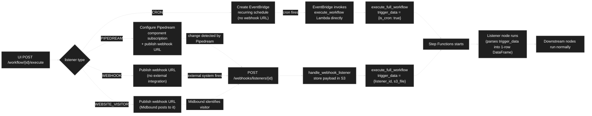

So three of the four types share the **webhook resume path** — change detection happens upstream and the resume is `POST /webhooks/listeners/{id}`. Only CRON skips that path because there's no change to detect — it's a clock.

### TL;DR

> "Webhook URL" was the path for three out of four listener types, and it's the change/event-driven path: someone (Pipedream / your CRM / Midbound) detects a change on your behalf and POSTs to us. "EventBridge schedule" is exclusively for CRON, where there's nothing to watch — it just fires on a clock. The downstream resume (Step Functions starts, listener node parses payload, workflow runs) is identical regardless of which path got us there.

### File references

- [constants/models/listeners.py:11](constants/models/listeners.py#L11) — `ListenerType` enum (the four types)
- [domains/workflow_builder/core/listener_facade.py:188](domains/workflow_builder/core/listener_facade.py#L188) — PIPEDREAM activation branch
- [domains/workflow_builder/core/listener_facade.py:206](domains/workflow_builder/core/listener_facade.py#L206) — CRON activation branch
- [domains/workflow_builder/core/listener_facade.py:221](domains/workflow_builder/core/listener_facade.py#L221) — WEBHOOK activation branch
- [domains/workflow_builder/core/listener_facade.py:237](domains/workflow_builder/core/listener_facade.py#L237) — WEBSITE_VISITOR activation branch
- [domains/workflow_builder/core/listener_facade.py:1465](domains/workflow_builder/core/listener_facade.py#L1465) — `_create_scheduler_listener()` (CRON → EventBridge)
- [domains/workflow_builder/core/listener_facade.py:811](domains/workflow_builder/core/listener_facade.py#L811) — `handle_webhook_listener()` (the shared resume)
- [domains/workflow_builder/application/workflow_builder_lambda_controller.py:91](domains/workflow_builder/application/workflow_builder_lambda_controller.py#L91) — CRON's "EventBridge fires Lambda" entrypoint
